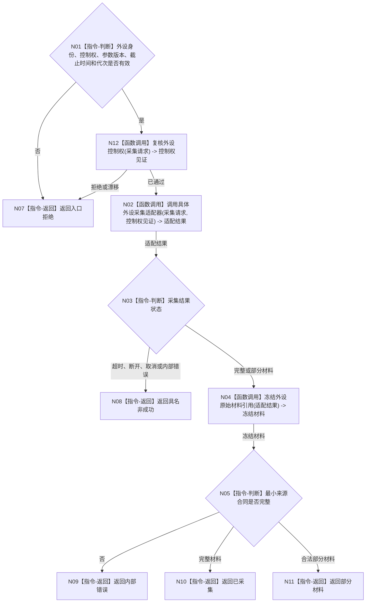

# BIZ-L2-006-01 采集一次外设原始材料目标函数流程图 v0.1

更新时间：2026-08-03

## 依据

```text
6320、6340、6350、6360；父函数 BIZ-L1-T06
当前相邻代码：海中鱼巣/适配/采集器.D455相机.ixx；仅作特定外设复用证据
```

## 身份与边界

正式目标函数设计图。根函数经目标外设独占控制域取得原始材料，不解释为观察结论或世界事实。

## 函数合同

```text
根函数：采集一次外设原始材料
归属模块 / 文件 / 层级：外设采集端口 / 海中鱼巣/适配/端口.外设采集.ixx / L2
现有或待新增：待新增通用合同；具体外设适配器可复用，D455 私有类型不得成为通用 ABI
完整签名：外设原始采集结果 外设采集端口::采集一次外设原始材料(const 外设原始采集请求& 请求)
参数：请求：const 外设原始采集请求&，只读借用；包含外设稳定身份、命令身份、采集参数版本、截止时间和运行代次
返回结果：外设原始采集结果；包含已采集、超时、断开、部分材料、取消、入口拒绝或内部错误，以及来源材料引用、发生时间和质量原始量
被调函数流程图：BIZ-L3-006-01-01 复核外设控制权；BIZ-L3-006-01-02 调用具体外设采集适配器；BIZ-L3-006-01-03 冻结外设原始材料引用
```

## 流程图



## 节点合同

| 节点 | 类型 | 输入绑定 | 输出绑定 | 事实读写 | 验证 |
| --- | --- | --- | --- | --- | --- |
| N02 | 函数调用 | 强类型采集请求 | 具体适配结果 | 外设 I/O | 超时、断连、取消、部分帧 |
| N04 | 指令-构造 | 适配结果 | 原始材料引用 | 只形成材料 | 来源和时间不可补造 |

## 关键边界

- 本函数不做任务匹配、存在确认、特征提交或因果判断。
- 同一物理外设仍由唯一控制域串行持有驱动权；线程池共享不放宽该权利。
