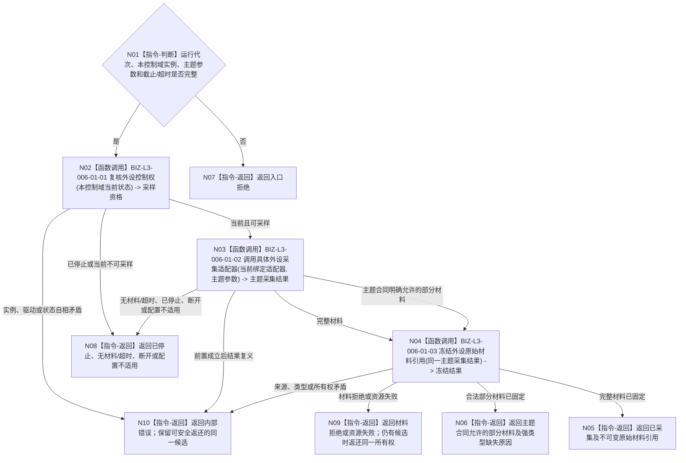

# BIZ-L2-006-01 采集一次外设原始材料目标函数流程图 v0.2

更新时间：2026-08-27

## 依据

```text
6320、6340 v0.6、6350 v0.6、6360；父函数 BIZ-L1-T06 v0.4
HEAD 1178ca9d：海中鱼巣/适配/协议.D455采样材料.ixx、海中鱼巣/适配/采集器.D455相机.ixx；只作D455特定采集叶证据
```

## 身份与边界

正式目标职责图。根目标只让一个已经建立的外设实例控制域，通过创建时绑定的采集适配器取得一次主题原始材料。它不形成外设报告、任务运行材料、观察结论或世界事实。

采样不要求每次都绑定命令、等待项或订阅项。双目相机可以在独占控制域内持续供料；等待项和订阅项约束后续报告调度与任务承接，不能冒充每帧采样许可。只有确由具名控制类命令触发的采样，才保留该命令作为可选来源。

## 函数合同

```text
根目标：外设采集端口::采集一次外设原始材料
归属模块 / 文件 / 目标分解深度：每实例外设控制域的采集端口 / 具体文件待详细设计 / BIZ-L2
现有或待新增：通用端口待新增；D455帧来源::采样一次可作为一个已绑定主题叶
候选签名：外设原始采集结果 外设采集端口::采集一次外设原始材料(const 外设原始采集请求& 请求)
参数最低职责：运行代次、本控制域当前实例、主题采样参数和截止/超时；可选具名控制命令只在其真实触发采样时存在
不得要求的输入：调用方自报控制权见证、等待项/订阅项身份、运行时适配器名称、D455私有DTO、目标ABI尚未冻结的取消令牌
返回结果最低分类：已采集、主题合同允许的部分材料、无当前材料/超时、已停止、设备断开、配置不适用、材料拒绝、资源失败、内部错误
成功载荷：调用方拥有的不可变主题原始材料引用及适配器已经形成的来源实例、发生时间、配置和完整性材料；主题已有采样身份/批次时原样保留；不在本函数补造摘要、报告身份或持久文件
被调目标：BIZ-L3-006-01-01 复核外设控制权；BIZ-L3-006-01-02 调用具体外设采集适配器；BIZ-L3-006-01-03 冻结外设原始材料引用
```

## 流程图



## 节点合同

| 节点 | 类型 | 参数 / 输入绑定 | 结果 / 输出绑定 | 事实读写 | 验证 |
| --- | --- | --- | --- | --- | --- |
| N01/N02 | 指令/函数调用 | 控制域对象和本轮主题参数 | 本次内部采样资格 | 只读控制域当前状态 | 错代、停止门、实例/驱动错配、并发I/O |
| N03 | 函数调用 | 创建时绑定的适配器和主题参数 | 主题私有采集结果 | 外设I/O | 完整、超时、断开、停止、主题特有失败 |
| N04 | 函数调用 | 同一主题结果 | 调用方拥有不可变引用 | 只形成运行期材料 | 来源、类型、时间、配置、完整性和所有权守恒 |
| N05—N10 | 返回 | 结构化结果 | 完整成功、合法部分或具名非成功 | 无业务事实写入 | 非成功零伪成功；候选不丢失 |

## 关键边界

- 控制权来自控制域创建时取得的唯一实例/驱动租约和串行I/O职责，不从请求字段、线程号、等待项或缓存位置重新签发。
- 适配器在控制域创建时按外设主题和实例配置绑定；本函数不新增运行时注册表、名称发现或版本猜测权威。
- 部分材料必须由具体主题强类型合同明确允许。D455当前只允许同步彩色、深度、左右红外、标定/配置和采集元数据全部完整时成功。
- 适配器已经取得材料后，冻结失败不得重新采样冒充重试；仍由调用方拥有的候选必须返回父函数唯一在途槽继续收束。
- 摘要、强类型报告、恢复材料和物理报告队列分别属于后续006-03、006-04及其正式owner；本目标不提前建立它们。

本图完成的是006-01职责校正，不是通用采集ABI详细设计、T06生产接线或真实外设闭环验收。
