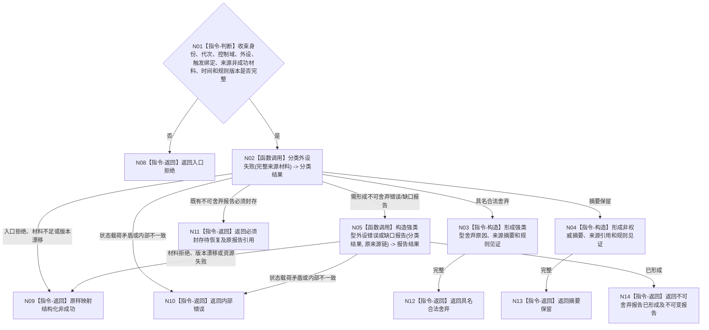

# BIZ-L2-006-02 分类并收束一次外设非成功材料目标函数流程图 v0.2

更新时间：2026-08-27

## 依据

```text
4050、6340 v0.6、6350 v0.6；父函数 BIZ-L1-T06 v0.4
```

## 身份与边界

正式目标函数设计图。根函数只对唯一在途槽中的原始采集、报告形成或报告发布非成功材料做强类型分类和收束。合法舍弃或摘要保留形成值式收束结果；不可静默舍弃材料形成强类型外设错误/缺口报告，交还父函数经006-04发布。本函数不提交线程生命周期消息、不拥有队列，也不直接创建任务或需求。

## 函数合同

```text
根函数：分类并收束一次外设非成功材料
归属模块 / 文件 / 层级：外设非成功收束 / 海中鱼巣/领域/服务.外设非成功收束.ixx / L2
现有或待新增：待新增纯值组合；HEAD没有本函数、外设错误报告形成器或第二诊断消息队列
完整签名：外设非成功收束结果 外设非成功收束服务::分类并收束一次外设非成功材料(const 外设非成功收束请求& 请求) const noexcept
参数：请求：const 外设非成功收束请求&，只读借用；包含收束稳定身份、运行/生产代次、控制域和外设身份、具名命令/等待项/订阅项绑定、原始结果或原报告、来源材料引用、发生/评估时间、报告TTL、配置版本和舍弃规则版本
返回结果：外设非成功收束结果；包含具名合法舍弃、摘要保留、不可舍弃报告已形成、必须封存待恢复、材料不足、版本漂移、入口拒绝、资源失败或内部错误；只有不可舍弃报告已形成携带同一来源链的不可变报告，其它状态不携带伪报告
被调函数流程图：BIZ-L3-006-02-01 分类外设失败；BIZ-L3-006-02-02 构造强类型外设错误或缺口报告
```

## 流程图



## 节点合同

| 节点 | 类型 | 输入绑定 | 输出绑定 | 事实读写 | 验证 |
| --- | --- | --- | --- | --- | --- |
| N02 | 函数调用 | 原始非成功材料和正式触发绑定 | 强类型分类结果 | 纯值 | 安全/回执/状态跃迁/目标丢失/外设错误/目标判断缺口 |
| N05 | 函数调用 | 不可舍弃分类与原来源链 | 不可变错误/缺口报告 | 纯值 | 来源、TTL、产品、恢复要求与负载闭合 |

## 关键边界

- 安全事件、当前任务所需回执、状态跃迁、目标丢失、外设错误和影响目标判断的缺口必须走不可舍弃报告分支。
- “当前任务所需”或“影响目标判断”只能从具名命令、等待项、订阅项和任务承接绑定裁定，不接受调用方裸布尔标记。
- 合法舍弃和摘要保留只收束当前在途材料，不发布线程事件；不可舍弃报告只交还父函数，不在本函数建立第二队列或递归调用006-04。
- 所有分支都不直接写世界、任务、需求或价值事实。
