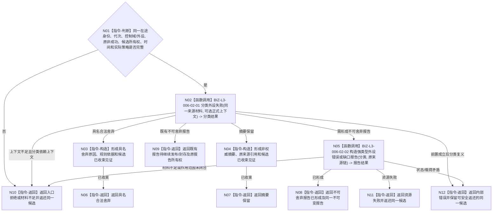

# BIZ-L2-006-02 分类并收束一次外设非成功材料目标函数流程图 v0.2

更新时间：2026-08-28

## 依据

```text
4050、6340 v0.6、6350 v0.6；父函数 BIZ-L1-T06 v0.5；BIZ-L2-006-01 v0.2
发布源码证据基线 `472914a8`：无通用外设失败分类器、不可舍弃错误/缺口报告形成器或第二诊断队列
```

## 身份与边界

正式目标职责图。根目标只收束T06唯一在途槽中的同一份采集、报告形成或报告发布非成功材料：普通可舍弃材料形成具名舍弃/摘要结果；不可静默舍弃材料保持原来源链，形成或保留强类型外设错误/缺口报告，再交父函数沿006-04唯一发布链处理。

本目标不要求每份失败都绑定命令、等待项或订阅项。安全事件、状态跃迁、目标丢失和外设错误按自身强类型类别不可舍弃；“当前任务所需回执”与“影响目标判断的缺口”只有在原在途材料已经携带正式报告生产/任务上下文时才能裁定，不能从首个等待项、订阅项、线程当前值或调用方布尔补造。

## 函数合同

```text
根目标：分类并收束一次外设非成功材料
归属模块 / 文件 / 目标分解深度：每实例外设控制域的非成功收束职责 / 具体文件待详细设计 / BIZ-L2
现有或待新增：待新增模块私有纯值组合；职责已冻结，公开ABI未冻结
候选签名：外设非成功收束结果 分类并收束一次外设非成功材料(const 外设非成功收束请求& 请求) noexcept
参数最低职责：同一在途身份、运行/生产代次、控制域/外设、原始结果或原报告、仍存在的原材料引用、发生/评估时间、TTL和实际适用的强类型舍弃策略；可选生产/任务上下文只在上游真实形成时存在
返回结果最低分类：具名合法舍弃、摘要保留、不可舍弃报告已形成、既有不可舍弃报告待继续发布/封存、材料不足、入口拒绝、资源失败、内部错误
所有权：每个结果都明确同一候选已被收束、已返还父槽或已移动进报告；禁止只返回原因后遗失候选
被调目标：BIZ-L3-006-02-01 分类外设失败；BIZ-L3-006-02-02 构造强类型外设错误或缺口报告
施工门禁：6340/6350先冻结设备/控制域级错误与单产品错误的强类型报告作用范围及产品/成熟度承载规则，再由详细设计冻结字段、状态和恢复合同
```

## 流程图



## 节点合同

| 节点 | 类型 | 输入绑定 | 输出绑定 | 事实读写 | 验证 |
| --- | --- | --- | --- | --- | --- |
| N01/N02 | 指令/函数调用 | 同一在途材料和可选正式上下文 | 互斥分类 | 纯值 | 六类不可舍弃、普通过期/重复/无命中、上下文缺失 |
| N03/N04 | 本函数内指令 | 可舍弃分类和原候选 | 舍弃或摘要收束 | 只形成运行期收束材料 | 原候选不遗失；摘要非权威 |
| N05 | 函数调用 | 不可舍弃分类和原来源链 | 同一不可变错误/缺口报告 | 纯值 | 实例级/产品级作用范围、来源和所有权 |
| N06—N12 | 本函数内返回 | 收束分类 | 结构化结果和候选所有权 | 无业务事实写入 | 成功/非成功载荷互斥 |

## 关键边界

- 6340六类不可舍弃集合中，安全事件、状态跃迁、目标丢失和外设错误可以由自身强类型事实判定；任务所需回执和目标判断缺口必须有真实生产/任务上下文。
- 普通超时不自动等于线程故障；设备断开可以是不可舍弃外设错误，但只有真实线程状态变化才能另经006-05发布生命周期投影。
- 合法舍弃、摘要保留和不可舍弃报告都不建立第二消息队列，不调用8110，不创建需求/任务，也不写世界事实。
- 6350四类产品不能自动表达整个设备或控制域失效。6340/6350正式机器合同闭合作用范围与产品承载前，本目标只能作为职责图，不能据此施工通用报告ABI。

本图不证明报告已经保存、发布、承接或形成世界事实。
