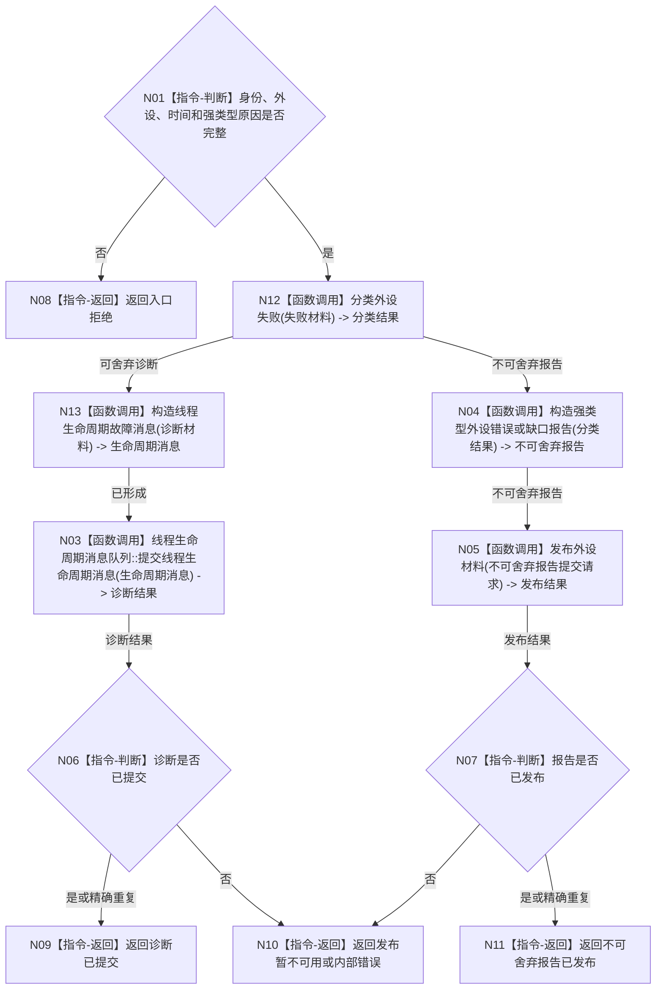

# BIZ-L2-006-02 提交外设诊断或缺口消息目标函数流程图 v0.1

更新时间：2026-08-03

## 依据

```text
4050、6340、8110；父函数 BIZ-L1-T06
```

## 身份与边界

正式目标函数设计图。根函数把外设失败分为可舍弃诊断与不可静默舍弃缺口，但不直接创建任务或需求。

## 函数合同

```text
根函数：提交外设诊断或缺口消息
归属模块 / 文件 / 层级：外设报告发布 / 海中鱼巣/线程/外设报告发布桥.ixx / L2
现有或待新增：待新增；复用线程生命周期与外设报告队列的发布基座
完整签名：外设诊断缺口提交结果 外设报告发布桥::提交外设诊断或缺口消息(const 外设诊断缺口提交请求& 请求)
参数：请求：const 外设诊断缺口提交请求&，只读借用；包含稳定身份、外设身份、发生时间、原因类型、不可舍弃标记和可选命令/任务诊断引用
返回结果：外设诊断缺口提交结果；包含诊断已提交、不可舍弃报告已发布、精确重复、入口拒绝、发布暂不可用或内部错误
被调函数流程图：BIZ-L3-006-02-01 分类外设失败；可舍弃诊断复用BIZ-L3-004-15-01/02；BIZ-L3-006-02-02 构造强类型外设错误或缺口报告；不可舍弃发布复用BIZ-L2-006-04
```

## 流程图



## 节点合同

| 节点 | 类型 | 输入绑定 | 输出绑定 | 事实读写 | 验证 |
| --- | --- | --- | --- | --- | --- |
| N03 | 函数调用 | 可舍弃诊断 | 线程诊断结果 | 非业务旁路 | 投影不可用隔离 |
| N05 | 函数调用 | 可恢复强类型报告 -> 外设材料发布请求 | 发布结果 | BIZ-L2-006-04 原子发布外设材料 | 不可舍弃、重复、恢复 |

## 关键边界

- 安全事件、当前任务所需回执、状态跃迁、目标丢失、外设错误和影响目标判断的缺口必须走不可舍弃报告分支。
- 两个分支都不直接写世界、任务、需求或价值事实。
