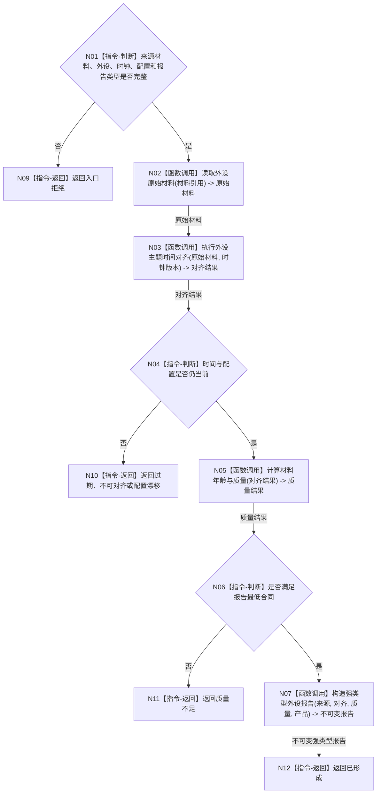

# BIZ-L2-006-03 时间对齐并形成强类型外设报告目标函数流程图 v0.1

更新时间：2026-08-03

## 依据

```text
6200—6360；父函数 BIZ-L1-T06
当前相邻代码：海中鱼巣/适配/协议.D455采样材料.ixx
```

## 身份与边界

正式目标函数设计图。根函数解释原始材料为强类型外设报告，仍不确认存在、关系、任务结果或世界事实。

## 函数合同

```text
根函数：时间对齐并形成强类型外设报告
归属模块 / 文件 / 层级：外设报告形成 / 海中鱼巣/领域/服务.外设报告形成.ixx / L2
现有或待新增：待新增通用入口；具体外设协议和私有算法按主题适配
完整签名：强类型外设报告形成结果 外设报告形成服务::时间对齐并形成强类型外设报告(const 强类型外设报告形成请求& 请求) const
参数：请求：const 强类型外设报告形成请求&，只读借用；包含原始材料引用、外设与命令身份、时钟版本、配置版本、报告类型和产品类型
返回结果：强类型外设报告形成结果；包含已形成、材料过期、时间不可对齐、质量不足、配置漂移、入口拒绝或内部错误，以及不可变外设报告
被调函数流程图：BIZ-L3-006-03-01 读取外设原始材料；BIZ-L3-006-03-02 执行外设主题时间对齐；BIZ-L3-006-03-03 计算外设材料年龄与质量；BIZ-L3-006-03-04 构造强类型外设报告
```

## 流程图



## 节点合同

| 节点 | 类型 | 输入绑定 | 输出绑定 | 事实读写 | 验证 |
| --- | --- | --- | --- | --- | --- |
| N02/N03 | 函数调用 | 材料引用和时钟版本 | 对齐材料 | 只读材料 | 丢帧、漂移、跨配置 |
| N05/N07 | 函数调用 / 构造 | 对齐材料 | 质量和强类型报告 | 只形成材料 | 产品互斥、成熟度、TTL |

## 关键边界

- 报告类型、逻辑供给产品和材料成熟度必须是独立强类型字段，不能从说明文本推断。
- 同一报告只绑定一个产品索引；报告仍需由 6340 任务域唯一承接。
