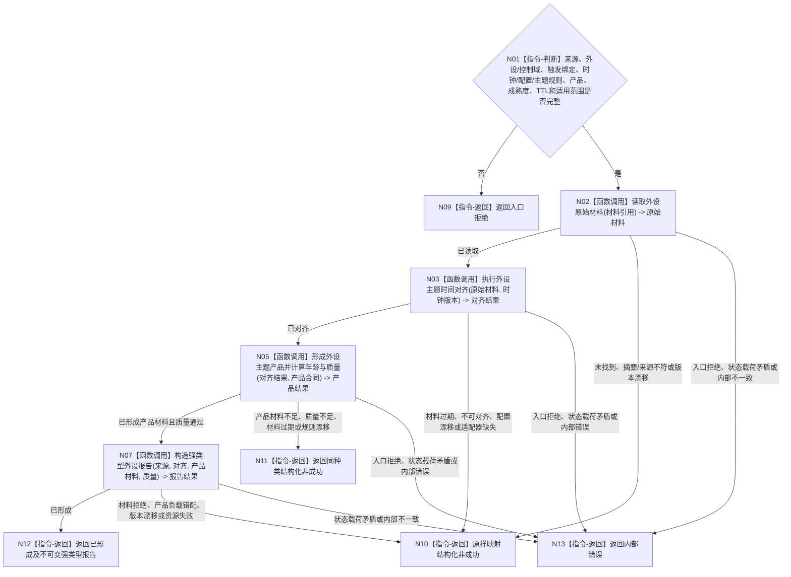

# BIZ-L2-006-03 时间对齐并形成强类型外设报告目标函数流程图 v0.2

更新时间：2026-08-27

## 依据

```text
6200—6360；父函数 BIZ-L1-T06 v0.4
HEAD 05b086e7：海中鱼巣/适配/协议.D455采样材料.ixx只提供L0同步四流、标定和采集元数据；没有分割、跨轮稳定、扫描基准、跟踪种子或四产品形成实现
```

## 身份与边界

正式目标函数设计图。根函数解释原始材料为强类型外设报告，仍不确认存在、关系、任务结果或世界事实。

## 函数合同

```text
根函数：时间对齐并形成强类型外设报告
归属模块 / 文件 / 层级：外设报告形成 / 海中鱼巣/领域/服务.外设报告形成.ixx / L2
现有或待新增：待新增通用入口；具体外设协议和私有算法按主题适配
完整签名：强类型外设报告形成结果 外设报告形成服务::时间对齐并形成强类型外设报告(const 强类型外设报告形成请求& 请求) const
参数：请求：const 强类型外设报告形成请求&，只读借用；包含原始材料引用、外设/控制域、具名命令/等待项/订阅项绑定、时钟/配置/主题规则版本、报告类型、逻辑供给产品、成熟度目标、TTL、适用范围及产品所需基准/目标约束；对应命令可空但触发绑定必填
返回结果：强类型外设报告形成结果；包含已形成、材料缺失、材料过期、时间不可对齐、产品材料不足、质量不足、配置/规则漂移、产品负载错配、入口拒绝、资源失败或内部错误；只有已形成携带来源链闭合的不可变外设报告
被调函数流程图：BIZ-L3-006-03-01 读取外设原始材料；BIZ-L3-006-03-02 执行外设主题时间对齐；BIZ-L3-006-03-03 形成外设主题产品并计算年龄与质量；BIZ-L3-006-03-04 构造强类型外设报告
```

## 流程图



## 节点合同

| 节点 | 类型 | 输入绑定 | 输出绑定 | 事实读写 | 验证 |
| --- | --- | --- | --- | --- | --- |
| N02/N03 | 函数调用 | 材料引用和时钟版本 | 原始/对齐材料 | 只读材料 | 缺失、摘要、跨时钟、跨配置 |
| N05/N07 | 函数调用 | 对齐材料和产品合同 | 主题产品、质量和强类型报告 | 只形成材料 | 分割/稳定/基准/目标约束、产品互斥、成熟度、TTL |

## 关键边界

- 报告类型、逻辑供给产品和材料成熟度必须是独立强类型字段，不能从说明文本推断。
- 时间对齐和通用质量门不能替代产品形成：原始逐簇需要分割与来源回查，稳定子集需要跨轮稳定，扫描变化需要基准和覆盖，目标跟踪需要目标种子与窗口。材料缺失时必须结构化失败，不能把同步帧直接包装成四产品之一。
- 原始逐簇产品即使成熟度为L0—L2也只允许任务域质量门、短期回查和诊断，不得成为自我侧方法正式输入；其它三类业务承接产品必须达到L3及各自前置。
- 同一报告只绑定一个产品索引；报告仍需由 6340 任务域唯一承接。
