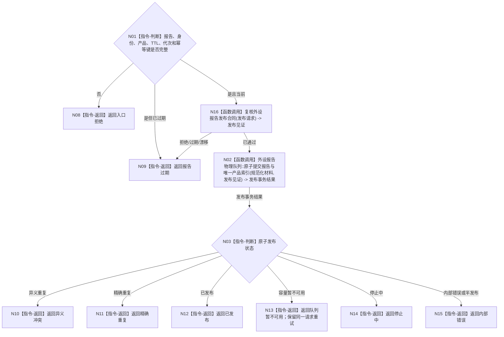

# BIZ-L2-006-04 发布外设材料目标函数流程图 v0.1

更新时间：2026-08-03

## 依据

```text
6340、6350；父函数 BIZ-L1-T06，异步后继 BIZ-L2-004-10
```

## 身份与边界

正式目标函数设计图。根函数把同一不可变报告发布到其控制域唯一物理队列；重复调用只允许精确幂等重试。

## 函数合同

```text
根函数：发布外设材料
归属模块 / 文件 / 层级：外设报告发布 / 海中鱼巣/线程/外设报告发布桥.ixx / L2
现有或待新增：待新增；现有外设采样材料线程只可作为队列与停止机制参考
完整签名：外设材料发布结果 外设报告发布桥::发布外设材料(const 外设材料发布请求& 请求)
参数：请求：const 外设材料发布请求&，只读借用；包含不可变报告、生产代次、报告稳定身份、产品类型、TTL 和发布幂等键
返回结果：外设材料发布结果；包含已发布、精确重复、队列暂不可用、报告过期、停止中、异义冲突、入口拒绝或内部错误
被调函数流程图：BIZ-L3-006-04-01 复核外设报告发布合同；BIZ-L3-006-04-02 原子提交外设报告与产品索引
```

## 流程图



## 节点合同

| 节点 | 类型 | 输入绑定 | 输出绑定 | 事实读写 | 验证 |
| --- | --- | --- | --- | --- | --- |
| N02 | 函数调用 | 不可变报告、产品类型和幂等键 | 原子发布事务结果 | 同事务提交唯一物理队列和可重建产品索引 | 产品互斥、重复、满载、停止、并发发布与逆序撤销 |

## 关键边界

- 队列和产品索引不是长期权威；恢复按报告稳定身份和消费治理事实重新准入。
- 物理队列项与其唯一产品索引必须同事务可见；任一失败都不得留下半发布队列项或孤立索引。
- 队列暂不可用时只能重试同一不可变材料和幂等键，不能重新采集来冒充重试。
- 发布成功不等于任务域已经承接，也不等于世界事实已经形成。
