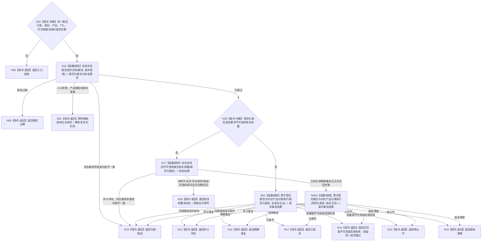

# BIZ-L2-006-04 发布外设材料目标函数流程图 v0.2

更新时间：2026-08-27

## 依据

```text
6340 v0.6、6350 v0.6；父函数 BIZ-L1-T06 v0.5，异步后继 BIZ-L2-004-10
```

## 身份与边界

正式目标职责图。根目标先复核006-03形成的同一不可变强类型报告，再按正式不可静默舍弃分类闭合可恢复前置，最后把报告与其所属产品分类索引原子发布到本控制域唯一运行期物理队列。无效、过期、产品错配或身份规则未闭合的报告不得先写恢复材料。物理队列和分类索引永不充当持久恢复权威。

## 函数合同

```text
根目标：发布外设材料
归属模块 / 文件 / 层级：每实例外设控制域的报告发布职责 / 具体文件待详细设计 / BIZ-L2
现有或待新增：待新增；职责已冻结，公开ABI未冻结。现有D455缓存和标量上行桥只可作为进程内候选/读回形状参考
候选签名：外设材料发布结果 发布外设材料(const 外设材料发布请求& 请求)
参数最低职责：006-03同一不可变强类型报告、来源外设/控制域、生产代次、报告稳定身份、唯一产品类型、成熟度、发生时间、TTL、配置版本、正式不可舍弃分类和同身份重试材料；稳定身份生成规则继续由006-03后继详细设计冻结
返回结果最低分类：已发布、精确重复、恢复前置未闭合、队列暂不可用、报告过期、停止中、版本漂移、异义冲突、入口拒绝、资源失败或内部错误；只有已发布/精确重复携带首次发布定位和队列版本
被调函数流程图：BIZ-L3-006-04-01 复核外设报告发布合同；BIZ-L3-006-04-03 闭合并读回不可舍弃报告恢复前置；BIZ-L3-006-04-02 原子提交外设报告与对应产品分类索引
```

## 流程图



## 节点合同

| 节点 | 类型 | 输入绑定 | 输出绑定 | 事实读写 | 验证 |
| --- | --- | --- | --- | --- | --- |
| N16 | 函数调用 | 同一不可变报告与发布语境 | 规范化报告、正式不可舍弃分类和恢复要求 | 纯值复核；零恢复写/队列写 | 无效、过期、错配报告不得先持久化 |
| N17 | 函数调用 | 已通过复核的不可舍弃报告与同身份重试材料 | 可恢复强类型报告或承接事实的正式读回见证 | 具体owner和ABI待详细设计；不是世界事实 | 首次、精确重复、同身份异义、提交后读回失败、跨代次原身份 |
| N02/N02A | 函数调用 | 规范化报告、对应产品分类和可选恢复见证 | 原子发布事务结果 | 同事务提交唯一物理队列和对应可重建分类索引 | 产品互斥、重复、满载、停止、并发发布与零半可见 |

## 关键边界

- 队列和产品索引不是长期权威；恢复按报告稳定身份和消费治理事实重新准入。报告稳定身份是跨任务、窗口、生产代次和恢复代次的唯一竞争键，禁止用复合键放宽唯一性。
- 不可静默舍弃报告必须先形成可正式读回的强类型报告或承接事实；保存候选、日志、D455缓存条目、线程消息或队列内存均不能替代恢复见证。6340尚未冻结该持久边界的唯一owner和公开ABI，目标图不得自行指定L1写入头、状态数值或文件。
- 物理队列项与其所属四类产品之一的分类索引必须同事务可见；任一失败都不得留下半发布队列项或孤立索引。
- 队列暂不可用时只能重试同一不可变材料和幂等键，不能重新采集来冒充重试。
- 发布成功不等于任务域已经承接，也不等于世界事实已经形成。
