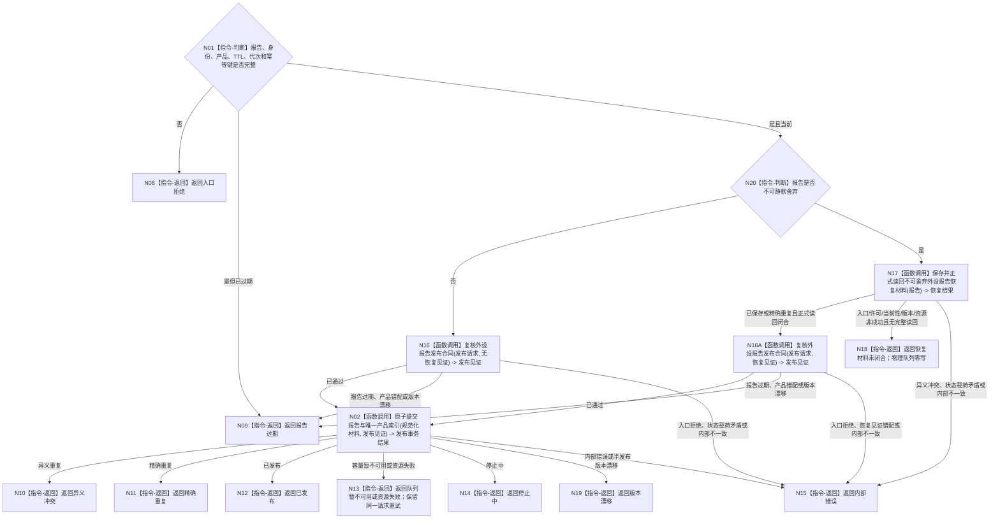

# BIZ-L2-006-04 发布外设材料目标函数流程图 v0.2

更新时间：2026-08-27

## 依据

```text
6340 v0.6、6350 v0.6；父函数 BIZ-L1-T06 v0.4，异步后继 BIZ-L2-004-10
```

## 身份与边界

正式目标函数设计图。根函数把同一不可变报告发布到其控制域唯一运行期物理队列；重复调用只允许精确幂等重试。不可静默舍弃报告在对队列可见前，必须先由具名恢复owner保存并正式读回可跨重启重新准入的材料；物理队列和产品索引永不充当该持久权威。

## 函数合同

```text
根函数：发布外设材料
归属模块 / 文件 / 层级：外设报告发布 / 海中鱼巣/线程/外设报告发布桥.ixx / L2
现有或待新增：待新增；现有外设采样材料线程只可作为队列与停止机制参考
完整签名：外设材料发布结果 外设报告发布桥::发布外设材料(const 外设材料发布请求& 请求)
参数：请求：const 外设材料发布请求&，只读借用；包含不可变报告、控制域/来源外设、生产代次、跨代次唯一报告稳定身份、唯一产品类型、成熟度、发生时间、TTL、配置版本、是否不可静默舍弃和发布幂等键
返回结果：外设材料发布结果；包含已发布、精确重复、恢复材料未闭合、队列暂不可用、报告过期、停止中、版本漂移、异义冲突、入口拒绝、资源失败或内部错误；只有已发布/精确重复携带发布序号、队列版本和恢复读回见证（适用时）
被调函数流程图：BIZ-L3-006-04-01 复核外设报告发布合同；BIZ-L3-006-04-03 保存并正式读回不可舍弃外设报告恢复材料；BIZ-L3-006-04-02 原子提交外设报告与产品索引
```

## 流程图



## 节点合同

| 节点 | 类型 | 输入绑定 | 输出绑定 | 事实读写 | 验证 |
| --- | --- | --- | --- | --- | --- |
| N17 | 函数调用 | 不可舍弃报告、来源链和恢复幂等材料 | 正式恢复材料读回 | 恢复owner写入/读回；不是世界事实 | 首次、精确重复、同身份异义、提交后读回失败、跨代次原身份 |
| N16/N16A | 函数调用 | 报告和可选正式恢复见证 | 规范化发布材料 | 纯值复核；零发布 | 可舍弃报告不要求恢复见证；不可舍弃报告必须逐字段互证正式读回 |
| N02 | 函数调用 | 不可变报告、产品类型、恢复见证（适用时）和幂等键 | 原子发布事务结果 | 同事务提交唯一物理队列和可重建产品索引 | 产品互斥、重复、满载、停止、并发发布与逆序撤销 |

## 关键边界

- 队列和产品索引不是长期权威；恢复按报告稳定身份和消费治理事实重新准入。报告稳定身份是跨任务、窗口、生产代次和恢复代次的唯一竞争键，禁止用复合键放宽唯一性。
- 不可静默舍弃报告必须先形成可正式读回的恢复材料；保存候选、日志、D455缓存条目、线程消息或队列内存均不能替代恢复见证。
- 物理队列项与其唯一产品索引必须同事务可见；任一失败都不得留下半发布队列项或孤立索引。
- 队列暂不可用时只能重试同一不可变材料和幂等键，不能重新采集来冒充重试。
- 发布成功不等于任务域已经承接，也不等于世界事实已经形成。
