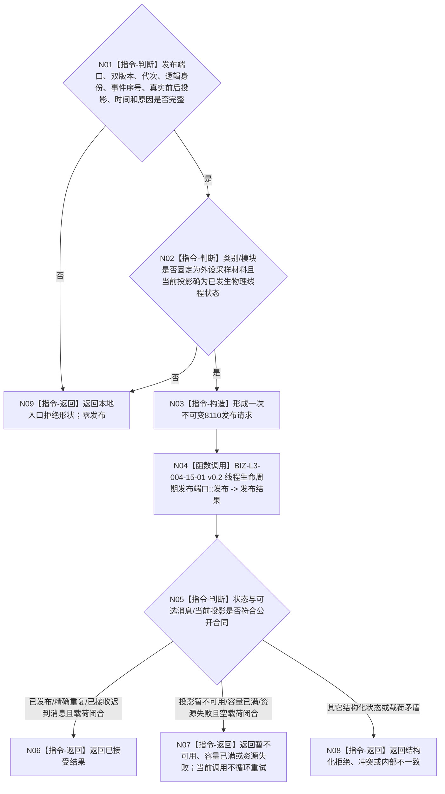

# BIZ-L2-006-05 报告一次外设线程生命周期投影目标函数流程图 v0.1

更新时间：2026-08-27

## 依据

```text
4050、8100 v0.8、8110 v0.3；父函数 BIZ-L1-T06 v0.4
HEAD 09e7b85b：线程生命周期发布端口及请求/结果ABI已发布；支持线程和自我线程已有真实调用，外设线程与启动空壳仍未接线
```

## 身份与边界

正式目标职责图。根目标只把已经发生的一次外设物理线程生命周期变化投影为现行8110公开请求，并在当前调用中恰一次调用唯一生命周期发布端口。外设采集超时、设备断开、材料过期、质量不足或观察缺口不是线程生命周期事件，必须留在006-02/006-04外设报告链。

## 函数合同

```text
根目标：报告一次外设线程生命周期投影
归属模块 / 文件 / 层级：外设线程对象的module-private薄适配 / 具体外设线程文件待T06详细设计 / BIZ-L2
现有或待新增：待适配；直接复用已发布`线程生命周期发布请求/结果`和发布端口，不新建外设专用DTO、消息形成器、第二队列或桥内重试槽
候选签名：线程生命周期发布结果 报告一次外设线程生命周期投影(线程生命周期发布端口& 端口, const 线程生命周期发布请求& 请求) noexcept
参数最低职责：现行8110公开请求；合同/消息版本、运行代次、外设线程逻辑身份、非零事件序号、可选系统线程身份、真实前一/当前投影、发生时间、原因键和可选任务/工作项诊断引用逐字段来自本次真实事件；类别/模块固定为外设采样材料
返回结果：原样保留线程生命周期发布结果；已发布、精确重复和已接收迟到消息表示已接受，其它状态保持公开分账；不携带外设报告、业务结果或待重发材料
被调函数流程图：复用 BIZ-L3-004-15-01 v0.2 线程生命周期发布端口::发布
```

## 流程图



## 节点合同

| 节点 | 类型 | 输入绑定 | 输出绑定 | 事实读写 | 验证 |
| --- | --- | --- | --- | --- | --- |
| N03 | 指令-构造 | 单次真实线程事件 | 8110公开请求 | 无 | 类别、模块、前后投影、序号与版本 |
| N04 | 函数调用 | 完整8110请求 | 公开发布结果 | 唯一生命周期消息账和当前投影 | 首次、精确重复、迟到、终态回退、冲突、暂不可用 |

## 关键边界

- 线程创建者负责创建事件；线程入口只报告实际进入后的运行、等待、停止、收尾、退出和故障事件，管理者仅在无法自行上报时按真实回收结果补充异常退出诊断。
- T01判定线程启动/完成依赖进程内进入、停产和完成见证；8110投影只服务可见性与诊断，不能替代这些内部见证。
- 发布暂不可用不允许阻塞采集、重新生成消息身份或改写外设业务状态；本函数不保存第二重发槽。若上层策略明确重放，只能原消息身份、原完整请求调用同一端口，以精确重复语义收敛。
- 外设错误只有同时造成真实线程生命周期变化时才可另外形成对应线程事件；错误报告与线程事件仍按两个独立合同分账。
