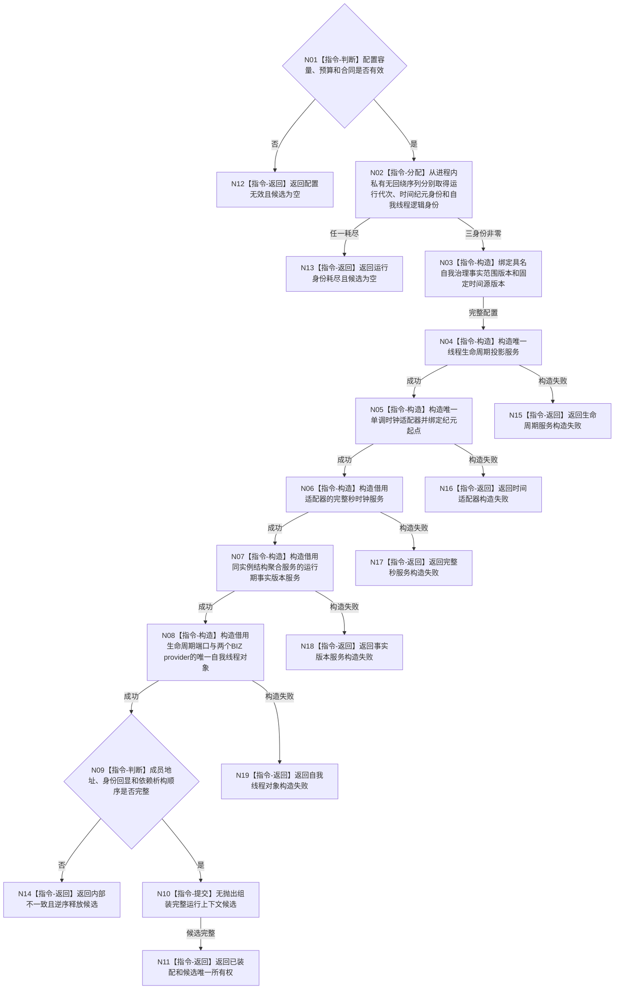

# BIZ-L3-001-01-01 装配自我治理运行上下文目标函数流程图 v0.1

更新时间：2026-08-15

## 依据

```text
0050、8110、8120 v0.10
BIZ-L2-001-01 v0.2、BIZ-L1-T02 v0.2
THREAD-LIFECYCLE-PROJECTION-SERVICE
RUNTIME-MONOTONIC-TIME-EVIDENCE-PROVIDER
RUNTIME-COMPLETE-SECOND-BOUNDARY-PROVIDER
RUNTIME-FACT-CURRENT-CUTOFF-CONSUME
RUNTIME-GOVERNANCE-CURRENT-BATCH-ASSEMBLY
```

## 身份与边界

正式目标函数设计图。该函数只在普通应用装配阶段形成运行身份和一组地址稳定的运行基础设施所有权，不启动线程、不冻结邮箱、不读取时间或事实截止，也不调用 DATA-L1—L3。

## 函数合同

```text
根函数：装配自我治理运行上下文
归属模块 / 文件 / 层级：普通应用装配内部 / 海中鱼巣/装配.普通应用.ixx / BIZ-L3
现有或待新增：待新增模块私有函数
完整签名：自我治理运行上下文装配结果 装配自我治理运行上下文(const L2结构聚合服务& 结构聚合服务, const 普通应用配置& 配置) noexcept
参数：结构聚合服务为稳定只读借用且生命周期由外层候选覆盖；配置为调用期只读借用
返回结果：成功时携带运行身份及生命周期投影服务、单调时钟适配器、完整秒服务、事实版本服务和唯一自我线程的全部唯一所有权；非成功不携带候选
被调函数流程图：无；私有无回绕身份分配是本函数内受检指令
```

## 流程图



## 节点合同

| 节点 | 类型 | 参数 / 输入绑定 | 结果 / 输出绑定 | 事实读写 | 后继条件 | 验证 |
| --- | --- | --- | --- | --- | --- | --- |
| N01 | 指令-判断 | 配置 | 准入结论 | 无 | 有效才分配 | 容量和预算边界 |
| N02 | 指令-分配 | 三个独立进程内序列 | 三个非零不透明身份 | 只写BIZ进程内分配计数；非业务事实 | 三者完整 | 并发唯一、单调、耗尽零回绕；允许跳号 |
| N03 | 指令-构造 | 三身份 | 全部provider值式配置 | 无 | 版本非零且域独立 | 禁止把数值相等解释为同一身份 |
| N04—N08 | 指令-构造 | 上一步稳定所有者 / 借用 | 五个唯一成员 | 不调用读取函数；零DATA调用 | 前置成功才继续 | 每一失败独立分账、逆序析构 |
| N09 | 指令-判断 | 完整候选 | 结构完整性 | 无 | 完整才提交 | 引用地址、配置回显、声明顺序 |
| N10 | 指令-提交 | 全部唯一所有权 | 一个完整候选 | 无 | 无抛出完成 | 零半候选发布 |
| N11—N19 | 指令-返回 | 装配结论 | 结构化结果 | 无业务事实 | 返回 | 成功恰一候选；非成功候选为空 |

## 关键边界

1. 三个运行身份只在当前进程内唯一；跨进程重启允许重新从首个非零值开始，不取得恢复或持久事实语义。
2. `自我治理事实范围版本`是本计划冻结的具名 BIZ 合同版本，不是分配身份；范围变化必须升版，不得由 DATA 当前截止或循环次数推导。
3. 本函数只构造空的 `自我线程`对象。邮箱在后继 `创建并使自我线程停在治理运行门`调用内构造；随后立即构造绑定该邮箱和两个provider的唯一路由，最后才创建物理线程。本叶仍禁止线程入口调用路由，故不会阻塞在邮箱冻结等待。
4. 父级当前治理批次处理槽由 T02 父计划拥有；实际接入首个路由调用前，后继必须冻结“停止邮箱并唤醒路由等待 -> 排空或形成未完成槽见证 -> join”的顺序，以及“路由待完成 / 父槽未完成 / 双空”互斥结果。本叶不得据此宣称停机闭环。
