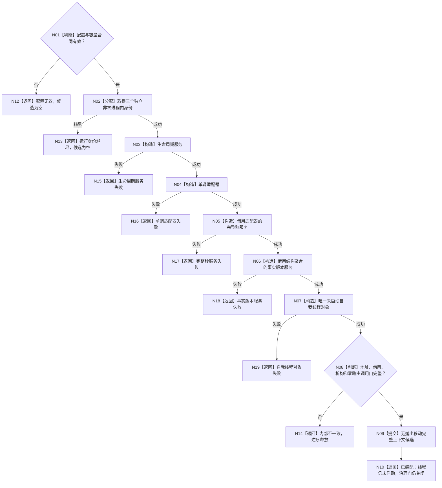

# BIZ-L3-001-01-01 装配自我治理运行上下文目标函数流程图 v0.2

更新时间：2026-08-20

计划身份：`RUNTIME-GOVERNANCE-T02-RUNTIME-CONTEXT-ASSEMBLY`

## 函数合同

```text
根函数：装配自我治理运行上下文
位置：海中鱼巣/装配.普通应用.ixx，普通应用内部私有函数
签名：自我治理运行上下文装配结果 装配自我治理运行上下文(const L2结构聚合服务&, const 普通应用配置&) noexcept
输入：同实例结构聚合服务与只读运行配置
输出：成功恰一完整候选；非成功候选为空
```

## 边界

本函数只装配未启动的生命周期/provider/self-thread对象；不创建物理线程、不打开治理门、不调用治理路由、不读取完整秒或事实截止、不写 DATA。



## 节点约束

|节点|机械约束|非成功|验证|
|---|---|---|---|
|N01|只检查配置，不带身份/时间/截止/provider指针|候选为空|零值、超上限、坏合同|
|N02|三个序列独立、非零、单调、不回绕|耗尽，允许跳号不复用|并发与源码守恒|
|N03-N07|只构造对象并形成借用，不执行读取|具名构造失败或资源/内部失败|逆序释放、零读取|
|N08|必须确认普通应用唯一owner、自我线程借用稳定、启动边界未开门、路由调用为零|内部不一致|静态引用/调用扫描|
|N09-N10|只提交完整值式候选|不得外泄半上下文|移动、地址、析构顺序|

## 启动消费边界

阶段 20 的启动协调不再局部构造自我线程；它只能调用普通应用上下文的具名“创建并使自我线程停在治理运行门”边界。该调用的 SELF 请求/结果类型以最终正式 ABI 机械匹配。本叶不在装配函数或启动协调中新增 `开放治理运行门`、`运行治理循环`或 `冻结当前治理批次`。

## 后继硬门

```text
关闭新输入 -> 停止邮箱并唤醒 -> 路由排空/待完成见证 -> 父槽互斥 -> join
```

关闭边界正式结果缺失时，N10 只表示上下文材料完整，不能表示父循环可启动、门可开放或系统已正常停止。
