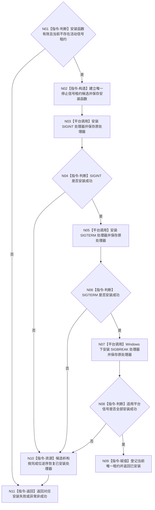

# BIZ-L3-001-02-01 安装程序停止信号目标函数流程图 v0.1

更新时间：2026-08-27

## 依据

```text
0050、8120；BIZ-L2-001-02 v0.2
HEAD 2138765a：海中鱼巣/启动.程序运行宿主.ixx
```

## 身份与边界

正式目标函数设计图。复用当前进程信号安装函数，依次替换 SIGINT、SIGTERM 和 Windows 下的 SIGBREAK 处理器；成功时返回唯一 RAII 租约，失败或租约析构时按实际完成位逆序恢复原处理器。异步信号处理器只锁存 `sig_atomic_t` 停止位，不分配内存、不停止线程、不调用领域逻辑。

运行代次由父函数 `安装程序停止来源` 绑定到租约组，当前单信号租约本身不保存运行代次；不得为了满足父图而伪称当前代码已经具备代次字段。

## 函数合同

```text
根函数：安装程序停止信号
归属模块 / 文件 / 目标分解深度：程序运行宿主 / 海中鱼巣/启动.程序运行宿主.ixx / BIZ-L3
现有或待新增：现有，可直接复用
完整签名：停止信号安装结果 安装程序停止信号(程序信号安装函数 安装函数 = 程序信号安装函数{&std::signal}) noexcept
参数：安装函数按值取得；用于安装和恢复平台信号处理器
返回结果：已安装且含唯一停止信号租约，或 SIGINT/SIGTERM/SIGBREAK 安装失败；异常收束为非成功
被调函数流程图：无；标准库 signal 调用为平台边界
父图：BIZ-L2-001-02 v0.2
```

## 流程图



## 关键边界

- 当前实现只可靠保存“是否收到任一停止信号”，不保存具体信号号、发生时间或跨来源先后；后继不得补造这些字段。
- 当前函数已经具备唯一租约、重复安装拒绝、部分安装逆序恢复和异常收束；父函数只需组合它，不应复制信号安装算法。
- 信号租约的读取适配由 BIZ-L4-001-10-01-01 承接；本函数不等待信号。
