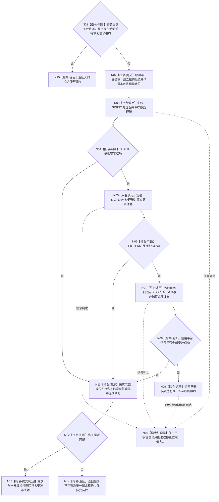

# BIZ-L3-001-02-01 安装程序停止信号目标函数流程图 v0.1

更新时间：2026-08-28

## 依据

```text
0050、8120；BIZ-L2-001-02 v0.3
已发布代码基线 HEAD：海中鱼巣/启动.程序运行宿主.ixx
```

## 身份与边界

正式目标函数设计图。复用当前进程信号安装函数，依次替换 SIGINT、SIGTERM 和 Windows 下的 SIGBREAK 处理器；成功时返回唯一租约。异步信号处理器只能给进程级 `volatile sig_atomic_t` 停止位赋值，不读取租约对象或其它普通静态对象，不分配内存、不停止线程、不调用领域逻辑。

安装开始前必须先在普通执行语境取得本进程唯一安装权并清零本轮停止位，再改变第一个处理器。因此从第一个新处理器可达起，任一信号都能锁存到同一停止位，不存在“处理器已替换但当前租约尚未发布”的丢失窗口。部分安装失败或最终释放时必须验证逆序恢复；恢复不完整时继续返还唯一剩余租约和结构化状态，不得清空占用标记或伪装资源已释放。

运行代次由父函数 `安装程序停止来源` 绑定到租约组，当前单信号租约本身不保存运行代次；不得为了满足父图而伪称当前代码已经具备代次字段。

## 函数合同

```text
根函数：安装程序停止信号
归属模块 / 文件 / 目标分解深度：程序运行宿主 / 海中鱼巣/启动.程序运行宿主.ixx / BIZ-L3
现有或待新增：现有函数需适配；公开函数身份和平台安装边界可复用
完整签名：停止信号安装结果 安装程序停止信号(程序信号安装函数 安装函数 = 程序信号安装函数{&std::signal}) noexcept
参数：安装函数按值取得；用于安装和恢复平台信号处理器
返回结果：已安装且含唯一停止信号租约；或具名入口/安装/恢复/资源/内部非成功。恢复不完整时结果仍携带唯一剩余租约；精确状态值和载荷 ABI 待详细设计冻结
被调函数流程图：无；标准库 signal 调用为平台边界
父图：BIZ-L2-001-02 v0.3；本叶是现行真实候选，不单独证明来源宇宙完整
```

## 流程图



## 关键边界

- 停止位只可靠保存“是否收到任一停止信号”，不保存具体信号号、发生时间或跨来源先后；后继不得补造这些字段。
- 唯一安装权是进程控制资源，不是业务事实。信号处理器不能通过普通指针寻找当前租约；读取、等待和父级运行代次绑定都在普通执行语境完成。
- 当前HEAD具备唯一租约、重复安装拒绝、逐信号安装和按完成位逆序恢复的基础形状，但处理器经普通静态指针写租约成员，且指针只在全部安装完成后发布；第一个处理器生效到指针发布之间可能丢失停止请求。
- 当前析构忽略恢复调用返回值并无条件清空当前租约指针，不能证明原处理器已经恢复。故代码仅部分实现，父函数可复用其平台边界，不能直接信任现有成功/释放合同。
- 信号租约的读取适配由 BIZ-L4-001-10-01-01 承接；本函数不等待信号。
