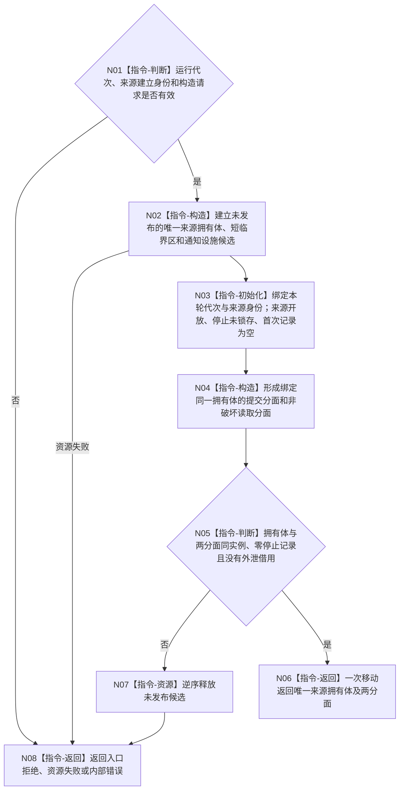

# BIZ-L3-001-02-02 构造程序控制停止来源目标函数流程图 v0.1

更新时间：2026-08-28

## 依据

```text
0050、8100 v0.7、8120 v0.10；BIZ-L2-001-02 v0.3；BIZ-L2-005-05 v0.2
BIZ-L3-005-05-02 v0.2；BIZ-L4-001-10-01-02 v0.1
```

## 身份与边界

正式目标职责图。为当前运行代次构造一个唯一拥有的程序控制停止来源，供控制面板或其它具名宿主管理入口提交不可变停止请求，供 T01 非破坏性读取。来源不是邮箱或命令总线：当前只允许一次程序停止锁存及其首次不可变记录，不存在消息队列、容量、出队、优先级或通用控制类型。

同一拥有体必须同时承载运行代次、开放/关闭状态、可空首次停止记录、与记录同一线性化点形成的停止锁存，以及只负责唤醒等待者的非权威通知设施。提交能力和读取能力可以分面交付，但都不能长于唯一拥有体。

## 函数合同

```text
根目标：构造程序控制停止来源
归属模块 / 文件 / 目标分解深度：程序控制停止来源 / 物理模块待统一详细设计选择 / BIZ-L3
现有或待新增：待新增
候选签名：程序控制停止来源构造结果 构造程序控制停止来源(const 程序控制停止来源构造请求& 请求) noexcept
参数最低职责：非零运行代次和来源建立身份；不得携带队列容量或默认停止请求
返回结果最低职责：成功时返回唯一来源拥有体及绑定同一实例的提交/读取分面；非成功时无可见半来源并结构化分账入口、资源和内部错误
被调函数流程图：无；拥有体、首次记录空槽、停止锁存和通知设施均为本函数内资源构造
父图：BIZ-L2-001-02 v0.3；本叶只保留候选职责，不证明必属来源全集
施工门禁：与005-05/001-10共享的来源DTO、分面、版本、关闭线性化点和非成功矩阵一次冻结
```

## 流程图



## 关键边界

- 构造成功不得自动形成停止请求、首次记录或停止锁存；无窗口模式建立来源也不能补造一个默认生产者。
- BIZ-L2-005-05只经提交分面原子形成首次记录和停止锁存；BIZ-L4-001-10-01-02只经读取分面非破坏性重读。两者共享拥有体，但互不取得对方能力。
- 同一运行代次最多一份首次记录。后到请求按精确重复、幂等冲突或既有停止已锁存分账，不进入第二队列项。
- 通知只在锁存提交后最佳努力唤醒 T01；通知丢失、合并或延迟不能改变来源权威状态，读取端必须重读锁存和首次记录。
- 无窗口模式仍可保留该来源供具名宿主管理入口使用；若当前没有生产者，来源保持开放且未锁存，不得据此零动作停止。
- 来源租约覆盖等待、收口和最终停止材料汇总。关闭后拒绝首次提交，但既有完整锁存仍可读；精确关闭矩阵待同一详细设计冻结。
