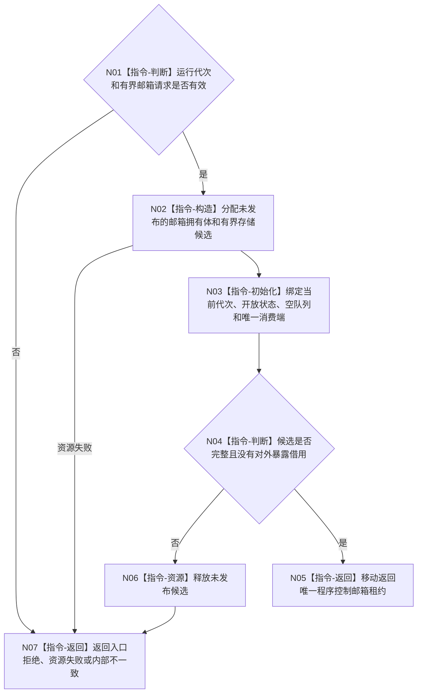

# BIZ-L3-001-02-02 构造程序控制邮箱目标函数流程图 v0.1

更新时间：2026-08-27

## 依据

```text
0050、8110、8120；BIZ-L2-001-02 v0.2；BIZ-L2-005-05 v0.2；确认稿第30项
```

## 身份与边界

正式目标函数设计图。为当前运行代次构造一个有界、唯一拥有的程序控制邮箱，供控制面板或其它正式宿主控制入口提交不可变程序停止控制消息，供 T01 唯一消费。邮箱不是业务邮箱，不承载需求、任务、世界事实、线程生命周期投影或人读 UI 文本。

本图冻结目标函数和资源行为，不宣称目标 DTO、枚举数值、容量上限、锁实现或协议版本已经由正式规范发布；这些字段必须在代码计划前由详细设计逐项冻结。

## 函数合同

```text
根函数：构造程序控制邮箱
归属模块 / 文件 / 目标分解深度：程序控制消息 / 海中鱼巣/线程/程序控制邮箱.ixx / BIZ-L3
现有或待新增：待新增
完整签名：程序控制邮箱构造结果 构造程序控制邮箱(const 程序控制邮箱构造请求& 请求) noexcept
参数：请求为只读借用；至少绑定非零运行代次和合法有界容量，逐字段 ABI 待详细设计冻结
返回结果：成功时返回唯一程序控制邮箱租约；非成功时无可见半邮箱并结构化分账入口、资源和内部错误
被调函数流程图：无；有界存储与同步原语构造为本函数内资源操作
父图：BIZ-L2-001-02 v0.2
```

## 流程图



## 关键边界

- 无窗口模式仍保留程序控制邮箱，以便正式宿主管理入口提交停止请求；没有 T05 不等于邮箱无需存在。
- 消息形成与提交由 BIZ-L2-005-05 及其子图负责；本函数不生成默认停止消息，也不把窗口关闭直接写成停止阶段。
- 邮箱租约必须覆盖运行等待、T05 输入门冻结和最终停止材料汇总；析构只释放进程内控制资源，不写业务事实。
