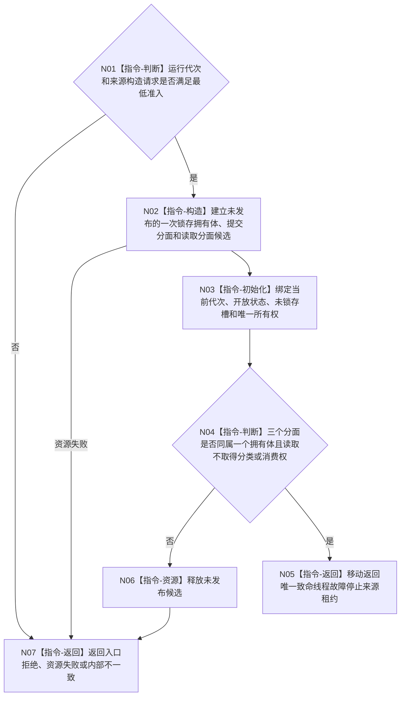

# BIZ-L3-001-02-03 构造致命线程故障停止来源目标函数流程图 v0.1

更新时间：2026-08-28

## 依据

```text
0050、8100、8110、8120；BIZ-L2-001-02 v0.2；确认稿第30项
```

## 身份与边界

正式目标职责图。为当前运行代次构造唯一的宿主致命线程故障停止来源，向合法生产者提供受约束提交分面，向 T01 提供非破坏性读取分面。来源只接受外部具名分类合同已经裁决为“必须停止本运行代次”的不可变故障材料；它不订阅或扫描 8110 生命周期投影，也不把普通退出、堵塞、控制面板故障、可选外设故障、日志失败或普通业务非成功升级为致命。

来源不是观察邮箱、候选组缓存或故障历史账。构造成功时当前代次保持“开放且未锁存”，不把没有生产者或没有已分类材料解释成运行安全；首次合法提交只形成一次停止锁存和一份不可变首次记录，后继读取不移动、不删除、不确认消费。

本图不定义哪些故障致命，也不冻结分类生产者、提交 DTO、结果状态、稳定枚举或关闭协议。该缺口统一登记为 `DRIFT-BIZ-HOST-FATAL-FAULT-CLASSIFIER-AND-SOURCE-ABI-UNFROZEN`；在其闭合前本目标不得进入代码计划，不能从 8110、日志或普通故障补造生产者。

## 函数合同

```text
根函数：构造致命线程故障停止来源
归属模块 / 文件 / 目标分解深度：程序运行宿主 / 海中鱼巣/启动.程序运行宿主.ixx / BIZ-L3
现有或待新增：待新增；受 DRIFT-BIZ-HOST-FATAL-FAULT-CLASSIFIER-AND-SOURCE-ABI-UNFROZEN 限制
候选签名：致命线程故障停止来源构造结果 构造致命线程故障停止来源(const 致命线程故障停止来源构造请求& 请求) noexcept
参数最低职责：绑定非零运行代次和同一来源拥有体的构造协议；不得携带观察游标、观察批序号、业务事实截止或候选容量
返回结果最低职责：成功时返回唯一来源租约及受约束提交/读取分面；非成功时无可见半来源并结构化分账入口、资源和内部错误；逐字段 ABI 待具名 DRIFT 闭合
被调函数流程图：无；进程内一次锁存拥有体和同步原语构造为本函数内资源操作
父图：BIZ-L2-001-02 v0.2
```

## 流程图



## 关键边界

- 首次合法提交的线性化、精确重复、同键异义、来源关闭和结果未知如何收束，必须由具名 DRIFT 的最终 ABI 冻结；本图不以“有一个槽”冒充这些语义已经完成。
- 8110 线程生命周期消息、控制面板显示、日志和健康摘要都不是该来源的提交材料或致命分类权威。
- T01 的本地观察批序号只用于一次组合读取的值式包络，不进入本来源，不持久化，也不成为提交或读取前置。
- 当前最小来源只保证首个已接受致命停止材料可重复读取。若最终程序结果需要保存全部后到故障、按严重度选择或枚举补充历史，必须另行冻结保存 owner、排序、完整性和读取合同；不得把一次锁存来源扩写成隐式历史队列。

## 2026-08-28 校正记录

- 从“观察端口 / 空候选组 / 有界观察状态”收紧为“一次停止锁存来源 / 首次不可变记录”。
- 删除来源对观察序号和业务事实截止的依赖；这些都不是宿主停止来源事实。
- 将分类生产者、提交/读取逐字段 ABI 及后到故障历史语义统一登记为具名 DRIFT，保持代码未实现边界。
