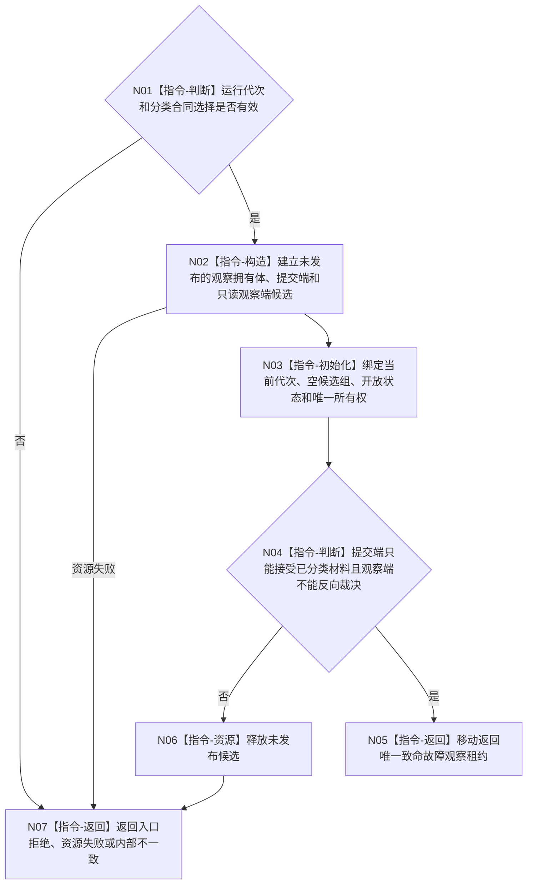

# BIZ-L3-001-02-03 构造致命线程故障观察端口目标函数流程图 v0.1

更新时间：2026-08-27

## 依据

```text
0050、8100、8110、8120；BIZ-L2-001-02 v0.2；确认稿第30项
```

## 身份与边界

正式目标函数设计图。为当前运行代次构造唯一的宿主致命故障观察端口，接收由外部具名分类合同已经裁决为“必须停止本运行代次”的不可变故障材料，并供 T01 只读观察。端口不订阅或扫描 8110 生命周期投影，不把普通退出、堵塞、控制面板故障、可选外设故障、日志失败或普通业务非成功升级为致命。

本图不定义“哪些故障致命”，也不冻结分类生产者、故障 DTO 字段顺序或稳定枚举值；这些是当前实现前必须闭合的专属详细设计输入。端口构造完成只证明观察基础设施存在，不证明已经存在任何合法致命故障生产者。

## 函数合同

```text
根函数：构造致命线程故障观察端口
归属模块 / 文件 / 目标分解深度：程序运行宿主 / 海中鱼巣/启动.程序运行宿主.ixx / BIZ-L3
现有或待新增：待新增
完整签名：致命线程故障观察端口构造结果 构造致命线程故障观察端口(const 致命线程故障观察端口构造请求& 请求) noexcept
参数：请求为只读借用；至少绑定非零运行代次和具名致命分类合同选择，逐字段 ABI 待详细设计冻结
返回结果：成功时返回唯一观察租约及受约束提交端；非成功时无可见半端口并结构化分账入口、资源和内部错误
被调函数流程图：无；进程内有界观察状态和同步原语构造为本函数内资源操作
父图：BIZ-L2-001-02 v0.2
```

## 流程图



## 关键边界

- 观察端口不是 8110 生命周期消息缓存的别名，也不是日志、UI 或健康摘要的第二权威。
- 合法提交者必须先依据专属致命性合同形成稳定故障身份、当前运行代次和来源见证；合同未冻结时生产提交保持不可实施，而不是默认全部故障致命或全部忽略。
- 后到的更严重致命故障只能补充最终程序结果，不撤销、倒退或重新开放已经锁存的停止阶段。
