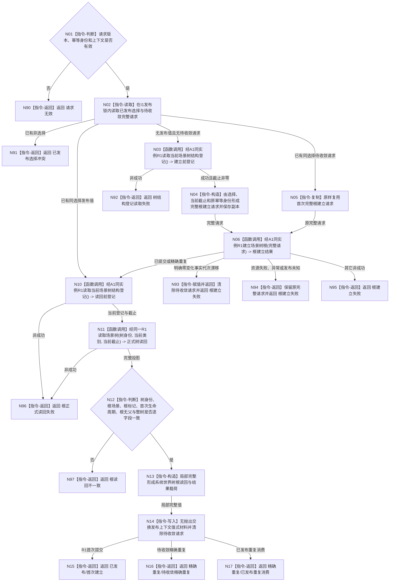

# BIZ-L3-001-03-00 初始化并发布系统具名场景树根目标函数流程图 v0.1

更新时间：2026-08-27

## 依据

```text
0050、4190、4200、4230、7130、8120 v0.10
规范/详细设计/20260812_SYSTEM-WORLD-TREE-ROOT-PUBLISH-I1_系统具名场景树根建立与正式读回发布详细设计_v0.2.md
计划/过期计划/20260812_SYSTEM-WORLD-TREE-ROOT-PUBLISH-I1_系统具名场景树根建立与正式读回发布代码实施切片_v0.2.md
父图：BIZ-L2-001-03 初始化普通系统
```

## 身份与边界

正式目标函数设计图。`BIZ-L3` 只表示目标分解深度，不是数据服务 L3。本图冻结 I1 一份根函数合同：L5 之外生产调用方明确本运行期的项目具名场景树选择，经 A1 透明取得同一 R1 场景服务，建立或按原请求收敛根，并在 R1 正式整树读回成功后才向普通应用上下文发布调用方拥有的值式根材料。

I1 不是基础数据 owner，不复制 R1 CRUD，不建立或解释自我、概念、需求、任务、方法、状态、动态或因果。I1 成功只把同次值式结果交给 I2；阶段 15 已退役且数值不复用。

## 函数合同

```text
根函数：初始化并发布系统世界树根
归属模块 / 文件 / 目标分解深度：目标归属为系统世界树根业务初始化 / 目标生产位置 `海中鱼巣/业务/初始化.系统世界树根.ixx`；HEAD 当前物理实现为 `海中鱼巣/业务/初始化.系统世界树根.inl` 加 `海中鱼巣/装配.普通应用.ixx` 薄 wrapper / BIZ-L3
现有或待新增：已实现并接入正式普通启动；DTO 位于 `业务/系统世界树根初始化.数据.h`，单源编排位于 `业务/初始化.系统世界树根.inl`，薄 wrapper 与上下文发布槽位于 `装配.普通应用.ixx`
完整签名：系统世界树根初始化结果 初始化并发布系统世界树根(普通应用上下文& 上下文, const 系统世界树根初始化请求& 请求) noexcept
参数：
  上下文：可修改借用；调用期间有效；必须持有唯一 A1 及同实例 R1；只允许 I1 friend 修改私有过程槽和值式发布槽
  请求：const 只读借用；合同版本为 1；根建立幂等身份非零；正式运行使用项目固定默认值，但该值不是树身份或跨进程项目身份
返回结果：
  系统世界树根初始化结果；成功仅为已发布或精确重复并携带完整已发布根材料；非成功不得携带已发布根，不得把 R1 非成功翻译成成功
被调函数流程图：R1 建立场景树根与读取场景树属于基础数据服务正式接口，其单函数实现图由对应代码图谱维护者独立维护
父图：BIZ-L2-001-03
```

## 流程图



## 节点合同

| 节点 | 类型 | 参数 / 输入绑定 | 结果 / 输出绑定 | 事实读写 | 后继条件 | 验证 |
| --- | --- | --- | --- | --- | --- | --- |
| N01 | 指令-判断 | 上下文、请求 | 准入分类 | 零数据写入 | 有效才进入发布锁 | 无效版本、零身份、缺服务均零 R1 调用 |
| N02 | 指令-读取 | 上下文私有过程槽和值式发布槽 | 已发布 / 待收敛分类 | 只读 I1 过程状态 | 同选择进入收敛或重读；异选择拒绝 | 并发串行、异选择零第二根写 |
| N03 | 函数调用 | 无根选择推断；经 A1 取得同一 R1 | 建立前当前登记及非零截止 | 只读 R1 当前结构 | 成功才形成首次完整请求 | A1、直接 getter、I1 三者 R1 同址 |
| N04—N05 | 本函数内指令 | 选择、截止、原幂等身份或已保存请求 | 一份不可改义的完整根建立请求 | 只写 I1 待收敛过程槽，不是机器根事实 | 原请求进入 N06 | 重试不得换键、重组可能已发布请求 |
| N06 | 函数调用 | 完整根建立请求 -> R1 请求 | R1 根建立结果 | 只有 R1 场景 owner 可以发布根结构 | 已提交 / 精确重复进入正式读回 | 首次、精确重复、漂移、资源 / 未知发布分账 |
| N10 | 函数调用 | 经同一 A1/R1，不从缓存取截止 | 读回前当前登记 | 只读 R1 | 成功且截止非零进入 N11 | 每次 I1 成功都执行本轮登记读取 |
| N11 | 函数调用 | 树身份、当前类别、当前截止 | R1 正式整树投影 | 只读 R1 | 完整投影进入逐字段互证 | 根权威只由该正式读回证明 |
| N12 | 指令-判断 | 根建立材料、正式整树投影、保存的首次事实 | 一致 / 不一致 | 无写入 | 一致才允许发布上下文值 | 根身份、标记、生命周期、无父和完整性逐项覆盖 |
| N13—N14 | 指令-构造 / 写入 | 完整局部候选 | 调用方拥有的值式发布材料 | 只更新 I1 上下文副本；不写 R1 | 无抛出交换完成后成功返回 | 交换前失败保留旧发布值和待收敛请求 |
| N15—N17 | 指令-返回 | R1 来源与本轮完整材料 | 三种唯一成功形状 | 无新增事实 | 父图把同次结果直接交 I2 | 同请求重复零 R1 写但必须重新正式读回 |
| N90—N97 | 指令-返回 | 实际失败前阶段材料 | 具名非成功 | 不撤销已发布 R1 根，不另键重建 | 函数结束 | 非成功 optional 形状、事实零变化或原请求保留 |

## 关键边界

```text
I1 业务选择与结果解释位于 L5 之外
-> A1 只透明提供同实例 R1，零根写、零结果解释
-> R1 只执行场景树纯结构创建与读取，不判断“现实世界”资格
-> 根权威只在 R1 场景 owner 的根标记、树归属和场景结构事实
-> I1 请求、固定幂等身份、返回值、上下文副本和缓存均不是根事实
```

- I1 成功直接把同次 `系统世界树根读回` 交给 I2。I2 重新经 A1/R1 正式读回；I2 不反向调用 I1 getter、不持有 I1 引用，因此运行依赖和实现依赖均是单向的。
- I1 失败由生产调用方映射阶段 14。阶段 15 已退役且数值永久不复用；I2 失败为阶段 16、真实自我缺失 / 失败为阶段 17、存在 / 特征 / 动态 / 因果链四个语言无关概念本体根生产初始化缺失 / 失败为阶段 18。
- R1 已发布但 I1 读回、局部构造或交换失败时不得撤销、换键或建立第二根；保留原完整请求后继收敛。
- 当前没有跨进程恢复合同。固定幂等身份只约束同一运行期建立意图；不得扫描非空旧域、按无父场景、名称、第一棵树、SQL、缓存或旧自我快照认领根。
- HEAD `a64e743d` 已包含 R1、A1、I1 与正式 `运行普通程序` 调用，并在 I1 成功后同次进入 I2；本图仍不以静态存在替代构建、动态专项或独立集成验收。

## 验证映射

1. 无效版本、零身份和异选择在 R1 写前拒绝，权威事实零变化。
2. 首次调用只接受 R1 `已提交` 且正式整树读回逐字段完整，随后返回 `已发布/首次建立`。
3. 待收敛精确重复必须原样重放首次完整请求；资源失败和发布未知不得换键。
4. 已发布同请求重复零 R1 写，但必须执行本轮登记读取与正式整树读取，返回 `精确重复/已发布重复消费`。
5. 根建立后读回失败或坏成功形状不发布新上下文值；既有发布值保持不变。
6. 上下文 getter 按值隔离；修改调用方副本不改变 R1 或上下文保存值。
7. A1 getter、普通应用直接场景 getter和 I1 实际 R1 对象同址，A1 零新增写函数。
8. HEAD 正式生产调用方已具备阶段 14 映射并在 I1 成功后连续调用 I2；本批只静态复核该调用边，动态回归未重跑，且不得出现阶段 15。
9. I1 两路都不安装停止信号、不进入控制面板、宿主、方法根、自我线程或概念初始化；只有后继阶段全部解除后才可达。
10. 分配失败、跨进程恢复、非空旧域迁移、长时并发和独立集成验收未实际执行时必须明确标记 `NOT_RUN`。
