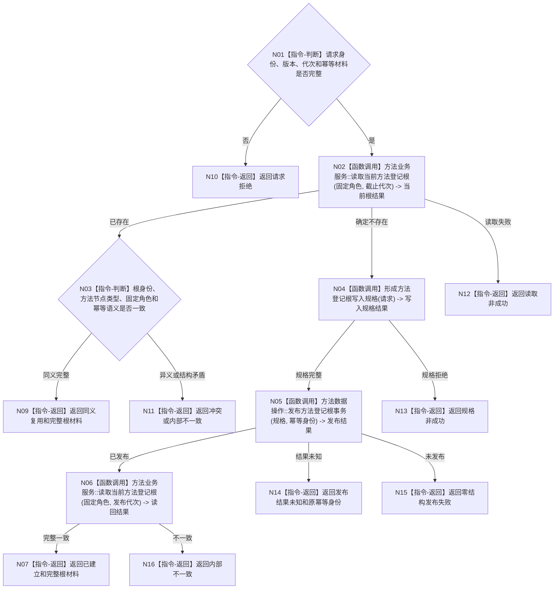

# BIZ-L3-001-03-01 初始化方法登记根目标函数流程图 v0.1

更新时间：2026-08-03

## 依据

```text
0050、3300、5300、8120；BIZ-L2-001-03；当前领域/方法服务.h
```

## 身份与边界

正式目标函数设计图。方法登记根是永久系统角色根，不是可执行方法首；不得用共享抽象状态或模板关系冒充方法首的关系23生命周期。

## 函数合同

```text
根函数：初始化方法登记根
归属模块 / 文件 / 层级：方法领域服务 / 海中鱼巣/领域/服务.方法.ixx / L3
现有或待新增：目标替换；现行同名入口的稳定键和幂等读回可参考，旧模板生命周期结构不得复用
完整签名：方法登记根初始化结果 方法服务::初始化方法登记根(const 方法登记根初始化请求& 请求)
参数：请求为只读借用；含运行代次、固定系统角色稳定主键、方法根规则版本、预期事实代次和幂等身份；零身份或版本不支持必须拒绝
返回结果：方法登记根初始化结果；含已建立、同义复用、请求拒绝、版本漂移、发布结果未知或内部不一致，以及调用方拥有的完整根材料和发布代次
被调函数流程图：BIZ-L4-001-03-01-01 读取当前方法登记根；BIZ-L4-001-03-01-02 形成方法登记根写入规格；BIZ-L4-001-03-01-03 发布方法登记根事务
父图：BIZ-L2-001-03
```

## 流程图



## 节点合同

| 节点 | 类型 | 输入 | 输出 | 事实读写 | 验证 |
| --- | --- | --- | --- | --- | --- |
| N01/N03 | 指令-判断 | 请求或当前根 | 准入/同义结论 | 无 | 零键、错类型、异义重复 |
| N02/N06 | 函数调用 | 固定角色和代次 | 不可变根投影 | 只读已发布事实 | 登记投影清空后仍等价 |
| N04—N05 | 函数调用 | 请求和幂等身份 | 写入规格与发布结果 | 方法领域唯一写入；原子发布新代次 | 故障点和结果未知 |
| 返回节点 | 指令-返回 | 结构化结论 | 初始化结果 | 不补造生命周期 | 精确状态守恒 |

## 关键边界

方法登记根只建立固定根身份及登记角色。普通方法首以后必须拥有唯一治理虚拟存在并按关系23形成自身生命周期；根不得共享或替代这些事实。
