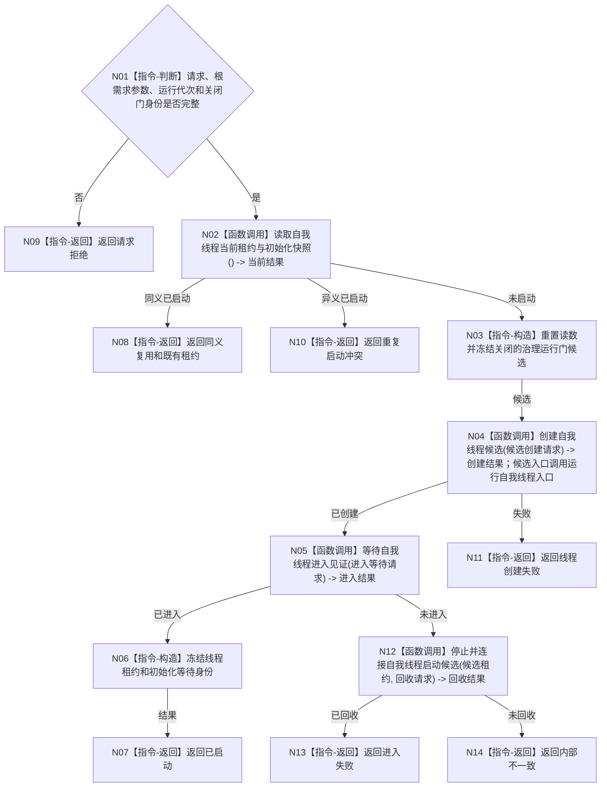

# BIZ-L3-001-03-02 启动自我线程目标函数流程图 v0.1

更新时间：2026-08-03

> 历史冻结（2026-08-14）：本图已退出 `BIZ-L2-001-03` 当前直接子图，不得施工、改名复活或隐式改挂未来 `BIZ-L3-001-03-10`。阶段18后的自我线程启动顺序、函数与 DTO 必须由未来 03-10 独立重新设计。

## 依据

```text
8100、8110、8120；BIZ-L2-001-03、BIZ-L2-001-08；当前线程/自我线程.ixx
```

## 身份与边界

正式目标函数设计图。启动唯一自我线程执行初始化；初始化成功后必须停在关闭的治理运行门，不得直接处理治理邮箱。

## 函数合同

```text
根函数：启动自我线程
归属模块 / 文件 / 层级：自我线程 / 海中鱼巣/线程/自我线程.ixx / L3
现有或待新增：适配扩展；复用线程创建和初始化体，增加运行代次、门身份和关闭门后置条件
完整签名：自我线程启动结果 自我线程::启动(const 自我线程启动请求& 请求)
参数：请求为只读借用；含运行代次、根需求初始化参数、关闭的治理运行门身份、初始化规则版本、线程逻辑身份和启动幂等身份
返回结果：自我线程启动结果；含已启动、同义复用、请求拒绝、重复冲突、线程创建失败或内部不一致，以及线程租约和初始化等待身份
被调函数流程图：BIZ-L4-001-03-02-01 创建自我线程候选；BIZ-L4-001-03-02-02 运行自我线程入口；BIZ-L4-001-03-02-03 等待自我线程进入见证；BIZ-L4-001-03-02-04 停止并连接自我线程启动候选
父图：BIZ-L2-001-03
```

## 流程图



## 节点合同

| 节点 | 类型 | 输入 | 输出 | 事实读写 | 验证 |
| --- | --- | --- | --- | --- | --- |
| N01 | 指令-判断 | 启动请求 | 准入 | 无 | 错代、无效参数、开放门 |
| N02 | 函数调用 | 当前线程状态 | 值式当前结果 | 只读线程投影和初始化快照 | 同义/异义重复 |
| N03—N05/N12 | 指令/函数调用 | 线程规格 | 门候选、移动租约、进入和回收结果 | 只改线程运行状态和8110投影；初始化入口调用各领域正式初始化服务 | 创建失败、进入超时、未回收租约 |
| 返回节点 | 指令-返回 | 启动结论 | 结构化结果 | 不处理治理消息 | 租约唯一性 |

## 关键边界

启动成功只证明指定线程候选已发布初始化进入见证；世界树、语素和根需求是否完整由后续等待与快照读回裁决。进入失败后的候选回收只回收线程资源，不删除已经正式发布的幂等初始化事实，也不替代普通运行期分阶段停机。
