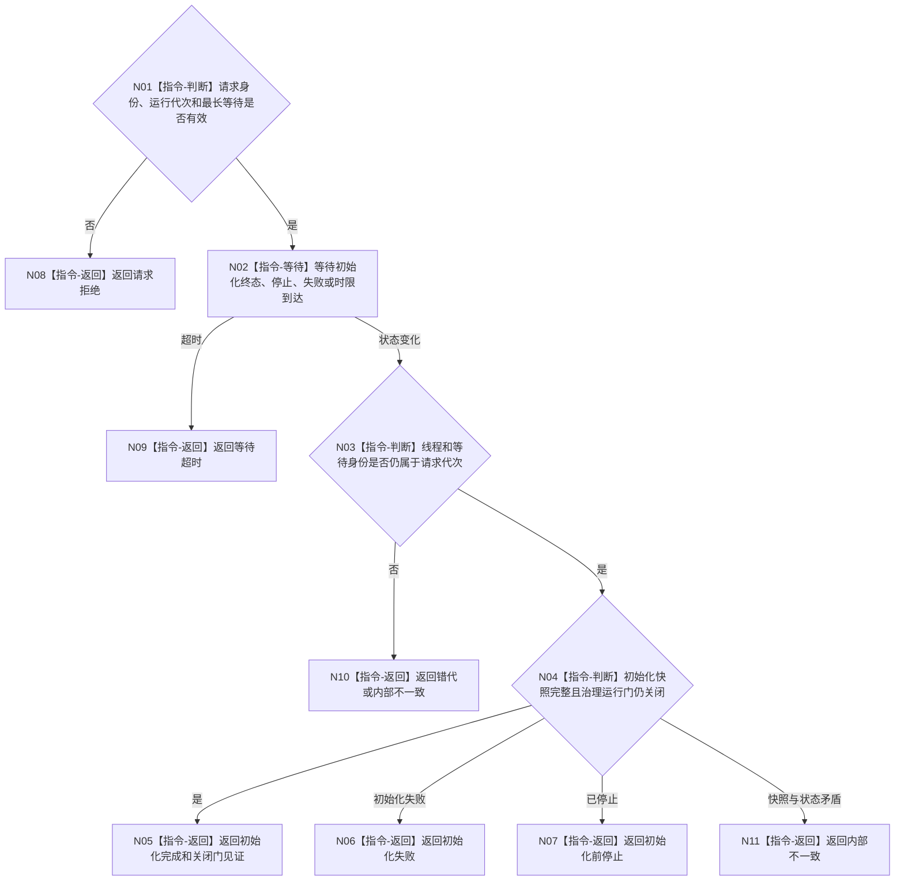

# BIZ-L3-001-03-03 等待自我线程初始化目标函数流程图 v0.1

更新时间：2026-08-03

> 历史冻结（2026-08-14）：本图已退出 `BIZ-L2-001-03` 当前直接子图，不得施工、改名复活或隐式改挂未来 `BIZ-L3-001-03-10`。旧初始化等待不属于当前 I1→I2→SELF-FORM→阶段18连续链。

## 依据

```text
8100、8110、8120；BIZ-L2-001-03；当前线程/自我线程.ixx
```

## 身份与边界

正式目标函数设计图。等待具名初始化完成、失败或超时；不把“线程运行中”当作初始化完成。

## 函数合同

```text
根函数：等待自我线程初始化
归属模块 / 文件 / 层级：自我线程 / 海中鱼巣/线程/自我线程.ixx / L3
现有或待新增：目标替换；现行bool结果和运行中判断不足以证明治理门关闭
完整签名：自我线程初始化等待结果 自我线程::等待初始化完成(const 自我线程初始化等待请求& 请求) const
参数：请求为只读借用；含运行代次、线程租约身份、初始化等待身份、期望关闭门身份和正的最长等待
返回结果：自我线程初始化等待结果；含初始化完成且门关闭、等待超时、初始化失败、已停止、错代或内部不一致
被调函数流程图：无；条件变量等待是线程同步内部实现
父图：BIZ-L2-001-03
```

## 流程图



## 节点合同

| 节点 | 类型 | 输入 | 输出 | 事实读写 | 验证 |
| --- | --- | --- | --- | --- | --- |
| N01 | 指令-判断 | 等待请求 | 准入 | 无 | 零时限和错租约 |
| N02 | 指令-等待 | 等待身份和时限 | 唤醒原因 | 无业务写入 | 伪唤醒、超时、并发停止 |
| N03—N04 | 指令-判断 | 状态、快照和门 | 终态分类 | 只读线程内部状态 | 快照/门/状态组合矩阵 |
| 返回节点 | 指令-返回 | 分类 | 结构化等待结果 | 无 | 每类结果唯一 |

## 关键边界

当前实现以“运行中”作为等待成功，目标实现必须改为“初始化快照完整且治理门关闭”；门开放由BIZ-L2-001-08独占。
