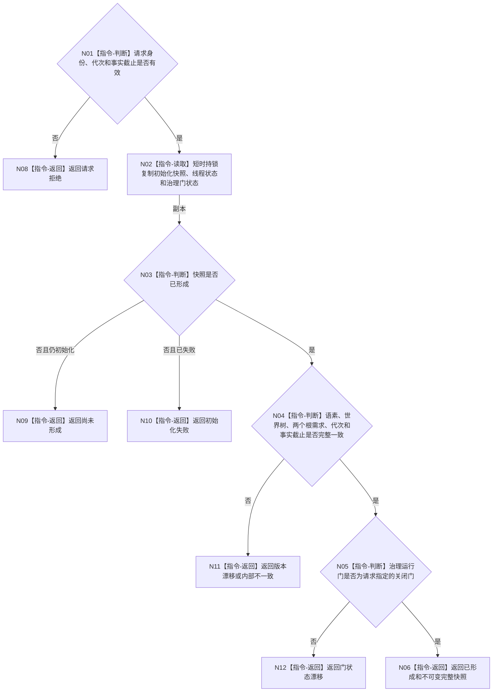

# BIZ-L3-001-03-04 读取自我线程初始化快照目标函数流程图 v0.1

更新时间：2026-08-03

## 依据

```text
0050、8100、8120；BIZ-L2-001-03；当前线程/自我线程.ixx
```

## 身份与边界

正式目标函数设计图。返回调用方拥有的不可变初始化快照及治理门见证，不泄漏线程内部引用。

## 函数合同

```text
根函数：读取自我线程初始化快照
归属模块 / 文件 / 层级：自我线程 / 海中鱼巣/线程/自我线程.ixx / L3
现有或待新增：适配扩展；复用加锁复制，增加请求、运行代次和结构化非成功
完整签名：自我线程初始化快照结果 自我线程::读取初始化快照(const 自我线程初始化快照请求& 请求) const
参数：请求为只读借用；含运行代次、线程租约身份、初始化代次、期望事实截止和关闭门身份
返回结果：自我线程初始化快照结果；含已形成、尚未形成、初始化失败、错代、版本漂移或内部不一致，以及语素、世界树、两个根需求和关闭门见证的不可变副本
被调函数流程图：无；加锁读取和复制为本函数内部实现
父图：BIZ-L2-001-03
```

## 流程图



## 节点合同

| 节点 | 类型 | 输入 | 输出 | 事实读写 | 验证 |
| --- | --- | --- | --- | --- | --- |
| N01 | 指令-判断 | 快照请求 | 准入 | 无 | 错代和无效截止 |
| N02 | 指令-读取 | 线程内部状态 | 调用方副本 | 短时锁内只复制 | 并发初始化与停止 |
| N03—N05 | 指令-判断 | 副本 | 完整性分类 | 无写入 | 五项组合和门状态 |
| 返回节点 | 指令-返回 | 分类 | 结构化快照结果 | 不补默认值 | 尚未形成与失败分离 |

## 关键边界

`std::optional`空值不足以区分尚未形成、失败和错代；目标结果必须保留具名原因和完整版本。
