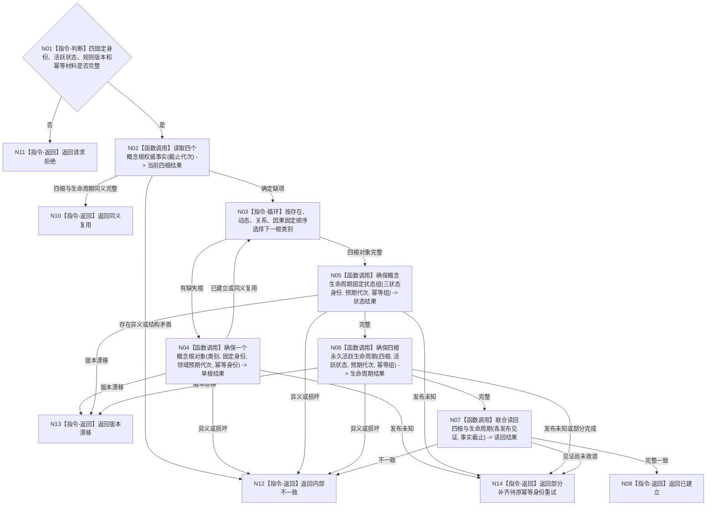

# BIZ-L3-001-03-05 初始化概念图四根目标函数流程图 v0.1

更新时间：2026-08-03

> 状态：历史失效
>
> 替代：`BIZ-L3-001-03-09`
>
> 以下正文仅保留历史证据，不得作为规范、详细设计、计划或施工依据。其“存在 / 动态 / 关系 / 因果四对象领域、关系 12、三个固定生命周期状态”语义已永久退出。

## 依据

```text
0050、4190、7140、8120；BIZ-L2-001-03；当前领域/初始化.概念图.ixx
```

## 身份与边界

正式目标函数设计图。四根由固定系统角色身份、本类对象结构和关系12永久活跃事实共同成立；登记数组、名称和活动投影不参与根身份裁决。四个对象领域分别拥有各自根对象写权，概念图领域拥有关系12和生命周期编排权；本函数按领域逐项幂等补齐并最终联合只读验证，不把四个独立对象写集伪装成一次跨四领域原子事务。

## 函数合同

```text
根函数：初始化概念图四根
归属模块 / 文件 / 层级：概念图初始化服务 / 海中鱼巣/领域/初始化.概念图.ixx / L3
现有或待新增：目标替换；现行根创建顺序可参考，运行期登记投影和名称不得作为权威完成条件
完整签名：概念图初始化结果 概念图初始化服务::初始化四个根(const 概念图初始化请求& 请求)
参数：请求为只读借用；含运行代次、事实截止、四类固定系统角色稳定主键、活跃/冷却/退役固定状态身份、7140规则版本、各领域预期事实代次和逐根幂等身份
返回结果：概念图初始化结果；含已建立、同义复用、请求拒绝、部分补齐待重试、版本漂移、发布结果未知或内部不一致，以及四根、三个固定生命周期状态、关系12材料和逐领域发布见证
被调函数流程图：BIZ-L4-001-03-05-01读取四个概念根权威事实、BIZ-L4-001-03-05-02确保一个概念根对象、BIZ-L4-001-03-05-03确保概念生命周期固定状态组、BIZ-L4-001-03-05-04确保四根永久活跃生命周期、BIZ-L4-001-03-05-05联合读回四根与生命周期
父图：BIZ-L2-001-03
```

## 流程图



## 节点合同

| 节点 | 类型 | 输入 | 输出 | 事实读写 | 验证 |
| --- | --- | --- | --- | --- | --- |
| N01/N03 | 指令-判断 / 循环 | 请求和缺失根类别 | 准入或下一根 | 无 | 固定身份、固定顺序和逐根幂等 |
| N02/N07 | 函数调用 | 截止或逐领域发布见证 | 四根、固定状态与关系12投影 | 只读权威事实 | 投影清空后等价 |
| N04—N06 | 函数调用 | 固定身份、预期代次和幂等材料 | 逐领域发布结果 | 各对象领域独立写根；概念图领域写状态与关系12 | 失败可重试且已发布事实不回滚 |
| 返回节点 | 指令-返回 | 分类 | 结构化初始化结果 | 不用名称/登记补造 | 结果状态守恒 |

## 关键边界

四根不持久化普通概念签名记录，不允许冷却、退役或删除。任一轮中已发布的根对象或生命周期事实不得因后项失败回滚；后续只使用原固定身份和幂等身份补齐。只有联合读回四根、三个固定状态和四条当前关系12完整后，启动层才返回“已建立”。名称语素和登记投影只能在此后派生，失败不能否定已发布根事实。
