# BIZ-L3-001-03-06 确保存在实例根支持目标函数流程图 v0.1

更新时间：2026-08-03

> 历史冻结（2026-08-14）：本图已退出 `BIZ-L2-001-03` 当前直接子图，不得施工、改名复活或隐式改挂未来 `BIZ-L3-001-03-10`。阶段18只初始化四个空本体根，不建立自我存在或其它世界事实的概念支持。

## 依据

```text
0050、4010、4040、7110、7140、8120；BIZ-L2-001-03；当前领域/概念图服务.h
```

## 身份与边界

正式目标函数设计图。只为一个已发布存在实例确保一条指向存在概念根的关系9；不创建存在、不靠登记投影猜测根。

## 函数合同

```text
根函数：确保存在实例根支持
归属模块 / 文件 / 层级：概念图领域服务 / 海中鱼巣/领域/服务.概念图.ixx / L3
现有或待新增：适配扩展；现行类别复核和幂等关系创建可参考，返回值和权威读回需结构化
完整签名：存在实例根支持结果 概念图服务::确保存在实例根支持(const 存在实例根支持请求& 请求)
参数：请求为只读借用；含运行代次、存在实例完整身份、存在根固定身份、7140规则版本、预期事实代次和关系9幂等身份
返回结果：存在实例根支持结果；含已建立、同义复用、请求拒绝、版本漂移、发布结果未知或内部不一致，以及关系9材料和发布代次
被调函数流程图：BIZ-L4-001-03-06-01 读取存在实例与存在根支持事实；BIZ-L4-001-03-06-02 形成实例支持概念关系9写入规格；BIZ-L4-001-03-06-03 发布实例支持概念关系9事务
父图：BIZ-L2-001-03
```

## 流程图

```mermaid
flowchart TD
    N01{"N01【指令-判断】请求身份、版本、代次和幂等材料是否完整"} -->|否| N10["N10【指令-返回】返回请求拒绝"]
    N01 -->|是| N02["N02【函数调用】读取存在实例与存在根支持事实(读取请求) -> 端点和当前关系结果"]
    N02 -->|端点不完整| N11["N11【指令-返回】返回端点拒绝或版本漂移"]
    N02 -->|同类端点完整| N03["N03【指令-分类】读取结果中的当前关系9是不存在、同义一条还是异义结构"]
    N03 -->|同义已存在| N09["N09【指令-返回】返回同义复用"]
    N03 -->|异义重复| N12["N12【指令-返回】返回内部不一致"]
    N03 -->|确定不存在| N04["N04【函数调用】形成实例支持概念关系9写入规格(请求, 端点) -> 写入规格"]
    N04 -->|完整| N05["N05【函数调用】发布关系9事务(规格, 幂等身份) -> 发布结果"]
    N04 -->|拒绝| N13["N13【指令-返回】返回规格非成功"]
    N05 -->|已发布| N06["N06【指令-读取】使用发布结果所含的同代次关系9权威读回 -> 读回结果"]
    N05 -->|结果未知| N14["N14【指令-返回】返回发布结果未知"]
    N05 -->|未发布| N15["N15【指令-返回】返回零结构发布失败"]
    N06 -->|完整一致| N07["N07【指令-返回】返回已建立"]
    N06 -->|不一致| N16["N16【指令-返回】返回内部不一致"]
```



## 节点合同

| 节点 | 类型 | 输入 | 输出 | 事实读写 | 验证 |
| --- | --- | --- | --- | --- | --- |
| N01 | 指令-判断 | 支持请求 | 准入 | 无 | 无效身份和错版本 |
| N02—N03/N06 | 函数调用 | 端点、关系键和代次 | 不可变投影 | 只读已发布事实 | 错类型、根作实例、重复关系 |
| N04—N05 | 函数调用 | 请求、端点和幂等身份 | 写入规格与发布结果 | 概念图服务独占关系9准入 | 故障点与结果未知 |
| 返回节点 | 指令-返回 | 分类 | 结构化支持结果 | 不创建端点 | 精确状态守恒 |

## 关键边界

关系9固定源为实例、目标为当前概念、顺序号为1；存在根不得作为实例端，名称或登记数组不得证明任一端点。索引未命中必须满足4010完整覆盖合同才能确认不存在；发布只修改关系9和幂等/发布见证，不改写两个端点。
