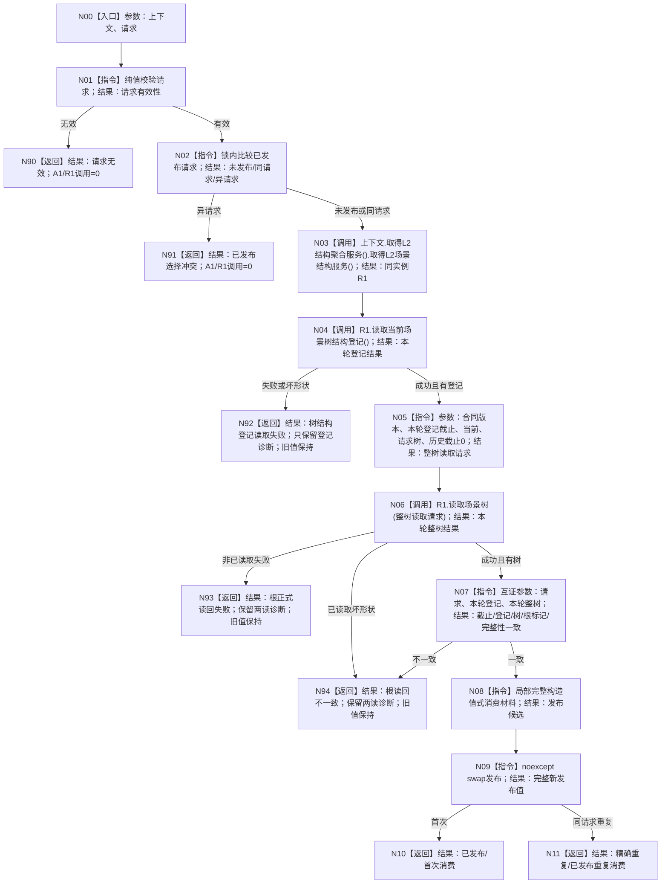

# BIZ-L3-001-03-07 正式再读回并发布自我世界树根消费材料目标函数流程图 v0.1

日期：2026-08-28

根函数：

```cpp
自我世界树根消费结果 消费并发布自我世界树根(
    普通应用上下文& 上下文,
    const 自我世界树根消费请求& 请求) noexcept;
```

父图：BIZ-L2-001-03。依据：0050 v2.1、4200、4230 v0.7、7130 v0.9、8120 v0.11。

身份与物理归属：BIZ-L3 只表示目标分解深度；公开 DTO 位于 `业务/自我世界树根消费.数据.h`，私有编排正文位于普通应用模块所属 `业务/消费.自我世界树根.inl`，唯一公开薄 wrapper 位于 `装配.普通应用.ixx`。函数不拥有 R1/A1，也不建立第二 provider。

参数与生命周期：`上下文`为本次同步调用期间的可写借用，必须持有唯一 A1 和 I2 发布槽；`请求`为只读借用，只能从同次 I1 成功结果逐字段形成。函数不保存上下文、请求、访问器或服务引用；发布材料为调用方拥有的值式副本。无效版本、身份、幂等绑定或首次根标记在 A1/R1 调用前返回请求无效。

上游合同边界：现行 I2 DTO 和校验器要求项目树选择等于 I1 唯一固定身份，与当前 I1 详细设计一致；但 8120 仍写“`DATA` 之外调用方提供非零不透明幂等身份并在同一上下文固定”。该冲突沿用 `DRIFT-BIZ-I1-PROJECT-TREE-SELECTION-CONTRACT-MISMATCH`，不是 I2 可以自行裁决的局部实现选择。若上游最终允许调用方自选非零身份，I2 请求有效性和与 I1 的逐字段绑定必须同步升级；不得保留固定身份校验形成旁路冲突。

返回语义：仅 `已发布/首次消费` 与 `精确重复/已发布重复消费` 成功；其它状态均不更新上下文旧值。登记失败只返回登记诊断；整树非已读取失败返回正式读回失败；已读取坏形状或跨结果漂移返回读回不一致；异常结果清空诊断 optional。



## 节点合同

| 节点 | 输入绑定 | 输出绑定 | 调用 / 事实边界 |
| --- | --- | --- | --- |
| N01—N02 | 上下文发布槽、只读请求 | 有效性、未发布/同请求/异请求 | 纯值与 I2 锁内选择；无效/异请求 A1/R1 零调用 |
| N03 | 上下文 | 本次同实例场景服务左值 | 每次只经 A1 getter；不保存引用、不用直接 getter旁路 |
| N04 | 同实例场景服务 | 本轮登记结果 | 只调用 `读取当前场景树结构登记()`；坏形状统一登记读取失败 |
| N05—N06 | 本轮登记截止、请求树 | 当前整树读取请求和结果 | 当前读取、历史截止0；零根写 |
| N07 | 请求、登记载荷、整树载荷 | 一致/不一致 | 截止、内嵌登记、树、根场景、根标记和 `L2场景树事实完整` 逐字段互证 |
| N08—N09 | 完整局部候选 | 完整上下文发布值 | 最后一次 `noexcept swap`；失败无半发布 |
| N10—N11/N90—N94 | 状态、来源、诊断与材料 | 精确结构化结果 | 只前两条成功；其它路径旧发布值守恒 |

## 业务合同

- 请求只从同一次 I1 成功结果的 `已发布根` 形成；本函数不调用 I1 getter。
- 首次与同请求重复都每次执行一次 A1 getter、一次登记读取、一次整树读取；不得缓存替代。
- I2 对 R1、A1和全部业务事实零写，不调用 `建立场景树根`。
- 根标记与首次根标记只比较同类型字段和生命周期；根节点场景生命周期由 R1 整树完整性保证，不发明跨类型相等。
- 任一失败或异常不半发布、不清空旧值；完整候选最后无抛出交换。
- 本函数成功只形成根消费材料，不形成真实自我、四个语言无关概念本体根、方法、线程、宿主或恢复状态。

## 冻结发布源码对照（提交 `294bd285`）

- 公开 DTO、私有 `.inl` 编排、普通应用薄 wrapper 和上下文发布槽均已进入 当前发布源码；`运行普通程序` 只从同次 I1 成功结果逐字段形成请求并真实调用本函数。
- 非成功已映射程序失败阶段 16；成功当前继续进入 SELF-FORM，不再固定短路于阶段 17。
- 本批确认的是源码、工程登记和生产调用边；没有重跑 I2 动态专项、根读回故障注入或独立集成验收。

## 2026-08-28 当前事实复核

- I2 同请求重复不比较旧发布截止；每次按本轮登记截止读取整树，并以本轮材料交换刷新，未发现 I1 的重复截止过约束。
- I2 实现与现行固定身份详细设计一致并已接正式启动；但其公开请求有效性依赖上游项目树选择冲突的最终裁决，因此只能声明“现行详细设计实现已接线”，不能声明跨正式规范的项目选择 ABI 已闭合。
