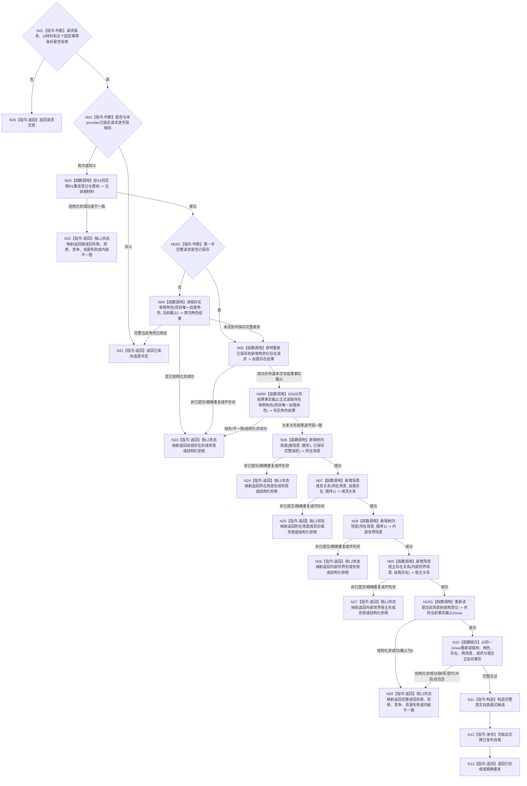

# BIZ-L3-001-03-08 形成并发布真实自我目标函数流程图 v0.1

更新时间：2026-08-28

## 依据

```text
0050 v2.1、4230 v0.7、7130 v0.10、8120 v0.11；
BIZ-L2-001-03；I2 v0.2；E-ROLE 结果 f7c3a684 / 清理 66cd780b；
S-HOST 结果 5e3a8573 / 清理 c72be0f7；SELF-FORM 详细设计 v0.2
```

## 身份与边界

正式 BIZ 目标函数设计图。业务身份：`SELF-FORM`。本图只冻结阶段 17 的真实自我形成合同：消费本次 I2 已正式再读回的现实世界树材料，经同一 A1 聚合中的最终存在、场景服务，按固定五步建立或精确收敛唯一自我结构，并在共同当前事实截止正式读回后值式发布。

E-ROLE 与 S-HOST 是业务中性的 DATA 能力；本函数解释“项目唯一自我”，但不把该含义下沉到 DATA-L2。阶段 18 四个概念本体根、方法根、自我线程、语言、概念和跨进程恢复均不在本图。

## 函数合同

```text
根函数：真实自我形成提供者::形成
归属模块 / 文件 / 目标分解深度：海中鱼巣.业务.提供者.真实自我形成 / 海中鱼巣/业务/提供者.真实自我形成.ixx / BIZ-L3
现有或待新增：公开 DTO、provider、工程登记和正式普通启动调用边已存在，但 provider 仅部分实现目标合同；当前发布源码中的生产入口在 I2 成功后构造 provider 并调用本函数
完整签名：真实自我形成结果 真实自我形成提供者::形成(const 真实自我形成请求& 请求) noexcept
参数：版本化请求；携带本次 I2 根消费材料和五个固定非零互异幂等身份；不携带 owner、仓库、锁、SQL、缓存、旧自我快照或概念本体根
返回结果：真实自我形成状态 + optional<真实自我事实>；成功态仅为已形成/精确重复且完整负载成立，全部非成功空负载
被调函数流程图：本图只登记最终公开能力调用；复杂 DATA 内部过程由 DATA 所有者维护，不在 BIZ 图复制
```

## 流程图



## 节点合同

| 节点 | 类型 | 参数 / 输入绑定 | 结果 / 输出绑定 | 事实读写 | 后继条件 | 验证 |
| --- | --- | --- | --- | --- | --- | --- |
| N01/N02 | 指令-判断 | 完整 SELF-FORM 请求 | 准入或异义 | 零 DATA 写 | 首次合法请求在首个 L2 写前锁定；失败后仍保留选择 | 零值、重复键、异请求写前冲突 |
| N03 | 函数调用 | I2 根消费材料 -> A1 同实例场景服务 | 当前登记与整树 | 只读 R1 权威事实 | 树、根、首次根标记与 I2 逐字段一致 | 每次调用都重读，缓存不得替代 |
| N04D/N04/N05/N05R | 指令-判断 / 函数调用 | 固定角色、写前当前截止、第一固定幂等身份；N05写结果事实截止 -> N05R期望事实代次 | 角色化存在和同写截止角色事实 | 首次无请求才预读；存在 owner 一写集原子建立存在+角色；每次写后按本次写截止正式读角色 | 外部既有角色拒绝；已保存请求先原样重放、后读角色互证；不得复用写前R1截止 | 十四种L2状态按详细设计5.1机械分账；写/读截止相等；冲突补读、漂移和未知发布不接纳 |
| N06/N08 | 函数调用 | 同树、直接父、顺序1、各自固定幂等身份 | 场景树节点和父关系 | 每步由场景 owner 原子建立一个树内场景 | 所在场景父为根；内部世界父为所在场景 | 首次、精确重复、树归属、父关系 |
| N07 | 函数调用 | 所在场景、自我存在、顺序1 | 当前成员关系 | 场景 owner 一事务 | 成员端点唯一且当前 | 不把成员关系当宿主关系 |
| N09 | 函数调用 | 内部世界场景、自我存在 | 当前宿主关系 | 场景 owner 一事务 | 正向与按存在反向均唯一 | 不把宿主关系当成员关系 |
| N10G | 函数调用 | I2 树身份 -> A1 同实例 R1 | 当前结构登记与非零共同截止 `Gnow` | 只读 R1 权威事实 | 不采用第五步写结果代次、I2 旧截止或 provider 缓存冒充当前截止 | 当前登记、拒绝、竞争、资源失败和坏形状分账 |
| N10 | 函数组合 | 五步重新取得的身份、同一 `Gnow` | 完整共同截止候选 | 只读 DATA 权威事实 | 现实整树、固定角色、完整存在、两完整场景、成员及宿主正反向读取全部截止等于 `Gnow`，拓扑闭合 | 所在场景唯一目标成员；宿主正反向唯一一致；自我不是内部世界成员；根/自我/两场景互异 |
| N11—N13 | 指令 | 完整候选 | 值式发布结果 | 只改调用方发布值 | 完整构造后一次交换 | 失败旧值守恒；重复调用仍完整重放和重读 |
| N20—N28 | 指令-返回 | 具名非成功 | 空负载结果 | 已发布前步不回滚 | 后继仍从第一步原请求收敛 | 资源失败/未知发布不得重组请求 |

## 关键边界

- 五步跨存在 owner 与场景 owner，明确不是一笔跨 owner 事务。后步失败不退出或重建已发布前步。
- 每一步首次完整 L2 请求一旦保存，期望事实代次、端点、顺序、角色和幂等身份均不可变；资源失败、异常或发布未知只能原请求重放。只有 DATA 明确返回零变化、无首次结果的事实代次漂移，才可正式重读后用同一幂等身份重组该步。
- provider 的同一发布锁必须覆盖请求选择、五步收敛、共同截止读回与最终交换；同请求重复仍完整重放五步并按本轮 `Gnow` 重新读回，不得在看到旧发布值后直接缓存返回。请求相同必须按完整 `真实自我形成请求` 逐字段判定，不能只比较树、根、旧截止和五个幂等身份。
- 本函数永不调用 E-ROLE 或 S-HOST 的替换/退出入口，不接纳 provider 启动前由外部绑定的“自我角色”。
- 成功只解除阶段 17 并开放阶段 18 的控制门；I2 与真实自我值式材料不构成阶段 18 请求字段、根身份或来源事实，保留给阶段 18 之后的自我线程等具名后继。成功不证明四本体根、方法、自我线程、语言、概念或宿主运行已经完成。

## 当前代码对应与偏差（冻结发布提交 `047859f555afd45c70182929403dee78b6506bc4`；源码 tree `2891b0a3db91d64cfdaae9a548b35dfb60775c19`）

- `海中鱼巣/业务/真实自我形成.数据.h`、`海中鱼巣/业务/提供者.真实自我形成.ixx` 和工程登记已存在；`运行普通程序` 经同一 `L2结构聚合服务` 构造 provider，以 I2 正式材料调用 `形成`，非成功映射阶段 17。五个默认幂等身份非零、互异且已进入 DTO。
- `DRIFT-BIZ-SELF-FORM-REQUEST-LOCK-AND-REPLAY-MISMATCH`：源码只比较根材料中的树、根、旧截止和五个幂等身份，不比较项目树选择、首次根建立请求、首次根标记、当前结构登记和正式树读回；发布锁也没有覆盖五步正文。已有发布值时直接返回缓存 `精确重复`，没有按目标原请求重放和本轮正式读回。
- `DRIFT-BIZ-SELF-FORM-CURRENT-CUTOFF-READBACK-INCOMPLETE`：入口根检查只以 I2 旧截止读取整树，没有重读当前场景树结构登记；最终又直接把第五步宿主关系的创建代次当共同截止。源码没有分别读取两份完整场景和自我存在反向当前宿主，也未证明所在场景目标成员唯一、内部世界不含自我、直接父链和宿主正反向唯一一致。
- `DRIFT-BIZ-SELF-FORM-STATUS-AND-RESULT-SHAPE-COLLAPSE`：五步 helper 把许可拒绝、事实代次漂移、资源失败、内部不一致、冲突和坏成功形状压成各步普通失败，未实现详细设计的十四状态映射、受限单次漂移重组和第一步冲突补读；`真实自我形成结果::成功()` 只检查成功枚举与 optional 存在，没有验证完整事实形状。
- 因此本叶只能裁决为“部分实现并接正式启动”，不能以五个调用点存在、编译或旧动态记录宣称 SELF-FORM 已符合目标合同。上游 I2 仍依赖 I1 的 `DRIFT-BIZ-I1-PROJECT-TREE-SELECTION-CONTRACT-MISMATCH`；本叶不得自行把固定选择解释成规范已经闭合。
- 当前启动代码只把 SELF-FORM 成功当作阶段 18 顺序门，未把 `已形成自我` 传给阶段 20 自我线程创建请求；这是 `BIZ-L3-001-03-11` 的消费端漂移，不回写或削弱本函数成功负载。
