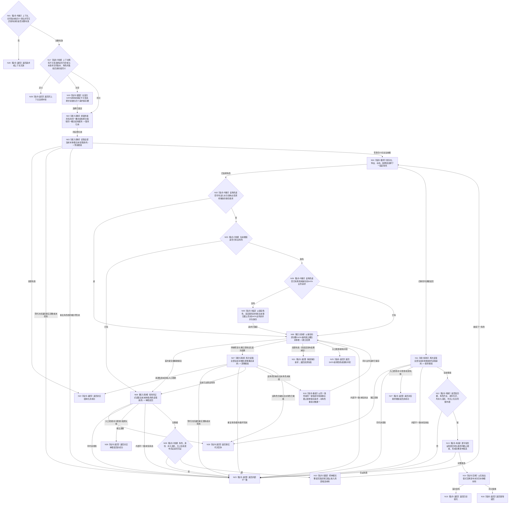

# BIZ-L3-001-03-09 初始化并发布四个语言无关概念本体根目标函数流程图 v0.1

更新时间：2026-08-27

## 依据

```text
0050、2220 v1.3、4240 v0.4、7140 v1.2、8120 v0.10；
BIZ-L2-001-03；SELF-FORM 后继控制门；用户确认的存在/特征/动态/因果链四根口径
```

## 身份与边界

正式 BIZ 目标函数设计图。业务身份：`CONCEPT-ONTOLOGY-ROOTS-PRODUCTION-INIT`。本图只冻结阶段 18 的业务消费合同：经普通应用持有的同一 DATA 聚合取得唯一概念结构服务，建立或幂等收敛存在、特征、动态、因果链四个语言无关空本体根，逐根正式读回并最终证明当前恰有四根。

本图冻结 BIZ 所需的最小 DATA 公开消费面：`L2概念结构服务` 提供建立一根、按角色读取一根、读取全部当前根三项能力，并由唯一 `L2概念结构聚合服务` 透明提供同实例 getter。三项是公开操作数，不是每根“精确仅三事实”：概念节点、族归属和固定角色关系只是必含，首次幂等 / 期望代次持久见证与共享直接上位关系类型的空组枚举也必须由同 owner 事务和正式读回承载。HEAD `a64e743d` 已实现并导出这些 DATA 能力；BIZ 仍不定义其内部属性类型、仓库或写端口。

本图正式替代历史 `BIZ-L3-001-03-05` 及 `BIZ-L4-001-03-05-01—05`。旧图的存在 / 动态 / 关系 / 因果四对象领域、关系 12 和固定生命周期状态组语义永久失效，不得作为当前施工依据。

## 函数合同

```text
根函数：四本体根生产初始化提供者::初始化
归属模块 / 文件 / 目标分解深度：`海中鱼巣.业务.提供者.四本体根生产初始化` / `海中鱼巣/业务/提供者.四本体根生产初始化.ixx` / BIZ-L3
现有或待新增：DTO、`.inl` 编排和 provider 已实现、登记工程并接正式普通启动；当前 provider 由 `运行普通程序` 栈上构造，尚未强制“同一普通应用上下文唯一协调者”所有权
完整签名（BIZ消费合同）：`四本体根生产初始化结果 四本体根生产初始化提供者::初始化(const 四本体根生产初始化请求& 请求) noexcept`
参数：提供者由普通应用唯一持有，构造时借用同一 `L2概念结构聚合服务`，内部持有唯一调用协调、不可变选择槽、四个按角色保存的 DATA 完整请求槽和发布槽；请求为只读值，含合同版本以及存在、特征、动态、因果链四个具名非零互异固定幂等身份。合同版本和四身份字段共同构成上下文选择；角色由四个具名字段闭合，不接收可扩展角色容器；不得包含操作截止、语言、词条、词性、普通概念、动态列表、因果候选、owner、仓库、锁、SQL或缓存
返回结果：结构化状态 + 可选调用方拥有的四本体根值式材料；成功负载含四项按固定角色排序的完整根读回和最终非零事实截止；非成功为空负载且既有已发布值守恒
被调函数流程图：前置 SELF-FORM 见 BIZ-L3-001-03-08；DATA 能力只在本图节点合同中登记需求，不为其伪造函数图
父图：BIZ-L2-001-03
```

## 流程图



## 节点合同

| 节点 | 类型 | 参数 / 输入绑定 | 结果 / 输出绑定 | 事实读写 | 后继条件 | 验证 |
| --- | --- | --- | --- | --- | --- | --- |
| N01/N17/N19 | 指令-判断 / 赋值 | 上下文、BIZ 请求 | 准入、入口拒绝、选择冲突或锁定选择 | 只写调用方上下文选择槽 | 角色由四个具名字段闭合；选择由合同版本和四身份组组成并在首次 DATA 调用前锁定 | 零/重复身份、额外可扩展角色字段、语言字段、异义选择拒绝；锁定后至上下文析构不可改义 |
| N02 | 能力调用 | 提供者持有的 `L2概念结构聚合服务&` -> `取得L2概念结构服务()` | 同一 `L2概念结构服务&` | 零事实写 | `noexcept` 引用 getter，取得真实同实例 | 禁止直达 L1、复制 CRUD 或第二 provider；概念服务缺失属于装配失败或编译门禁，不是阶段18运行结果 |
| N03/N07/N11 | 能力调用 | 首次 / 漂移重读以 `期望事实代次=0` 选择调用时最新当前快照；最终读以最近非零截止作乐观守卫 | 实际请求 + 全部当前本体根组结果 + 单一非零事实截止 | 只读 DATA 权威根事实 | 零至四合法项；零请求返回漂移 / 未找到是内部不一致；漂移重读截止不得早于调用前已知截止；非零守卫与当前代次不等时返回零变化漂移，成功截止必须精确等于请求守卫；漂移重读决定读根或本角色至多一次同键重组；最终必须恰四项 | 重复角色、第五根、坏生命周期、旧截止或错事实截止；禁止把0解释为历史代次、无效请求或任意忽略 |
| N04/N10/N32/N33 | 指令-循环 / 判断 / 赋值 | 固定角色顺序、待重放标记、预读根组、单根结果 | 本角色处理路线和局部完整候选 | 无权威写 | 待重放请求优先于预读已有根；其余角色才按预读存在性分流；每个角色本次都必须正式读回 | 顺序不构成根身份；重复调用不准用缓存跳过；发布未知不得被预读已有根绕过 |
| N05/N06/N18/N29 | 指令 / 能力调用 | 锁定角色、固定幂等身份、当前事实截止 -> 保存的原完整 DATA 请求 | 进入时待重放 optional + 实际请求 + 建立结果调用证据或结构化非成功 | 每次至多由 DATA 概念 owner 建立一个根；BIZ 只保存值式完整请求和待重放标记，不持有写端口 | 新请求在调用前保存；进入时待重放请求无条件先原样调用；其它已有请求只在预读缺根时重放；已提交只向后推进本地截止，精确重复的旧首次截止不得使本轮预读截止回退；首次/重复进入正式读回；零变化漂移经 N07 重读后，本角色本次调用至多一次同键重组 | 待重放 optional 必须逐字段等于第一次实际调用；成功根首次见证必须与实际发送请求一致；发布未知、异常、坏非成功形状或资源失败跨调用保留原完整请求；只有明确空载荷、零变化且无首次结果可替换保存请求；再次漂移返回事实代次竞争 |
| N08/N09 | 能力调用 / 判断 | 固定角色 -> 非零守卫角色读取请求 | 实际请求 + 单根完整事实结果及其事实截止 | 只读 DATA 权威根事实 | 成功截止精确等于请求守卫；根身份非零、角色与本轮角色一致、永久活跃、无上位、见证闭合；建立结果、漂移重读根、单根读回和发布材料逐字段一致 | 同代未找到、已退出、截止不等、错角色、错根身份、错上位、坏成功形状均内部不一致 |
| N12/N13 | 判断 / 构造 | 四次单根读回 + 最终根组 | 完整值式发布候选 | 无权威写 | 最终根组恰四根且以一个事实截止成立；四次较早读回与最终项逐字段同义 | 根身份互异、零额外根、各单根截止不晚于最终截止；不得要求多次独立读取共享虚构全局截止 |
| N14—N16 | 交换 / 返回 | 完整候选 | 上下文发布槽和结构化成功 | 只改调用方拥有的值式发布槽 | 交换后才成功 | 任一此前失败旧发布值逐字段守恒 |
| 具名失败节点 | 指令-返回 | 具名失败 | 空负载非成功 | 不补写、不回滚已发布 DATA 根；选择和已保存业务请求按合同保留 | 调用方统一映射阶段18 | 日志、线程、缓存不能补成功；未知 DATA 状态和坏成功形状只能映射内部不一致 |

## DATA 公开能力需求

| 业务需求 | 强类型语义 | 必要结果形状 | 一致性 / 幂等 | ABI 状态 |
| --- | --- | --- | --- | --- |
| 取得同一概念结构服务 | `L2概念结构聚合服务::取得L2概念结构服务()` const/non-const | 非 owning 同实例引用 | 聚合零 owner、零写、零锁、零缓存、零第二 DATA provider | HEAD 已实现；本 provider 构造时借用该聚合 |
| 读取全部当前本体根 | `L2当前概念本体根组读取结果 L2概念结构服务::读取全部当前概念本体根(const L2当前概念本体根组读取请求&) const` | `vector<L2概念本体根事实>`；成功为0—4项按角色严格排序及单一非零事实截止，空组成功；任一非成功 vector 和变更事实代次均为空；可识别重复/第五根/坏形状 | `期望事实代次=0` 选择最新当前快照；非零值作当前代次乐观守卫；不从名称/缓存拼接 | HEAD 已实现并由本 provider 调用 |
| 建立一个本体根 | `L2概念本体根写入结果 L2概念结构服务::建立概念本体根(const L2概念本体根建立请求&)` | `optional<L2概念本体根事实>`；已提交/精确重复成功必须有值，事实截止严格晚于实际请求期望代次，变更代次等于成功截止，并正式回显首次幂等 / 期望代次见证；任一非成功 optional 和变更事实代次均为空 | 同角色同完整请求收敛；同键异义拒绝；一根一概念 owner 事务；节点/族归属/角色只是必含而非唯一写集 | HEAD 已实现并由本 provider 调用；不新增 deadline |
| 按角色正式读根 | `L2当前概念本体根读取结果 L2概念结构服务::按角色读取当前概念本体根(const L2当前概念本体根读取请求&) const` | `optional<L2概念本体根事实>`；成功有完整根身份、概念族来源、固定根角色关系、首次请求持久见证、共享直接上位关系类型枚举空组、永久当前生命周期和事实截止；任一非成功 optional 和变更事实代次均为空 | 每次正式读取；BIZ 同代读回未找到视为内部不一致 | HEAD 已实现并由本 provider 调用 |

这些是 BIZ 冻结的公开消费类型、具名函数和 getter，DATA 实现必须机械匹配。DATA 所有者只独立决定 C1 内部 owner、关系键、事务和未冻结字段布局；任何公开类型、函数或结果语义差异都必须先退回 BIZ 重基线，不得以“等价接口”替换，也不得让 BIZ 直达 L1、猜测根、按语言 / 词性建根或用缓存替代正式读回。

## 关键边界

- 阶段 18 只初始化四个空根；零语言、零词条、零词性、零普通概念、零二次特征、零动态扫描、零因果候选、零直接因果、零普通因果链概念。
- 四根依次建立不是跨四根原子事务。前项已正式发布后，后项失败不回滚权威根；重试用原角色和原幂等身份收敛。只有调用方值式发布是“完整候选后一次无抛出交换”。
- 重复调用预期零根写，但仍必须重新读取全部当前根、逐根正式读回并最终再次读取全组；不得用旧发布值或缓存跳过 DATA 读取。
- 四次单根读回可以具有各自非零事实截止；最终全组读取必须返回一个覆盖本组的非零事实截止。成功比较的是根身份、角色、生命周期、上位组和发布见证等字段，不把多次独立读取伪装成同一全局事务或同一历史截止。
- 同一普通应用上下文只允许一个阶段18调用协调者串行进入。首次完整请求在任何 DATA 调用前把合同版本、角色闭集和四身份组锁定到上下文；同一选择重复调用每次完整重读；异义选择在 DATA 调用前冲突并保持旧发布值。每个角色的业务请求先保存后调用，跨调用保留至上下文析构；资源失败或发布未知只以原保存业务请求重放，明确零变化且无首次结果才允许同键重组。该协调只保护调用方请求与值式发布，不取得 DATA 根事实权。
- provider 模块已登记工程并由 `运行普通程序` 构造调用，但公开构造器仍允许同一聚合被构造多个协调者；目标要求的“同一普通应用上下文唯一协调者”尚未由所有权结构或等强单实例限制证明。该偏差不允许用当前栈上恰好只有一个对象替代合同。
- 本函数只有预读、固定四角色循环、每角色至多一次漂移重组和最终读回，不含等待或无界重试，因此不新增操作截止、墙钟、休眠或取消字段。若后继确有外部取消需求，必须建立独立正式合同，不得把时间值混入本体根幂等请求。
- `SELF-FORM` 成功只开放阶段 18 控制门，不成为根身份、来源字段或请求内容。E-ROLE、S-HOST 是 SELF-FORM 间接前置，不是本函数直接 DATA 输入。
- 当前 `运行普通程序` 已把本函数非成功映射阶段 18，并在成功后继续方法登记根与自我线程创建；阶段 15 永久退出且数值不复用。本叶自身仍不实现方法、线程、概念支持、语言形成、投影、信号、宿主或跨进程恢复。

## BIZ 结果状态与 DATA 分类映射

| BIZ 结果状态语义 | 触发边界 | DATA 分类映射 | 负载 / 守恒 |
| --- | --- | --- | --- |
| 已初始化 / 幂等读回 | 四角色逐根读回、最终恰四根并交换发布 | 只接受最终 ABI 明确定义的成功状态与完整成功形状 | 携带完整值式四根材料；前者首次发布，后者同义替换 |
| 请求或上下文无效 | BIZ 合同、角色、身份或上下文入口无效 | DATA 尚未调用 | 空负载；零 DATA 写；旧发布值守恒 |
| 同上下文选择冲突 | 锁定选择与本次合同版本、角色闭集或四身份组异义 | DATA 尚未调用 | 空负载；旧选择、保存请求和发布值守恒 |
| 事实代次竞争 | 非零守卫读取明确漂移，或同角色本次第二次零变化写漂移 | 仅事实漂移；不把零请求漂移、同代未找到或未知状态猜成竞争 | 空负载；保存请求依规则保留；旧发布值守恒 |
| DATA 请求拒绝 / 幂等冲突 | DATA 入口拒绝、许可拒绝、错角色、同键异义或引用冲突 | 最终 ABI 的具名逻辑内分类逐项机械映射 | 空负载；不改写已发布 DATA 根 |
| 资源失败 | 分配、存储、底层发布结果未知或其它不能证明零变化的资源失败 | 最终 ABI 的资源失败分类 | 空负载；原保存完整请求保留待重放，禁止重组或换键 |
| 内部不一致 | 零请求漂移 / 未找到、同代单根未找到、重复 / 第五根、坏形状、错生命周期 / 上位 / 见证、未知枚举或成功空负载 | DATA 内部不一致、未知状态以及 BIZ 互证失败 | 空负载；不补写、不猜成功，旧发布值守恒 |

DATA 精确类型名、三函数名和 getter 已由本图冻结；枚举数值与字段布局仍须在 DATA 正式设计及结果发布时机械核对。上表机器语义不能在施工时合并成布尔成功或文本错误。

## 分层验证边界

| 层次 | 必须证明 | 当前状态 |
| --- | --- | --- |
| 文档 / 静态合同 | 四角色闭集、零第五根、零语言 / 词性 / 普通概念；请求在首个 DATA 调用前锁定；每角色每调用最多一次漂移重组；零 deadline / 墙钟 / sleep；全部非成功空负载和值式发布守恒 | 本图发布后可检查 |
| 最终 ABI 机械匹配 | C1 三类能力、根 DTO、状态分类、事实截止，以及 A1 同实例 getter 和普通应用装配，能够逐项承载本图；操作控制与幂等业务语义可分离 | HEAD 静态接口与 provider 调用已存在；本批未重跑编译或 ABI consumer |
| 生产外动态验证 | 首次四根、同义重复零预期写但完整三层读回、异义读前拒绝、部分完成续跑、并发串行、一次漂移重组、资源失败 / 发布未知原请求重放、坏形状 / 额外根 / 未知状态拒绝、旧发布值守恒、阶段18映射 | 本批 `NOT_RUN`；不得以静态读取替代动态矩阵 |
| 生产接线与连续链 | SELF-FORM 成功同次进入阶段18；失败仍为18；成功后才允许后继；阶段15不出现 | HEAD 静态生产调用边已存在；唯一协调者所有权仍漂移 |
