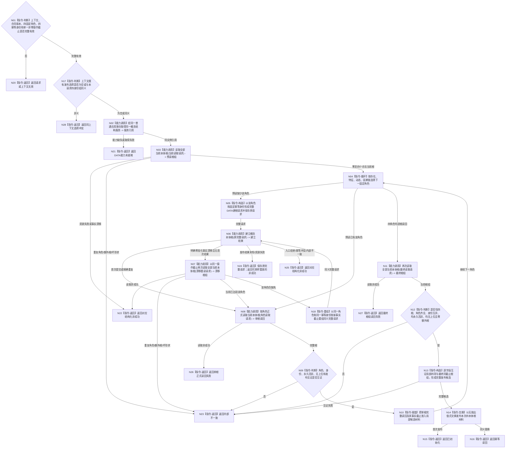

# BIZ-L3-001-03-09 初始化并发布四个语言无关概念本体根目标函数流程图 v0.1

更新时间：2026-08-14

## 依据

```text
0050、2220 v1.3、4240 v0.3、7140 v1.2、8120 v0.8；
BIZ-L2-001-03；SELF-FORM 后继控制门；用户确认的存在/特征/动态/因果链四根口径
```

## 身份与边界

正式 BIZ 目标函数设计图。业务身份：`CONCEPT-ONTOLOGY-ROOTS-PRODUCTION-INIT`。本图只冻结阶段 18 的业务消费合同：经普通应用持有的同一 DATA 聚合取得唯一概念结构服务，建立或幂等收敛存在、特征、动态、因果链四个语言无关空本体根，逐根正式读回并最终证明当前恰有四根。

本图不冻结或发明 DATA 实现 ABI、owner、文件、关系键或事务布局；下列“建立 / 读取”都是具名公开能力需求，精确 C++ DTO、函数名和 getter 由 DATA-L1—L5 所有者在提供者设计中形成后机械匹配。

本图正式替代历史 `BIZ-L3-001-03-05` 及 `BIZ-L4-001-03-05-01—05`。旧图的存在 / 动态 / 关系 / 因果四对象领域、关系 12 和固定生命周期状态组语义永久失效，不得作为当前施工依据。

## 函数合同

```text
根函数：初始化并发布四个语言无关概念本体根
归属模块 / 文件 / 目标分解深度：普通系统初始化业务提供者 / 待后继 BIZ 详细设计绑定 / BIZ-L3
现有或待新增：待新增 BIZ provider；阶段18当前仅有能力未实现短路
完整签名（BIZ消费合同）：四本体根生产初始化结果 初始化并发布四个语言无关概念本体根(普通应用上下文& 上下文, const 四本体根生产初始化请求& 请求) noexcept
参数：上下文为本次普通应用生命周期内可变借用，必须持有同一概念结构聚合、唯一调用协调和发布槽；请求为只读值，含合同版本、固定角色闭集{存在,特征,动态,因果链}、四个非零互异固定幂等身份及覆盖本轮全部 DATA 调用的单一非零操作截止；不得包含语言、词条、词性、普通概念、动态列表、因果候选、owner、仓库、锁、SQL或缓存
返回结果：结构化状态 + 可选调用方拥有的四本体根值式材料；成功负载含四项按固定角色排序的完整根读回和最终非零事实截止；非成功为空负载且既有已发布值守恒
被调函数流程图：前置 SELF-FORM 见 BIZ-L3-001-03-08；DATA 能力只在本图节点合同中登记需求，不为其伪造函数图
父图：BIZ-L2-001-03
```

## 流程图



## 节点合同

| 节点 | 类型 | 参数 / 输入绑定 | 结果 / 输出绑定 | 事实读写 | 后继条件 | 验证 |
| --- | --- | --- | --- | --- | --- | --- |
| N01/N17 | 指令-判断 | 上下文、BIZ 请求 | 准入、入口拒绝或选择冲突 | 无 | 四固定角色、四互异身份、单一非零操作截止；既有选择为空或同义 | 零/重复身份、额外角色、语言字段、零截止、异义身份组拒绝 |
| N02 | 能力调用 | 上下文 -> DATA 聚合同实例 getter 需求 | 同一概念结构服务引用 | 零事实写 | 取得真实同实例 | 禁止直达 L1、复制 CRUD 或第二 provider |
| N03/N07/N11 | 能力调用 | 当前读取语义、同一非零操作截止、可选期望事实截止 | 全部当前本体根组 + 单一非零事实截止 | 只读 DATA 权威根事实 | 零至四合法项；漂移重读决定读根或同键重组；最终必须恰四项 | 重复角色、第五根、坏生命周期、错截止、操作超时 |
| N04/N10 | 指令-循环 / 赋值 | 固定角色顺序、单根结果 | 局部完整候选 | 无权威写 | 每个角色本次都必须正式读回 | 顺序不构成根身份；重复调用不准用缓存跳过 |
| N05/N06/N18 | 指令 / 能力调用 | 角色、固定幂等身份、预读事实截止、同一操作截止 -> 完整 DATA 请求 | 建立结果或结构化非成功 | 每次至多由 DATA 概念 owner 建立一个根；BIZ 不持有写端口 | 首次/重复进入正式读回；零变化漂移经N07重读后才可同键重组 | 发布未知或资源失败保存原请求重放；仅明确零变化且无首次结果可同键重组 |
| N08/N09 | 能力调用 / 判断 | 固定角色、同一非零操作截止 -> 角色读取请求 | 单根完整事实及其事实截止 | 只读 DATA 权威根事实 | 根身份非零、角色与本轮角色一致、永久活跃、无上位、见证闭合；建立结果若回显根身份则必须一致 | 已退出、错角色、错根身份、错上位、坏成功形状、操作超时 |
| N12/N13 | 判断 / 构造 | 四次单根读回 + 最终根组 | 完整值式发布候选 | 无权威写 | 最终根组恰四根且以一个事实截止成立；四次较早读回与最终项逐字段同义 | 根身份互异、零额外根、各单根截止不晚于最终截止；不得要求多次独立读取共享虚构全局截止 |
| N14—N16 | 交换 / 返回 | 完整候选 | 上下文发布槽和结构化成功 | 只改调用方拥有的值式发布槽 | 交换后才成功 | 任一此前失败旧发布值逐字段守恒 |
| N20—N28 | 指令-返回 | 具名失败 | 空负载非成功 | 不补写、不回滚已发布 DATA 根 | 调用方映射阶段18 | 日志、线程、缓存不能补成功 |

## DATA 公开能力需求

| 业务需求 | 强类型语义 | 必要结果形状 | 一致性 / 幂等 | ABI 状态 |
| --- | --- | --- | --- | --- |
| 取得同一概念结构服务 | 普通应用持有的语言概念聚合同实例 getter | 非 owning 同实例引用 | 零写、零第二 owner/provider | 待 DATA 所有者形成并机械匹配 |
| 读取全部当前本体根 | 闭合根角色、同一非零操作截止 | 零至多项稳定排序、单一非零事实截止；可识别重复/额外/坏形状 | 一次正式权威读取，不从名称/缓存拼接 | 待 DATA 所有者形成并机械匹配 |
| 建立一个本体根 | 固定根角色、非零幂等身份、期望事实截止、同一非零操作截止 | 首次提交/精确重复/漂移/冲突/资源失败/未知/内部不一致分账 | 同角色同请求收敛；同键异义拒绝；一根一事务 | 待 DATA 所有者形成并机械匹配 |
| 按角色正式读根 | 固定角色当前读取、同一非零操作截止 | 完整根身份、角色、生命周期、直接上位组、发布见证、事实截止 | 每次正式读取；成功负载完整，非成功空 | 待 DATA 所有者形成并机械匹配 |

这些是 BIZ 消费语义，不是 DATA 函数签名。DATA 所有者可以组合现有公开能力或提供等价强类型接口，但不得让 BIZ 直达 L1、猜测根、按语言 / 词性建根或用缓存替代正式读回。

## 关键边界

- 阶段 18 只初始化四个空根；零语言、零词条、零词性、零普通概念、零二次特征、零动态扫描、零因果候选、零直接因果、零普通因果链概念。
- 四根依次建立不是跨四根原子事务。前项已正式发布后，后项失败不回滚权威根；重试用原角色和原幂等身份收敛。只有调用方值式发布是“完整候选后一次无抛出交换”。
- 重复调用预期零根写，但仍必须重新读取全部当前根、逐根正式读回并最终再次读取全组；不得用旧发布值或缓存跳过 DATA 读取。
- 四次单根读回可以具有各自非零事实截止；最终全组读取必须返回一个覆盖本组的非零事实截止。成功比较的是根身份、角色、生命周期、上位组和发布见证等字段，不把多次独立读取伪装成同一全局事务或同一历史截止。
- 同一普通应用上下文只允许一个阶段18调用协调者串行进入。既有发布选择为空时接受首个完整请求；同一四身份组重复调用每次完整重读；异义身份组在首次 DATA 调用前冲突并保持旧发布值。该协调只保护调用方值式发布，不取得 DATA 根事实权。
- `SELF-FORM` 成功只开放阶段 18 控制门，不成为根身份、来源字段或请求内容。E-ROLE、S-HOST 是 SELF-FORM 间接前置，不是本函数直接 DATA 输入。
- 失败由 `初始化普通系统` 映射阶段 18；阶段 15 永久退出且数值不复用。方法根、自我线程、概念支持、语言形成、投影、信号、宿主和跨进程恢复均为后继 `NOT_RUN`。
