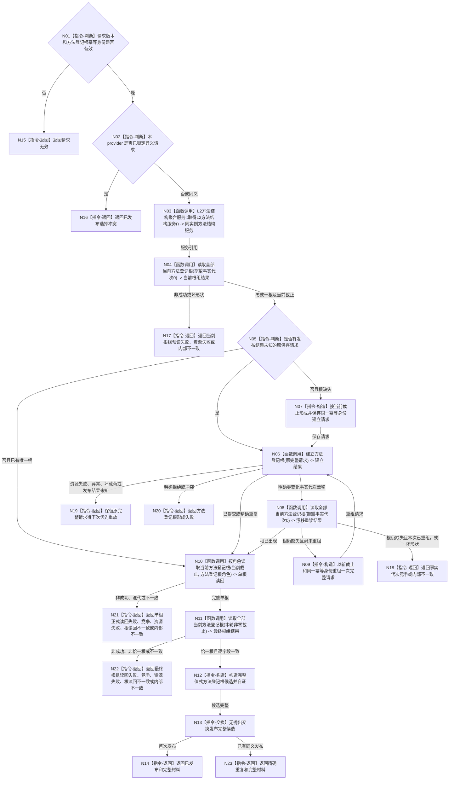

# BIZ-L3-001-03-10 初始化并发布方法登记根目标函数流程图 v0.1

更新时间：2026-08-28

## 依据

```text
0050、3300、5300、8120 v0.10；BIZ-L2-001-03；阶段18四本体根生产初始化成功结果
DATA 当前公开合同：L2方法结构聚合服务、L2方法结构服务三项根能力
```

## 身份与边界

正式目标函数设计图。阶段 18 成功后必须先调用本函数，建立或幂等收敛唯一方法登记根并正式读回；任一非成功映射阶段 19。`BIZ-L3-001-03-10` 是新身份，不复活、改名或改挂历史 `BIZ-L3-001-03-01` 及其三个 L4。

## 函数合同

```text
根函数：方法登记根生产初始化提供者::初始化
归属模块 / 文件 / 目标分解深度：`海中鱼巣.业务.提供者.方法登记根生产初始化` / `海中鱼巣/业务/提供者.方法登记根生产初始化.ixx`，公开 DTO 位于 `海中鱼巣/业务/方法登记根生产初始化.数据.h` / BIZ-L3
现有或待新增：DTO、provider、方法结构聚合 getter 与三项根能力已实现、登记工程并接正式普通启动；当前 provider 由 `运行普通程序` 栈上构造，唯一协调者所有权未由上下文强制
完整签名：方法登记根生产初始化结果 方法登记根生产初始化提供者::初始化(const 方法登记根生产初始化请求& 请求) noexcept
参数：请求为只读借用；含合同版本和一个非零方法登记根幂等身份；阶段18结果只作调用顺序门，不成为根事实或请求字段
返回结果：值式结果；成功仅为已发布或精确重复并携带完整方法登记根发布材料；其它状态成功载荷为空且保持旧发布值
被调函数流程图：无当前 BIZ-L4；三项 L2 方法结构公开能力的内部实现不在本图重复展开
父图：BIZ-L2-001-03
```

## 流程图



## 节点合同

| 节点 | 类型 | 参数 / 输入绑定 | 结果 / 输出绑定 | 事实读写 | 后继条件 | 验证 |
| --- | --- | --- | --- | --- | --- | --- |
| N01/N02 | 指令-判断 | 请求合同、幂等身份、已锁定选择 | 准入或结构化拒绝 | 无 DATA 调用；首次合法选择在首个 DATA 调用前锁定 | 同义继续，异义返回 | 零身份、错版本、异义请求零调用 |
| N03 | 函数调用 | provider 持有的唯一聚合引用 | 同实例 `L2方法结构服务&` | 聚合零写、零缓存、零 DTO 映射 | 必须取得引用 | getter 同址与单实例 |
| N04/N08 | 函数调用 | 实际零代次组读请求 | 实际请求与组读结果证据 | 只读 DATA 当前根事实 | 初读取得非零截止；漂移重读截止不早于旧截止 | 零/一根、坏载荷、旧截止拒绝 |
| N06/N07/N09 | 指令 / 函数调用 | 保存请求、同一幂等身份和非零截止 | 零至两次实际建立请求与结果证据 | 每次 DATA 调用至多建立一根；发布未知不换请求 | 成功、一次重组或结构化非成功 | 原请求优先、第二次漂移、成功截止推进 |
| N10 | 函数调用 | 方法登记根角色和当前非零截止 | 实际单根读取请求与结果证据 | 只读 DATA 根事实 | 结果截止精确等于请求守卫且根完整 | 未找到、混代、错角色、首次见证 |
| N11 | 函数调用 | 本轮最新非零截止 | 实际最终组读请求与结果证据 | 只读 DATA 当前根事实 | 恰一根且与单根读回一致 | 零根、第二根、混代、错序 |
| N12—N14/N23 | 指令 | 全部调用证据与根材料 | 已发布或精确重复 | 只更新调用方拥有的值式发布槽 | 完整候选后一次交换 | 失败旧值守恒、交换无抛出 |
| N15—N22 | 指令-返回 | 当前结构化非成功 | 空成功载荷 | 不补造方法登记根 | 函数结束 | 状态、载荷和事实代次守恒 |

## 关键边界

- 阶段 18 成功只是本函数可达门；四本体根、自我材料、语言、名称和缓存都不是方法登记根事实。
- 正常同请求重复预期零根写，但每次仍执行零代次全组预读、非零单根读回和非零最终全组读回。
- 本函数只初始化唯一方法登记根，不创建方法首、默认方法、方法生命周期、条件、结果、动作入口、概念支持、语言、投影或线程。
- 冻结发布提交 `629a481a` 已包含 `L2方法结构聚合服务` / `L2方法结构服务` 三项根能力、BIZ DTO/provider 和 `运行普通程序` 阶段 19 映射；请求锁、待重放、受限漂移重组、单根与最终恰一根读回及完整结果谓词静态对应本图。本批未重跑编译、故障矩阵或独立集成验收。
- `DRIFT-BIZ-METHOD-REGISTRY-ROOT-COORDINATOR-OWNERSHIP-NOT-ENFORCED`：provider 当前为可公开构造的栈上对象，未证明同一普通应用上下文只能形成一个请求锁定 / 发布协调者；不能以当前启动路径恰好只构造一个对象替代目标所有权合同。
