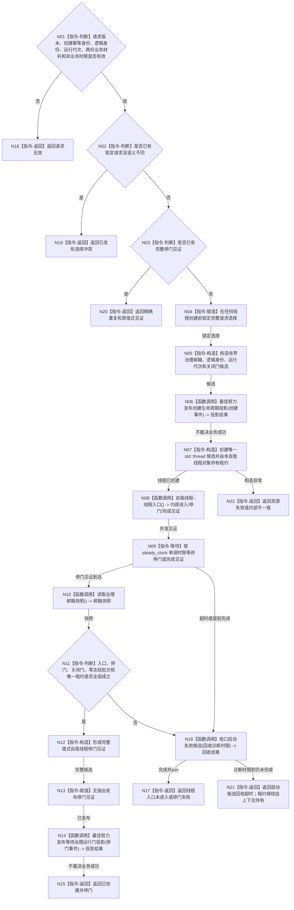

# BIZ-L3-001-03-11 创建并使自我线程停在治理运行门目标函数流程图 v0.1

更新时间：2026-08-14

## 依据

```text
0050、8100、8110、8120 v0.10；BIZ-L1-T01、BIZ-L2-001-03；I2 v0.2、SELF-FORM v0.2、METHOD-REGISTRY-ROOT-PRODUCTION-INIT v0.1
```

## 身份与边界

正式目标函数设计图。唯一业务目标是在方法登记根生产初始化成功后创建唯一自我线程候选，并证明线程入口已经真实进入且停在关闭的治理运行门。它不开放运行门、不消费治理邮箱、不执行自我内部循环，也不把线程、消息或生命周期投影解释为世界事实。

## 函数合同

```text
根函数：自我线程::创建并使自我线程停在治理运行门
归属模块 / 文件 / 目标分解深度：自我线程唯一租约 / 海中鱼巣/线程/创建.自我线程.ixx / BIZ-L3
现有或待新增：待新增；当前没有受跟踪的自我线程模块
完整签名：自我线程生产创建结果 自我线程::创建并使自我线程停在治理运行门(const 自我线程生产创建请求& 请求) noexcept
参数：请求为只读借用；业务材料仅含 I2 本轮正式再读回材料和 SELF-FORM 正式读回材料；另含非业务线程逻辑身份、运行代次、邮箱容量与本次调用等待时限
返回结果：结构化创建结果；成功只允许已创建并停门 / 精确重复并携带完整停门见证
被调函数流程图：BIZ-L4-001-03-11-01 自我线程::线程入口
```

## 流程图



## 节点合同

| 节点 | 类型 | 参数 / 输入绑定 | 结果 / 输出绑定 | 事实读写 | 后继条件 | 验证 |
| --- | --- | --- | --- | --- | --- | --- |
| N01—N04 | 指令 | 完整创建请求 | 锁定的同请求选择 | 只写 provider 私有选择槽 | 异义请求零线程创建 | 版本、零身份、两材料错树、异义并发 |
| N05—N07 | 指令 / 函数调用 | 运行配置、锁定请求 | 邮箱、逻辑身份、运行代次、唯一线程候选 | 只写运行期线程对象；生命周期投影非权威 | 候选由普通应用唯一对象持有 | 构造失败、投影端口失败不冒充线程失败 |
| N08—N10 | 函数调用 / 等待 | 关闭门与候选租约 | 入口、停门或完成见证 | 不消费治理邮箱，不写业务事实 | 使用单调时限且等待时释放状态锁 | 真实入口、虚假唤醒、提前退出 |
| N11—N15 | 判断 / 构造 / 返回 | 内部见证与邮箱快照 | 完整停门材料 | 只发布值式见证 | 零冻结批次、门关闭、租约仍在 | 首次、精确重复、生命周期投影失败隔离 |
| N16—N21 | 函数调用 / 返回 | 失败候选与回收诊断时限 | 已回收或仍持有结论 | 锁存停止、唤醒关闭门、完成后 join | 超时禁止 detach / 覆盖 / 遗失 | 每个失败点、超时后租约守恒 |

## 关键边界

- 阶段 18 和阶段 19 的结果只作调用顺序门，不进入请求、不复制为线程缓存；本函数唯一业务材料是本轮 I2 根消费材料与 SELF-FORM 正式读回材料。线程逻辑身份、运行代次、邮箱容量和等待时限只是运行基础设施配置，不取得业务事实权。
- 成功必须由内部进入见证、关闭门停驻见证、治理邮箱零冻结批次和普通应用持有的唯一租约共同证明。8110 生命周期消息只作控制面板投影，不能替代上述见证。
- 失败回收固定为“锁存停止 -> 唤醒关闭门 -> 等待完成见证 -> 完成后 join -> 清除候选”。诊断时限到不得 detach；上下文继续持有租约，正常程序返回必须等待安全回收。
- 本叶不开放运行门。开放属于 BIZ-L2-001-08；自我治理循环、需求、任务、方法执行、概念支持、语言形成、线程组和运行宿主均为后继 `NOT_RUN`。
