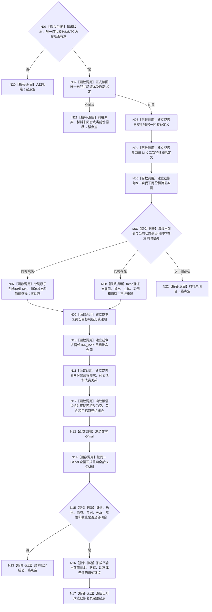

# BIZ-L3-001-03-12 初始化并读取本能根运行锚点目标函数流程图 v0.1

更新时间：2026-08-28

## 依据

```text
0050 v2.1、6120 v0.8、6130 v0.7、8100 v1.1、8120 v0.11、8300 v1.0；BIZ-L2-001-03；INSTINCT-BOOTSTRAP-ROOT-ANCHOR 详细设计 v0.1
```

## 身份与边界

正式目标函数设计图。唯一业务目标是在方法登记根初始化成功后、创建自我线程之前，为唯一自我建立或恢复安全根和服务根的正式运行材料，并在同一非零 `Gfinal` 完整读回后形成值式本能根运行锚点。编号 `03-12` 是稳定图身份，不表示它在 `03-11` 之后执行；实际顺序固定为 `03-10 -> 03-12 -> 03-11`。

本函数不计算本轮差值，不展开具体需求，不创建任务，不改变现实，不缓存跨启动权威，也不自动发布空根或用名称、顺序、编码大小猜测角色。

## 函数合同

```text
根函数：本能根运行初始化提供者::初始化并读取本能根运行锚点_v1
归属模块 / 文件 / 目标分解深度：海中鱼巣.业务.提供者.本能根运行初始化 / 海中鱼巣/业务/提供者.本能根运行初始化.ixx / BIZ-L3
现有或待新增：待实施；正式规范和详细设计已发布，计划当前由计划索引治理
完整签名：本能根运行初始化结果_v1 本能根运行初始化提供者::初始化并读取本能根运行锚点_v1(const 本能根运行初始化请求_v1& 请求) noexcept
参数：请求为只读借用；只含合同版本、正式唯一自我和大于零的本次启动UTC纳秒
返回结果：仅已形成或已恢复成功并携带完整本能根运行锚点_v1；其它状态锚点为空
被调函数流程图：直接编排具名 DATA-L2 特征、状态和需求结构公开服务；其内部事务不在目标业务层重复展开
```

## 流程图



## 节点合同

| 节点 | 类型 | 输入 | 输出 | 权威读写 | 验证 |
| --- | --- | --- | --- | --- | --- |
| N01—N02 | 判断 / 函数调用 | 请求、正式唯一自我 | 准入或结构化非成功 | 只读唯一自我 | 零身份、坏版本、零UTC、错自我 |
| N03—N05 | 函数调用 | 固定业务幂等身份、唯一自我 | 两套定义、二次概念和实例 | 只经特征结构服务形成 / 恢复；二次概念零实例和值 | 首次、精确重复、0/N、多义、角色交叉 |
| N06—N08 | 判断 / 函数调用 | 当前值和当前状态事实 | 首值首态结果或互证材料 | 首次只经双参与者原子入口形成值、状态、选择；不写动态 | 同代、值等、UTC、零动态、单边缺失、重启不重置 |
| N09—N12 | 函数调用 | 两根定义、唯一自我、M | 注册、合同、根需求和列表闭包 | 只经具名状态 / 需求结构服务；不建立第二角色索引 | 目标 M、允许关系位、父为空、精确列表项、成员闭包 |
| N13—N17 | 调用 / 判断 / 构造 / 返回 | 全部稳定身份 | 同截止锚点 | 全部按 Gfinal 正式重读；锚点只是值式副本 | 截止相等、完整形状、首次 / 恢复、漂移零载荷 |
| N20—N23 | 返回 | 当前结构化非成功 | 空锚点 | 不回滚已发布前步，不拼接异截止材料 | 幂等冲突、引用冲突、材料未闭合、已可能发布、资源失败、内部不一致 |

## 关键边界

- `M = I64_MAX`，首次 `A0 = V0 = M / 2 = 4,611,686,018,427,387,903`；余数 1 舍弃。首次赋值形成当前值、初始状态和当前选择，不形成动态。
- 两份差值只持久化二次特征概念定义。本函数不形成 `M-当前值` 的具体值；治理轮次必须 fresh 读取当前值后局部计算并用后丢弃。
- 锚点包含两根的稳定身份和形成时 `Gfinal`，不保存当前值副本、初始状态身份、动态或差值。后续治理轮次不得复用 `Gfinal` 作为当前截止。
- 根需求是长期普通 D；当前满足只关闭本轮具体需求展开，不退役根。安全根和服务根身份、事实、列表、目标及结算账保持独立。
- 任一非成功由父级映射 `程序失败阶段::本能根运行初始化 = 21`，且自我线程创建调用次数必须为零。成功锚点原样进入 BIZ-L3-001-03-11 的创建合同 v2 锁定请求。

## 当前发布源码对照

- 当前发布源码 tree `2891b0a3db91d64cfdaae9a548b35dfb60775c19` 尚无 `本能根运行初始化提供者`、锚点 DTO、首值首态组合入口或阶段 21 生产调用，本图为已获正式规范依据的目标，不是当前实现事实。
- 已发布 `INSTINCT-BOOTSTRAP-ROOT-ANCHOR` 详细设计和计划只提供施工合同；计划登记、代码 WIP、编译或测试均不能替代发布源码实现与独立读回。
- 本图不修改需求结构公开服务；现有 `按精确目标查询需求列表项` 必须直接复用。
