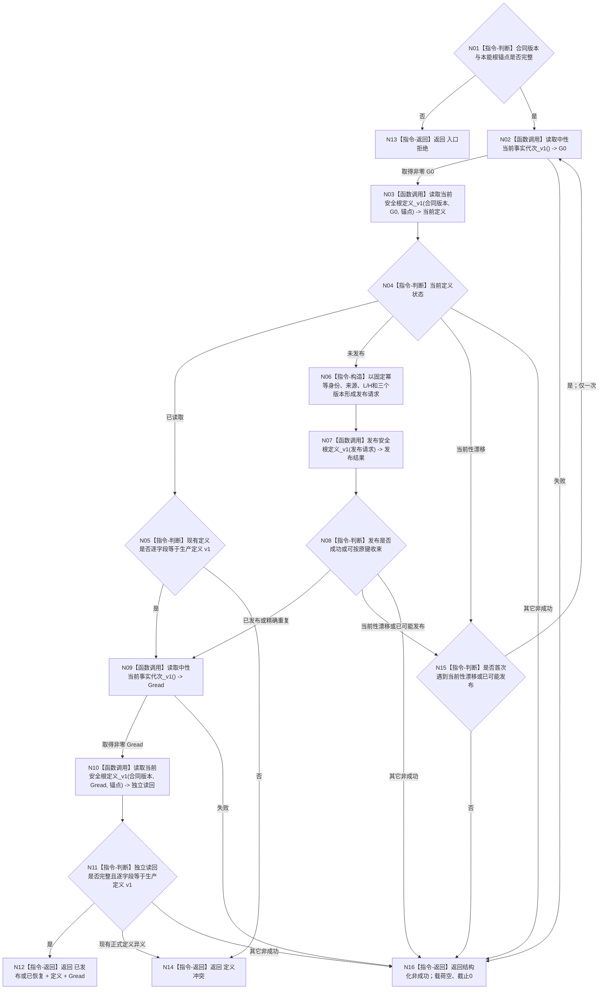

# BIZ-L3-001-03-13 初始化并读取安全根生产定义 目标函数流程图 v0.1

更新时间：2026-08-29

## 依据

```text
用户裁决：生产 L/H 按根值域上界的 30% / 80% 形成
0050、6120 v0.10、6170 v0.6
INSTINCT-ROUTE v0.1
安全根定义与当前值 provider 结果提交 2fdcc4bf
当前启动入口：海中鱼巣/启动.应用程序.ixx
```

## 身份与边界

本图是待新增生产目标函数的正式设计图。它只在本能根运行锚点完整后建立或恢复安全根生产定义，并独立读回；不执行主动安全结算、被动服务维护、需求自检或线程创建。

## 函数合同

```text
根函数：初始化并读取安全根生产定义_v1
归属模块：海中鱼巣.业务.提供者.安全根生产定义初始化
物理文件：海中鱼巣/业务/提供者.安全根生产定义初始化.ixx
现有或待新增：待新增
完整签名：安全根生产定义初始化结果_v1 初始化并读取安全根生产定义_v1(const 安全根生产定义初始化请求_v1& 请求) noexcept
参数：请求为只读借用；包含合同版本与完整本能根运行锚点
返回结果：已发布 / 已恢复成功并携带完整正式定义及独立读回截止；全部非成功载荷空、截止 0
被调函数流程图：发布安全根定义_v1、读取当前安全根定义_v1 使用既有 provider 合同，本图不展开其内部事务
```

## 流程图



## 节点合同

| 节点 | 类型 | 参数 / 输入绑定 | 结果 / 输出绑定 | 事实读写 | 后继条件 | 验证 |
| --- | --- | --- | --- | --- | --- | --- |
| N01 | 指令-判断 | 请求 | 有效性 | 无 | 有效 / 无效 | 错版本、坏锚点 |
| N02/N09 | 函数调用 | 无参数 | 非零当前代次 | 只读 DATA-L1 当前代次 | 取得 / 失败 | 读前与读后截止 |
| N03/N10 | 函数调用 | G、锚点 | 定义读取结果 | 只读安全根定义 owner | 状态分支 | 未发布、已读取、漂移 |
| N05/N11 | 指令-判断 | 正式定义、生产常量 | 全字段一致性 | 无 | 相同 / 冲突 | L/H、版本、来源、角色 |
| N06 | 指令-构造 | G0、锚点、生产常量 | 发布请求 | 无 | 构造完成 | 固定键与整数常量 |
| N07 | 函数调用 | 发布请求 | 发布结果 | 可能原子发布安全根定义 | 结果状态 | 首次、重复、漂移、未知 |
| N15 | 指令-判断 | 尝试次数、下游状态 | 是否重试 | 无 | 最多一次 | 不生成新键、不换语义 |
| N12 | 指令-返回 | 独立读回 | 成功结果 | 无 | 返回 | 完整定义与截止 |
| N13/N14/N16 | 指令-返回 | 失败材料 | 结构化非成功 | 无新增业务事实 | 返回 | 空载荷、截止 0 |

## 关键边界

```text
M = I64_MAX
L = floor(M*30/100) = 2,767,011,611,056,432,742
H = floor(M*80/100) = 7,378,697,629,483,820,645

比例计算不使用 float/double，不使用 UINT64_MAX。
首次发布固定定义版本1、主动安全结算规则版本1、被动服务维护规则版本1。
已有正式定义异义时拒绝启动，不自动迁移或覆盖。
重试只复用同一幂等身份和同义请求；最多一次。
成功必须来自独立正式读回，不以发布成功码、SQL行、日志或测试fixture代替。
```
