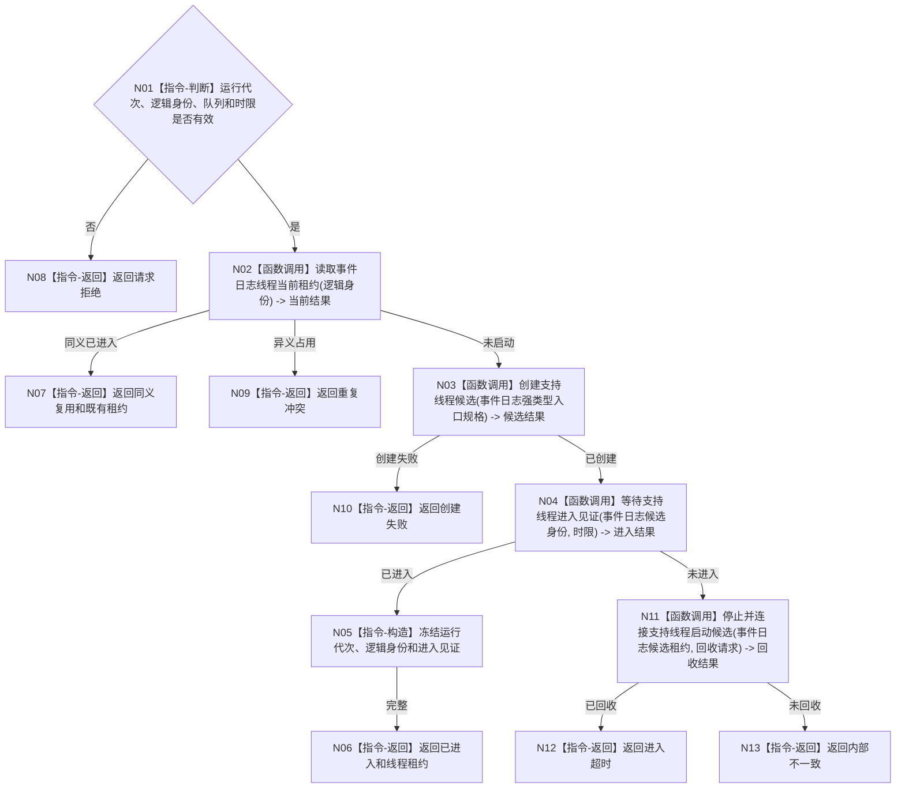

# BIZ-L3-001-04-01 启动事件日志线程目标函数流程图 v0.1

更新时间：2026-08-03

## 依据

```text
0050、8110、8120；BIZ-L2-001-04；当前海中鱼巣/线程/事件日志线程.ixx
```

## 身份与边界

正式目标函数设计图。现行无参 `启动()` 仅是相邻实现证据；目标函数增加运行代次、唯一逻辑身份、进入见证和结构化回收语义。事件日志失败只形成支持旁路降级。

## 函数合同

```text
根函数：事件日志线程::启动
归属模块 / 文件 / 层级：事件日志线程 / 海中鱼巣/线程/事件日志线程.ixx / L3
现有或待新增：适配扩展
完整签名：事件日志线程启动结果 事件日志线程::启动(const 事件日志线程启动请求& 请求)
参数：请求为只读借用；含运行代次、线程逻辑身份、事件队列借用、启动幂等身份和启动时限；队列及其所有者覆盖线程租约
返回结果：值式事件日志线程启动结果；含已进入、同义复用、请求拒绝、重复冲突、创建失败、进入超时或内部不一致，以及调用方拥有的线程租约
被调函数流程图：BIZ-L4-001-04-00-01 创建支持线程候选；BIZ-L4-001-04-00-02 等待支持线程进入见证；BIZ-L4-001-04-00-03 停止并连接支持线程启动候选；BIZ-L4-001-04-01-01 运行事件日志线程入口
父图：BIZ-L2-001-04
```

## 流程图



## 节点合同

| 节点 | 类型 | 参数 / 输入绑定 | 结果 / 输出绑定 | 事实读写 | 后继条件 | 验证 |
| --- | --- | --- | --- | --- | --- | --- |
| N01—N02 | 判断 / 函数调用 | 请求、逻辑身份 | 准入、当前租约 | 只读线程投影 | 同义、异义或未启动 | 错代、重复身份 |
| N03—N04 | 函数调用 | 请求、候选租约 | 创建和进入结果 | 只发8110生命周期消息 | 创建或等待完成 | 创建失败、进入超时 |
| N05—N13 | 指令 / 函数调用 | 进入或回收材料 | 租约或具名非成功 | 不写业务事实 | 结果完整 | 零悬空候选 |

## 关键边界

日志是否可写、是否持久化和显示内容不得改变业务初始化、线程组启动或退出码；系统线程ID只作诊断绑定。
