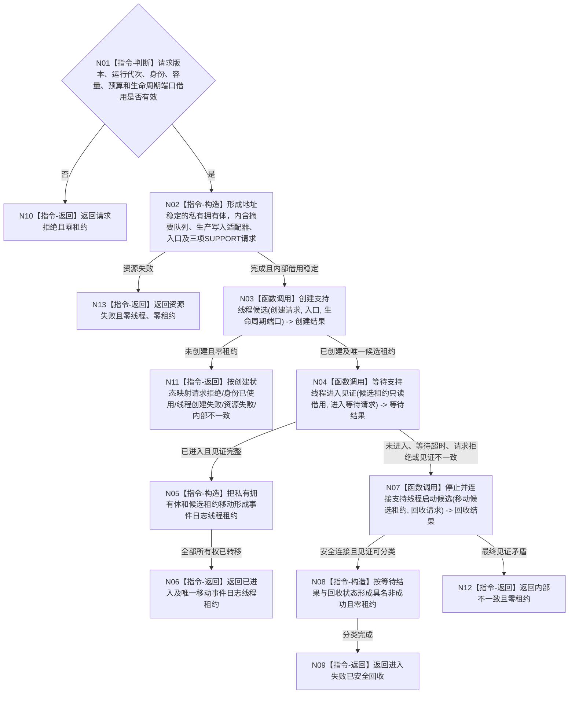

# BIZ-L3-001-04-01 启动事件日志线程目标函数流程图 v0.2

更新时间：2026-08-27

## 依据

```text
0050、8110、8120、日志系统规范；BIZ-L2-001-04；BIZ-L2-001-15；
SUPPORT-THREAD-CANDIDATE-LIFECYCLE v0.1 最终实现；BIZ-L4-001-04-00-01—03 v0.2
```

## 身份与边界

正式目标函数设计图。先形成同一 `事件日志线程租约` 所拥有的专属有界队列、生产写入适配器、入口和 SUPPORT 候选租约，再消费共享 SUPPORT 候选生命周期能力；固定执行“创建候选 -> 等待内部进入见证 -> 未进入则移动 SUPPORT 租约安全停止并连接 -> 已进入则返回唯一事件日志线程租约”。本函数不读取 8110 投影、不维护第二份当前租约，也不把日志摘要或写入结果解释成机器事实。

## 函数合同

```text
根函数：启动事件日志线程
归属模块 / 文件 / 层级：海中鱼巣.线程.运行.事件日志线程 / 海中鱼巣/线程/运行.事件日志线程.ixx / BIZ-L3
现有或待新增：已实现并登记工程；HEAD 模块导出正式自由函数、唯一移动 EVENT 租约和结构化启动/停止结果，但尚无 BIZ-L2-001-04 或其它生产调用者
完整签名：事件日志线程启动结果 启动事件日志线程(const 事件日志线程启动请求& 请求, 线程生命周期发布端口& 生命周期端口) noexcept
参数：请求为只读借用，含合同版本、运行代次、唯一线程逻辑身份、非零队列容量、非零进入等待毫秒和非零回收诊断等待毫秒；固定 `事件日志/事件日志` 类别—模块配对只由本函数内部形成，不是公开请求字段；生命周期端口为调用期借用且生命周期必须覆盖成功返回的事件日志线程租约
返回结果：移动值式事件日志线程启动结果；含已进入、请求拒绝、身份已使用、线程创建失败、资源失败、进入超时已安全连接、入口故障已安全连接、超过诊断预算后已安全连接或内部不一致；只有已进入携带一份只可移动构造的 `事件日志线程租约`，它唯一持有队列、生产写入适配器、入口和 SUPPORT 候选租约，全部非成功零租约
返回租约能力：事件日志线程停止连接结果 事件日志线程租约::停止并连接(const 事件日志线程停止连接请求& 请求) && noexcept；仅供 BIZ-L2-001-15 移动调用。请求须证明队列已停收，且处理已完成到接受截止或同一截止的剩余快照已成功读取；内部始终幂等锁存停止接收并移动唯一 SUPPORT 租约调用正式回收，返回结构化队列/入口/连接见证，不暴露裸 SUPPORT 租约。前置未闭合也必须安全 stop + join，但返回“前置未闭合但已安全连接”，不得伪报正常收口
被调函数流程图：BIZ-L4-001-04-00-01 v0.2 创建支持线程候选；BIZ-L4-001-04-00-02 v0.2 等待支持线程进入见证；BIZ-L4-001-04-00-03 v0.2 停止并连接支持线程启动候选；BIZ-L4-001-04-01-01 v0.2 运行事件日志线程入口
父图：BIZ-L2-001-04
```

## 流程图



## 节点合同

| 节点 | 类型 | 参数 / 输入绑定 | 结果 / 输出绑定 | 事实读写 | 后继条件 | 验证 |
| --- | --- | --- | --- | --- | --- | --- |
| N01/N10 | 指令 | 启动请求、生命周期端口 -> 根函数参数 | 准入或请求拒绝 -> 启动结果 | 无事实写入 | 全部字段有效且固定配对 | 坏版本、错代、错配、零容量/预算、缺借用 |
| N02/N13 | 指令-构造/返回 | 启动请求字段 | 地址稳定的私有拥有体（队列、生产写入适配器、入口）、`支持线程候选创建请求`、`支持线程进入等待请求`、`支持线程候选回收请求`，或资源失败 | 只形成未发布私有对象 | 入口借用指向拥有体内部稳定地址 | 分配失败、事件日志固定配对、预算不丢失、外层移动不改变内部地址 |
| N03 | 函数调用 | 创建请求/入口/生命周期端口 -> 同名参数 | `支持线程候选创建结果` -> 创建结果 | 8110 仅由 SUPPORT 最佳努力投影 | 已创建才有SUPPORT租约 | 六种创建状态、入口借用稳定 |
| N04 | 函数调用 | 候选租约/等待毫秒 -> 等待函数参数 | `支持线程进入等待结果` -> 等待结果 | 只读候选内部见证 | 仅已进入可发布 | 超时、完成未进入、投影不可用 |
| N05/N06 | 指令 | 私有拥有体、SUPPORT候选租约和进入见证 | 已进入和唯一 `事件日志线程租约` -> 启动结果 | 无额外生命周期写入 | 两项所有权只移动一次且内部地址稳定 | 成员销毁顺序先安全连接线程再销毁拥有体，零复制、零第二租约 |
| N07 | 函数调用 | 候选租约移动输入/诊断预算 -> 回收函数参数 | `支持线程候选回收结果` -> 回收结果 | SUPPORT 锁存停止、等待完成并 join | 任一未进入结果都必须调用 | 请求无效仍安全连接、超预算仍连接 |
| N08/N09/N11/N12 | 指令 | 创建/等待/回收结果 | 具名非成功且零租约 | 不改变业务事实 | 分类与租约守恒 | 创建失败零租约、失败候选零悬空 |

## 关键边界

```text
内部进入见证是物理启动依据；8110、系统线程ID、日志文本和摘要字段均不取得启动事实权。
共享 SUPPORT 只接受一个入口端口；事件日志 DTO、队列、生产写入适配器和入口都由 `事件日志线程租约` 唯一拥有，不反向进入共享基础。
本函数不存在“读取当前租约”“同义复用”或第二 owner；同一运行代次逻辑身份重复由 SUPPORT 返回身份已使用。
失败路径必须移动原唯一租约调用正式回收函数；不得 detach、返还 joinable 租约或另造停止入口。
成功结果不得暴露 SUPPORT 裸租约；调用方只移动持有 `事件日志线程租约`，并通过其生产写入适配器提交摘要。
阶段15必须先取得“已停收且已完成到接受截止”或“已停收且同截止剩余快照已成功读取”见证，再对右值事件日志租约调用结构化 `停止并连接`，由它内部移动唯一 SUPPORT 租约进入正式回收；前置未闭合仍安全连接并返回专门状态。普通析构只是在异常离开所有权域时防止 joinable 泄漏的 fallback，不是正常收口能力、阶段15完成证据或结构化结果替代品。
日志不可用只形成支持旁路降级；不得改变业务初始化、线程继续或退出码。
```

## 当前代码对应（HEAD `b9abf5a3`）

- `海中鱼巣/线程/事件日志线程.数据.h` 与 `海中鱼巣/线程/运行.事件日志线程.ixx` 已受工程唯一登记；提交 `f2726649` 实现本叶，后继 `a867a528` 退出计划、`3cd75bad` 清理临时专项。
- 当前公开请求字段与本图校正后合同一致；固定 SUPPORT 类别—模块配对由函数内部形成，调用方不能提供或改写。
- 源码已实现地址稳定拥有体、SUPPORT 创建/等待/失败回收、唯一移动 EVENT 租约、提交/停收/位置/等待/快照和右值停止连接；失败不遗留第二租约，日志结果不进入业务裁决。
- HEAD 除本模块自身声明/定义外没有 `启动事件日志线程` 调用；因此只能记为 provider 已实现、生产接线未实现，不能升级 BIZ-L2-001-04 或阶段15完成。
- 本批未重跑历史 `20 PASS / 0 FAIL / 3 NOT_RUN` 专项和根工程双配置；只确认已发布源码、工程登记及零生产消费者。
