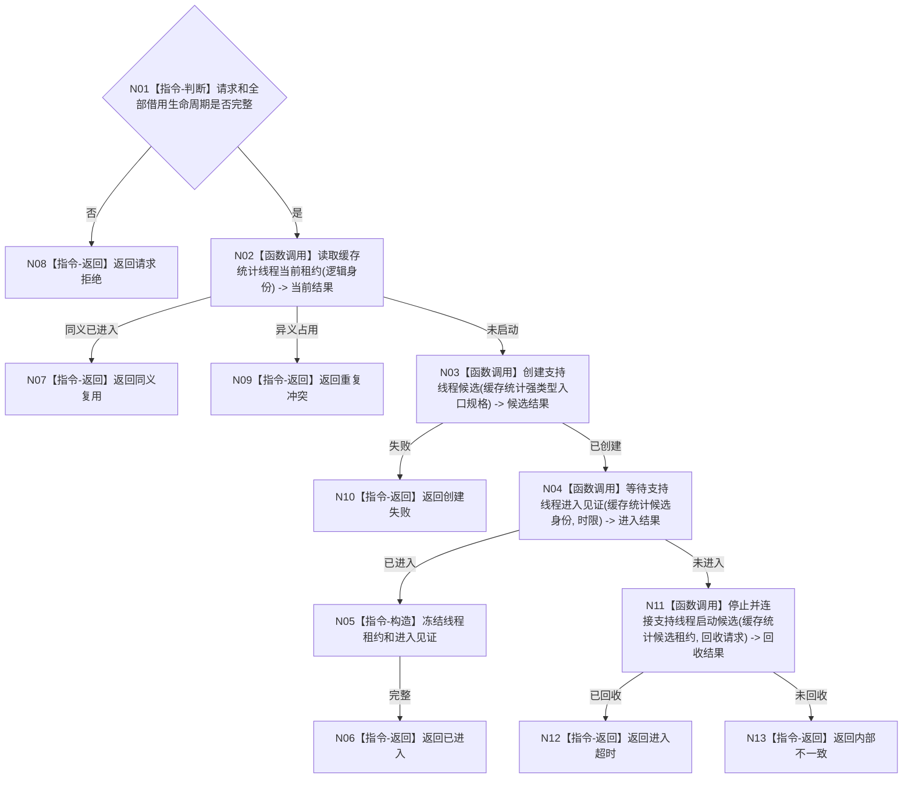

# BIZ-L3-001-04-02 启动缓存统计线程目标函数流程图 v0.1

更新时间：2026-08-03

## 依据

```text
0050、8110、8120；BIZ-L2-001-04；当前海中鱼巣/线程/缓存统计线程.ixx
```

## 身份与边界

正式目标函数设计图。启动只读统计与可重建缓存旁路，不创建或修改业务事实；现行无参 `启动()` 需适配运行代次和进入见证。

## 函数合同

```text
根函数：缓存统计线程::启动
归属模块 / 文件 / 层级：缓存统计线程 / 海中鱼巣/线程/缓存统计线程.ixx / L3
现有或待新增：适配扩展
完整签名：缓存统计线程启动结果 缓存统计线程::启动(const 缓存统计线程启动请求& 请求)
参数：请求为只读借用；含运行代次、线程逻辑身份、统计消息队列、只读统计端口、启动幂等身份和时限；全部借用对象覆盖线程租约
返回结果：值式缓存统计线程启动结果；含已进入、同义复用、请求拒绝、重复冲突、创建失败、进入超时或内部不一致，以及调用方拥有的线程租约
被调函数流程图：BIZ-L4-001-04-00-01 创建支持线程候选；BIZ-L4-001-04-00-02 等待支持线程进入见证；BIZ-L4-001-04-00-03 停止并连接支持线程启动候选；BIZ-L4-001-04-02-01 运行缓存统计线程入口
父图：BIZ-L2-001-04
```

## 流程图



## 节点合同

| 节点 | 类型 | 输入 | 输出 | 事实读写 | 验证 |
| --- | --- | --- | --- | --- | --- |
| N01—N02 | 判断 / 函数调用 | 请求和逻辑身份 | 准入与当前租约 | 只读线程投影 | 错代、借用失效、重复 |
| N03—N04 | 函数调用 | 启动请求 | 候选和进入结果 | 只发8110消息 | 创建失败、进入超时 |
| N05—N13 | 指令 / 函数调用 | 进入或回收材料 | 租约或非成功 | 不写业务事实 | 零悬空线程 |

## 关键边界

缓存不可用只触发回源或具名降级；统计缺失、缓存命中和缓存刷新都不能裁决机器事实。
