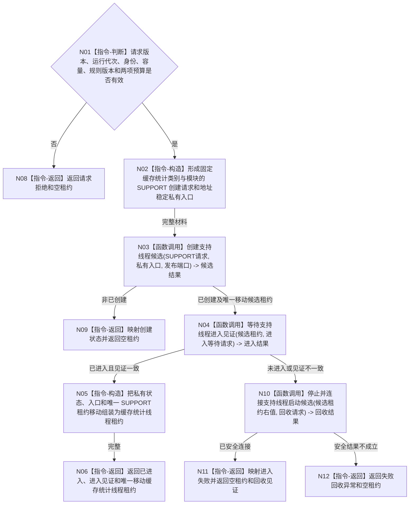

# BIZ-L3-001-04-02 启动缓存统计线程目标函数流程图 v0.2

更新时间：2026-08-28

## 依据

```text
0050、4060、8110、8120；BIZ-L2-001-04；
CACHE-STATISTICS-THREAD-PRODUCTION-START v0.1；
SUPPORT-THREAD-CANDIDATE-LIFECYCLE v0.1 最终实现。
```

## 身份与边界

正式目标函数设计图。启动唯一缓存统计支持线程；该线程只读取同一运行代次的 8110 当前线程投影组，形成可丢弃统计，不消费 DATA-L1—L3，不依赖事件日志线程先实现。支持线程组的最终组合仍须分别取得三个具体叶的真实结果。

## 函数合同

```text
根函数：启动缓存统计线程
归属模块 / 文件 / 层级：海中鱼巣.线程.运行.缓存统计线程 / 海中鱼巣/线程/运行.缓存统计线程.ixx / BIZ-L3
现有或待新增：目标数据头、模块、自由函数、私有入口、唯一移动租约和工程登记均不存在；详细设计已形成，但启动非成功矩阵仍有具名DRIFT，尚不能直接交代码施工
完整签名：缓存统计线程启动结果 启动缓存统计线程(const 缓存统计线程启动请求& 请求, const 线程生命周期投影读取端口& 读取端口, 线程生命周期发布端口& 发布端口) noexcept
参数：请求为只读借用，含合同版本、运行代次、非零线程逻辑身份、刷新队列容量、统计规则版本、进入等待和失败回收诊断预算；读取端口为 const 借用，发布端口为可变借用，二者生命周期覆盖成功租约
返回结果：值式结果；已进入时恰含一份唯一移动缓存统计线程租约和 SUPPORT 进入见证；请求拒绝、身份已使用、候选创建失败、进入超时但已安全连接、失败回收异常、内部不一致时零租约
返回租约能力：提交刷新、读取当前统计快照、停止接收并取得截止、读取处理位置、等待完成到截止、冻结并丢弃未处理刷新，以及右值限定停止并连接；全部只管理可丢弃统计与唯一物理租约，不暴露裸 SUPPORT 租约。正常停止必须先证明已完成到截止或同截止未处理刷新已冻结丢弃；前置未闭合仍安全连接但不得返回正常收口
被调函数流程图：BIZ-L4-001-04-00-01 v0.2 创建支持线程候选；BIZ-L4-001-04-00-02 v0.2 等待支持线程进入见证；BIZ-L4-001-04-00-03 v0.2 停止并连接支持线程启动候选；BIZ-L4-001-04-02-01 v0.2 运行缓存统计线程入口
父图：BIZ-L2-001-04
```

## 流程图



## 节点合同

| 节点 | 类型 | 参数 / 输入绑定 | 结果 / 输出绑定 | 事实读写 | 后继条件 | 验证 |
| --- | --- | --- | --- | --- | --- | --- |
| N01 | 指令-判断 | 启动请求 -> 值式运行校验；读取/发布端口 -> 调用期引用前置 | 准入或拒绝 | 零事实写入 | 请求字段有效才继续；两个端口及其覆盖成功租约的寿命由调用方在进入函数前保证，不能由本函数运行时探测 | 坏版本、零代次/身份/容量/规则/预算均在创建前拒绝 |
| N02 | 指令-构造 | 请求 -> SUPPORT请求；读取端口 -> 私有入口 | 固定 `缓存统计/缓存统计` 配对 | 零线程创建 | 材料完整 | 调用方不能选择 SUPPORT 类别/模块，不复制 SUPPORT DTO 到公开请求 |
| N03 | 函数调用 | SUPPORT请求、私有入口、发布端口 | 候选状态和可选唯一移动租约 | 8110 只作最佳努力投影 | 已创建或返回 | 使用最终 SUPPORT ABI；同代身份历史重用拒绝 |
| N04 | 函数调用 | 候选租约只读、进入等待请求 | 进入状态和内部见证 | 只读 SUPPORT 内部见证 | 已进入或回收 | 不读 8110 投影裁决物理进入 |
| N05/N06 | 指令 | 私有拥有体、入口、候选租约和见证 | 一份缓存统计线程租约 | 零业务事实 | 全部唯一 owner 已移动 | 成功恰一租约；裸 SUPPORT 租约不公开 |
| N10—N12 | 函数调用 / 返回 | 候选租约右值、回收请求 | 最终见证和结构化非成功 | 只回收线程资源 | 安全连接后返回 | 超时、入口故障和内部不一致均零悬空线程 |

## 关键边界

```text
读取端口必须按 const 借用保存；发布端口只交给 SUPPORT 做最佳努力生命周期投影。
本函数不读取当前租约、不提供同义复用、不重复使用失败身份、不暴露裸 SUPPORT 租约。
EVENT 已实现但零生产调用，且本叶不依赖 EVENT 才可施工；BIZ-L2-001-04 的最终三叶组合仍为后继 NOT_RUN。
DATA-L1、DATA-L2、DATA-L3 均为零消费；统计结果不得裁决任何业务事实。
```

## 冻结发布源码对照（提交 `d24ea5d4`）

- 当前发布源码树 不存在 `海中鱼巣/线程/缓存统计线程.数据.h`、`海中鱼巣/线程/运行.缓存统计线程.ixx`、`启动缓存统计线程`、`缓存统计线程租约`或其工程登记；只有目标图、详细设计和已退出实施计划。因此本叶是实现缺失，不是空壳、未接线 provider 或已编译候选。
- SUPPORT 候选生命周期与 8110 const 当前线程投影组读取均已发布，只能证明直接依赖可复用；它们不替代 CACHE 的刷新队列、统计快照、唯一租约、入口和结构化停止能力。
- `DRIFT-BIZ-CACHE-STATISTICS-START-NON-SUCCESS-MATRIX-INCOMPLETE`：现行详细设计和本图没有冻结私有拥有体分配失败的启动状态，也没有逐项保存 SUPPORT 的资源失败、入口故障、超过诊断预算后已安全连接等结果；N02 资源失败无出边，N10—N12 不能机械完成精确映射。该矩阵闭合前不得由代码临场把资源失败压成内部不一致或把安全连接结果压成失败回收异常。
- 本批未运行构建、程序或业务专项；不存在的目标模块不能因依赖已实现、设计已形成或旧计划曾存在而升级为代码完成。

## v0.2 校正记录

- 将两个端口寿命明确为调用方所有权前置，不再伪造为 N01 可运行探测条件。
- 补回唯一移动 CACHE 租约必须向阶段15提供的刷新、快照、停收、截止、丢弃与右值停止连接能力。
- 按当前发布源码事实登记完整实现缺失，并把启动资源失败与 SUPPORT 非成功结果映射不足具名退回设计治理。
