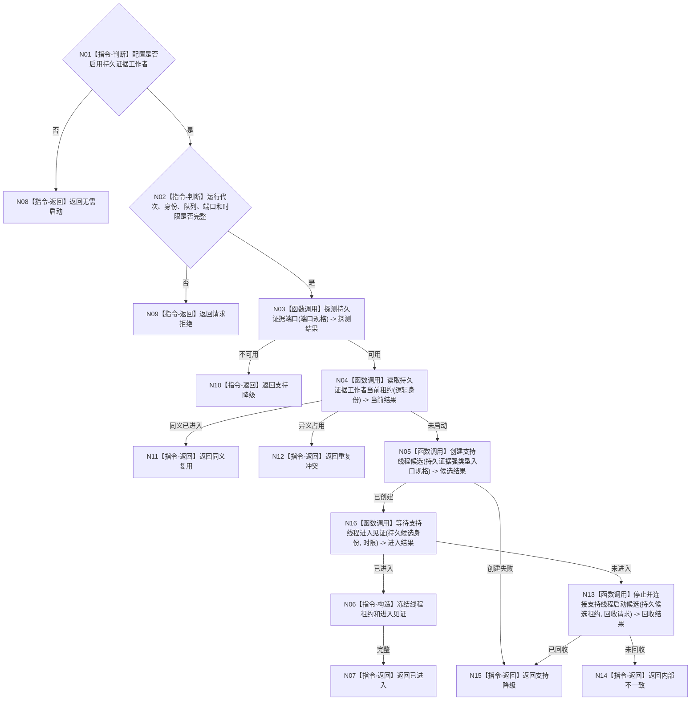

# BIZ-L3-001-04-03 按配置启动持久证据工作者目标函数流程图 v0.1

更新时间：2026-08-03

## 依据

```text
0050、8110、8120；BIZ-L2-001-04；目标线程归属与跨线程材料
```

## 身份与边界

正式目标函数设计图。持久证据工作者是可选支持旁路；SQL和独立材料只保存已发布代次证据，不取得运行期事实权。

## 函数合同

```text
根函数：持久证据工作者::按配置启动
归属模块 / 文件 / 层级：持久证据旁路 / 海中鱼巣/线程/持久证据工作者.ixx / L3
现有或待新增：待新增
完整签名：持久证据工作者启动结果 持久证据工作者::按配置启动(const 持久证据工作者启动请求& 请求)
参数：请求为只读借用；含启用配置、运行代次、线程逻辑身份、已发布证据队列、持久端口、启动幂等身份和时限；端口及队列所有者覆盖租约
返回结果：值式启动结果；含无需启动、已进入、同义复用、支持降级、请求拒绝、重复冲突或内部不一致，以及可空线程租约
被调函数流程图：BIZ-L4-001-04-03-01 探测持久证据端口；BIZ-L4-001-04-00-01 创建支持线程候选；BIZ-L4-001-04-00-02 等待支持线程进入见证；BIZ-L4-001-04-00-03 停止并连接支持线程启动候选；BIZ-L4-001-04-03-02 运行持久证据工作者入口
父图：BIZ-L2-001-04
```

## 流程图



## 节点合同

| 节点 | 类型 | 输入 | 输出 | 事实读写 | 验证 |
| --- | --- | --- | --- | --- | --- |
| N01—N02 | 指令-判断 | 配置与请求 | 无需启动或准入 | 无 | 关闭配置、缺端口 |
| N03—N05/N13 | 函数调用 | 端口、身份和请求 | 探测、当前租约、进入和回收结果 | 只读端口状态并发8110消息 | 端口不可用、重复、超时 |
| N06—N14 | 指令 | 进入和回收材料 | 租约、降级或内部不一致 | 不发布业务事实 | 降级守恒和零悬空候选 |

## 关键边界

持久成功不等于运行期事实发布成功；持久失败不得撤销或覆盖已经发布的内存代次。
