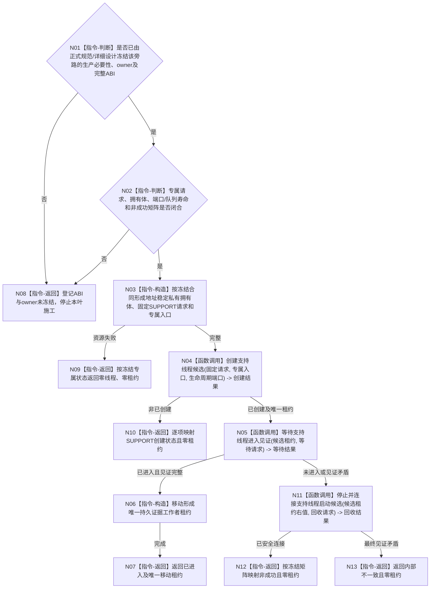

# BIZ-L3-001-04-03 按配置启动持久证据工作者目标函数流程图 v0.2

更新时间：2026-08-28

## 依据

```text
0050、4040、4070、8110、8120；BIZ-L2-001-04；
SUPPORT-THREAD-CANDIDATE-LIFECYCLE v0.1 最终实现。
```

## 身份与边界

正式目标治理图。该编号暂时保留“可选已发布证据追写旁路”的目标位置，但现行正式规范只冻结持久材料不取得运行期事实权，以及恢复、审计和材料回收属于独立管理面；没有冻结本工作者的生产必要性、唯一 owner、队列、端口、证据格式、重试、停止和结果 ABI。4070 当前阶段不实施恢复，也不要求生产代码保留既有恢复或审计入口，因此本图不能作为可执行函数合同。

业务写入若要求发布前准备持久证据，仍必须留在其同步事务合同中；异步工作者不得把发布后追写冒充发布前参与者，不得因追写失败撤销、覆盖或替代已经发布的内存事实代次。

## 函数合同

```text
根函数候选：按配置启动持久证据工作者
归属模块 / 文件 / 目标分解深度：待设计治理冻结 / 待设计治理冻结 / BIZ-L3
现有或待新增：HEAD 不存在专属数据头、模块、公开函数、入口、唯一移动租约或工程登记；现行详细设计和有效计划也没有冻结本叶
完整签名：未冻结；旧 v0.1 的成员函数签名、请求字段和返回状态只是目标草图，不是现行 ABI
参数：未冻结；至少不得把端口/队列引用寿命、当前租约查询或启动幂等身份伪装成已存在公开材料
返回结果：未冻结；必须在后继设计中覆盖关闭配置、请求拒绝、SUPPORT 六种创建状态、等待结果、失败候选全部安全连接结果和成功唯一租约守恒
被调函数流程图：只可复用 BIZ-L4-001-04-00-01—03 v0.2 的最终 SUPPORT 候选生命周期；旧 03-01/03-02 仍是未获正式 ABI 支撑的目标草图，不是可施工叶
父图：BIZ-L2-001-04
```

## 设计门禁流程



## 节点合同

| 节点 | 当前可确认合同 | 仍待冻结 | 验证边界 |
| --- | --- | --- | --- |
| N01/N02/N08 | 没有完整正式依据时停止受影响施工，不从旧草图补 ABI | 生产必要性、owner、完整请求/结果、端口和队列生命周期 | 规范、详细设计、计划三方闭合 |
| N03/N09 | 专属拥有体必须地址稳定；分配发生在 SUPPORT 调用前 | 拥有体内容、分配失败状态和销毁顺序 | 资源失败零线程、零租约 |
| N04/N10 | 只复用最终 SUPPORT 创建 ABI；固定类别/模块由叶内部形成 | 专属类别/模块与六种创建状态映射 | 同一运行代次同身份历史重用返回 `身份已使用` |
| N05—N07 | 物理进入只由 SUPPORT 内部见证证明；成功只交付一份专属唯一移动租约 | 专属入口、停止能力和成功后置 | 不以 8110 投影、日志或当前租约查询证明进入 |
| N11—N13 | 任一未进入候选必须移动原租约安全停止并连接 | 等待/回收逐项映射和诊断预算 | 禁止 detach、悬空候选或析构冒充正常收口 |

## 当前代码对应（HEAD `655d9284`）

- HEAD 不存在 `海中鱼巣/线程/持久证据工作者.ixx`、`海中鱼巣/线程/协议.持久证据工作者.ixx`、同名公开函数、专属 DTO 或工程登记；因此本叶不是未接线 provider，而是完整实现缺失。
- 共享 SUPPORT 候选生命周期已经实现创建、内部进入等待和失败候选安全回收。其身份账在创建调用开始时永久占用 `(运行代次, 线程逻辑身份)`；重复只能返回 `身份已使用`，没有“读取当前租约”“同义复用”或启动幂等回放入口。
- 0050/4040 已有的同步持久准备和写入证据合同不能被异步发布后追写替代；4070 只保留未来独立恢复/审计管理面边界，当前不要求实现该管理面。
- 当前没有有效详细设计或计划冻结本工作者；旧确认稿、历史计划和 L4 目标草图均不能取得机器语义或施工许可。

## 具名偏差

1. `DRIFT-BIZ-PERSISTENT-EVIDENCE-WORKER-ABI-AND-OWNER-UNFROZEN`：生产必要性、唯一 owner、队列/端口、证据格式、生命周期、重试、停止、完整结果矩阵和阶段15收口材料未冻结；无法从 0050/4070 边界自行推出。
2. `DRIFT-BIZ-PERSISTENT-EVIDENCE-WORKER-SUPPORT-LIFECYCLE-OBSOLETE`：旧 v0.1 的“读取当前租约 -> 同义复用/重复冲突”和启动幂等模型与最终 SUPPORT 身份墓碑合同冲突。后继若保留本叶，必须采用一次创建、失败身份不复用、唯一移动专属租约和显式安全连接模型。

## 关键边界

```text
本次校正不裁决该可选旁路最终保留还是退出，只证明旧函数合同不能直接施工。
不得自动新增恢复、审计或持久证据生产管理面，也不得用异步追写改变内存已发布事实。
本叶闭合前，BIZ-L2-001-04 只能把持久项记为未冻结可选叶，不能把三叶组合或阶段15记为完成。
```

## v0.2 校正记录

- 删除“读取当前租约、同义复用、启动幂等身份”目标模型，改为服从最终 SUPPORT 身份墓碑和唯一移动租约合同。
- 登记目标模块、DTO、公开入口、工程登记、详细设计和有效计划均不存在。
- 将生产必要性与持久工作者完整 ABI 退回设计治理；保留 0050/4040/4070 的权威分账，不把边界规范误当实现授权。
