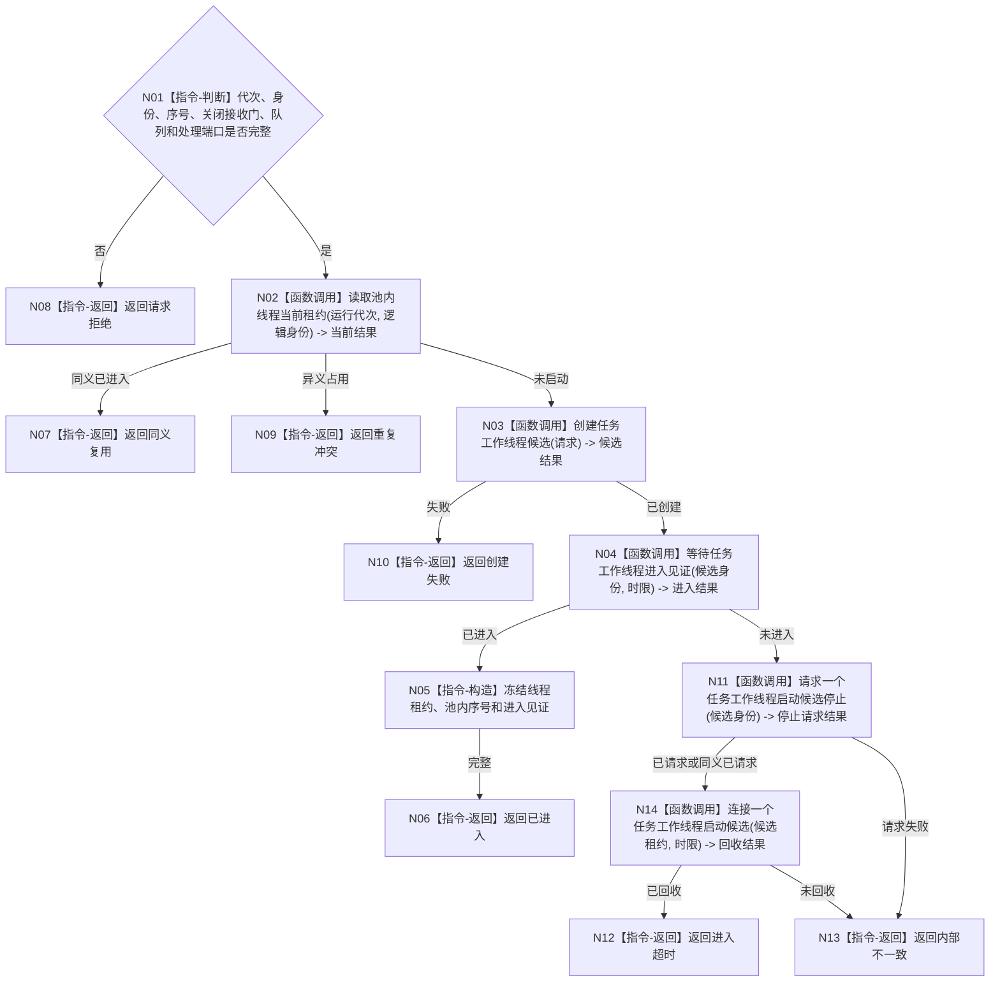

# BIZ-L3-001-05-01 启动一个任务工作线程目标函数流程图 v0.1

更新时间：2026-08-03

## 依据

```text
0050、8100、8110、8120；BIZ-L2-001-05；当前海中鱼巣/线程/任务工作线程.ixx
```

## 身份与边界

正式目标函数设计图。每次只启动一个有稳定池内序号的消费者；现行无参 `启动()` 需升级为强类型工作包、回执端口和进入见证合同。

## 函数合同

```text
根函数：任务工作线程::启动
归属模块 / 文件 / 层级：任务工作线程 / 海中鱼巣/线程/任务工作线程.ixx / L3
现有或待新增：适配扩展
完整签名：任务工作线程启动结果 任务工作线程::启动(const 任务工作线程启动请求& 请求)
参数：请求为只读借用；含运行代次、线程逻辑身份、池内稳定序号、关闭的工作包接收门身份、工作包队列、回执队列、筹办/执行处理端口、启动幂等身份和时限；全部借用覆盖线程租约
返回结果：值式启动结果；含已进入、同义复用、请求拒绝、重复冲突、创建失败、进入超时或内部不一致，以及调用方拥有的单线程租约和进入见证
被调函数流程图：BIZ-L4-001-05-01-01 创建任务工作线程候选；BIZ-L4-001-05-01-02 运行任务工作线程入口；BIZ-L4-001-05-01-03 等待任务工作线程进入见证；BIZ-L4-001-05-02-01/02 失败候选停止与连接
父图：BIZ-L2-001-05
```

## 流程图



## 节点合同

| 节点 | 类型 | 输入 | 输出 | 事实读写 | 验证 |
| --- | --- | --- | --- | --- | --- |
| N01—N02 | 判断 / 函数调用 | 请求 | 准入和当前租约 | 只读线程投影 | 重复序号、错代、缺端口 |
| N03—N04 | 函数调用 | 启动请求 | 候选和进入结果 | 只发8110消息 | 创建失败、进入超时 |
| N05—N14 | 指令 / 函数调用 | 进入或回收材料 | 租约或非成功 | 不取出工作包 | 停止请求与连接分属两个函数调用节点；启动阶段零业务消费 |

## 关键边界

线程启动不选择任务、不推进任务状态；工作种类只能来自接收门开放后取得的不可变强类型工作包。创建候选时运行入口已经绑定，但进入见证必须在零工作包消费状态发布。
