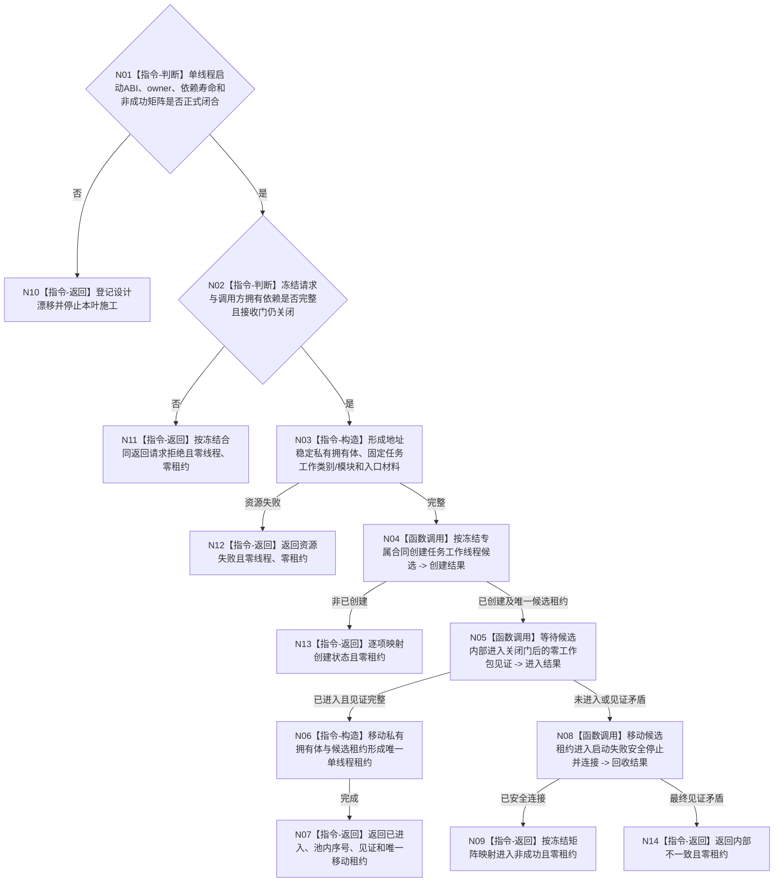

# BIZ-L3-001-05-01 启动一个任务工作线程目标函数流程图 v0.2

更新时间：2026-08-28

## 依据

```text
0050、8100、8110、8120；BIZ-L1-T04 v0.4；BIZ-L2-001-05；
HEAD 海中鱼巣/线程/任务工作线程.ixx。
```

## 身份与边界

正式目标治理图。目标是在同一运行代次内启动一个绑定稳定池内序号的任务工作线程，使它先真实进入关闭接收门后的零工作包等待态，再把唯一物理线程所有权交给父线程池。线程入口后继只调用 BIZ-L1-T04；启动阶段不选择任务、不推进任务状态、不取出工作包。

现行规范只冻结线程职责、启动顺序边界和 8110 非权威生命周期投影，没有冻结单工作线程启动的公开 ABI、候选 owner、依赖注入、唯一租约、门/队列寿命或非成功矩阵。仓库也没有对应详细设计或有效计划。因此下列目标骨架只用于登记缺口，不能直接交代码施工。

## 函数合同

```text
根函数候选：启动一个任务工作线程
归属模块 / 文件 / 目标分解深度：任务工作线程运行基础 / 物理文件待设计治理冻结 / BIZ-L3
现有或待新增：HEAD 只有无参 `任务工作线程操作结果 任务工作线程::启动() noexcept`，创建旧结果尾部线程；目标数据头、启动结果、入口、候选/正式租约和内部进入见证均不存在
完整签名：未冻结；旧 v0.1 的 `任务工作线程::启动(const 任务工作线程启动请求&)` 只是目标草图
参数：未冻结；必须明确对象/租约 owner，运行代次、逻辑身份、池内序号、关闭接收门、工作包来源、结果定位交付端、BIZ-L1-T04 provider 组和 8110 端口分别由构造依赖还是启动请求交付，以及全部借用寿命
返回结果：未冻结；成功必须恰含一份唯一移动的单线程租约和完整内部进入见证，全部非成功零第二线程且不遗失任何已创建候选
被调函数流程图：旧 BIZ-L4-001-05-01-01—03 与 001-05-02-01/02 均为未获详细设计支撑的目标草图；后继设计可复用其“候选创建—零消费进入—失败安全连接”职责分解，但不得直接采用现有字段和状态
父图：BIZ-L2-001-05
```

## 设计门禁与目标骨架



## 节点合同

| 节点 | 当前可确认合同 | 仍待冻结 | 验证边界 |
| --- | --- | --- | --- |
| N01/N10 | 没有正式详细设计和计划时停止受影响施工 | 公开 ABI、owner、依赖方向、状态数值、版本和完整矩阵 | 不从旧图或旧线程对象补字段 |
| N02/N11 | 接收门必须在启动和进入见证形成时保持关闭；8110 端口寿命是调用方前置 | 门身份/代次、队列与 provider 交付方式 | 坏请求零分配、零物理线程 |
| N03/N12 | 线程入口借用必须由地址稳定 owner 覆盖；资源失败发生在物理创建前 | owner 布局、销毁顺序、资源失败状态 | 零悬空借用、零第二 owner |
| N04/N13 | 同一物理候选只能有一份移动所有权 | 专属候选创建状态、身份墓碑或重试策略 | 不提供“读取当前租约”或第二份租约 |
| N05—N07 | 物理进入只由内部见证证明，且形成见证前零工作包消费 | 等待请求/结果、见证字段和租约公开能力 | 8110、日志、线程ID和构造成功均不能替代进入见证 |
| N08/N09/N14 | 任一未进入候选必须显式移动原唯一租约完成安全连接 | 停止/连接合同、预算和逐项映射 | 禁止 detach、丢失候选或析构冒充正常回收 |

## 当前代码对应（HEAD `41673a21`）

- `海中鱼巣/线程/任务工作线程.ixx` 的构造函数只保存旧结果队列容量和 `任务管理线程&`；对象不可移动并直接持有 `std::thread`。
- 无参 `启动()` 在对象锁内把状态改为运行中后构造平台线程，入口固定为私有 `运行结果尾部()`；没有运行代次、逻辑身份、池内序号、关闭接收门、候选/正式租约、进入等待或失败候选回收。
- `运行结果尾部()`消费的是已经形成的 `任务工作结果材料`，形成旧回执并直接交给 T03；它不是 BIZ-L1-T04 的筹办/执行工作包循环。形成或上交失败只增加拒绝计数，已取材料没有正式重交/接管守恒。
- 平台线程构造、条件变量等待、停止锁存和 `join` 只能作为机械资源候选；不能证明目标入口、唯一租约、内部见证或线程池启动顺序已经实现。
- HEAD 没有为本目标冻结详细设计或有效计划；L4 五个专属叶和本函数旧签名都只存在于目标流程图。

## 具名偏差

1. `DRIFT-BIZ-TASK-WORKER-START-ABI-OWNERSHIP-AND-NON-SUCCESS-MATRIX-UNFROZEN`：候选/正式租约 owner、构造与启动依赖分配、门/队列/provider 生命周期、版本、状态和创建/等待/安全连接逐项矩阵未冻结。
2. `DRIFT-BIZ-TASK-WORKER-START-REPLAY-UNIQUE-LEASE-CONFLICT`：旧 v0.1 要求“读取当前租约 -> 同义复用”，同时又要求调用方唯一拥有单线程租约；重复调用无法合法再取得同一唯一所有权。后继必须选择一次性身份墓碑、只读状态查询或其它不复制租约的明确模型，不能保留该分支。

## 关键边界

```text
本次校正不实施代码，也不替设计者选择最终线程候选 ABI。
任务工作线程不能复用现行 SUPPORT provider：其正式详细设计只允许 EVENT/CACHE/持久三组配对，并明确禁止任务线程旁路复用。
本叶未闭合时，BIZ-L2-001-05 只能记为目标池与实现均缺失，不能从单个旧尾部线程推断消费者池已就绪。
```

## v0.2 校正记录

- 删除“读取当前租约/同义复用”的矛盾目标分支，保留唯一物理线程与唯一移动租约边界。
- 登记目标 DTO、候选/正式租约、入口、进入见证、详细设计和有效计划均不存在。
- 明确现行 SUPPORT provider 的正式白名单不含任务工作线程，不能为避免设计缺口而越界复用。
