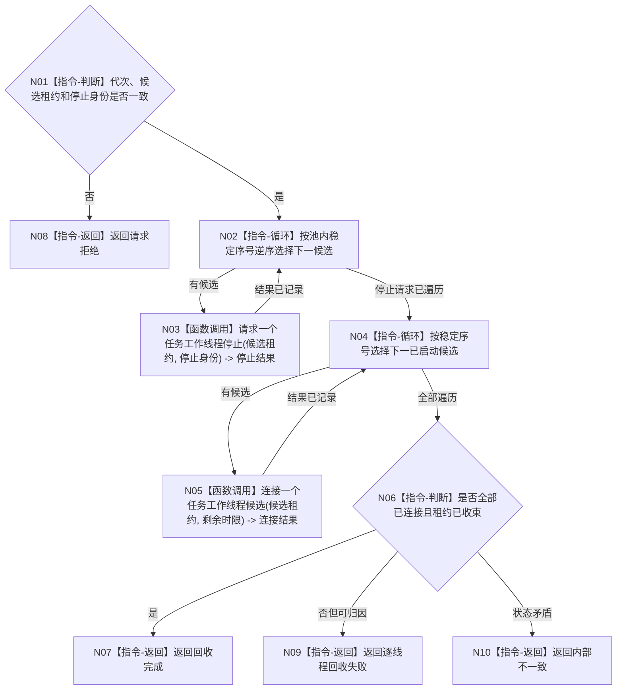

# BIZ-L3-001-05-02 停止并连接本轮已启动工作线程目标函数流程图 v0.1

更新时间：2026-08-03

## 依据

```text
8100、8110、8120；BIZ-L2-001-05；当前任务工作线程的请求停止并发送停止消息/收口等待相邻能力
```

## 身份与边界

正式目标函数设计图。只用于线程池启动半失败的候选回收，不替代生产停机阶段的在途工作排空。

## 函数合同

```text
根函数：停止并连接本轮已启动工作线程
归属模块 / 文件 / 层级：线程启动协调 / 海中鱼巣/启动.线程组协调.ixx / L3
现有或待新增：待新增；组合现有停止消息和收口等待能力
完整签名：任务工作线程候选回收结果 停止并连接本轮已启动工作线程(任务工作线程候选租约组&& 候选租约组, const 任务工作线程候选回收请求& 请求) noexcept
参数：候选租约组为唯一移动所有权并按池内序号确定排列；请求为只读借用，含运行代次、停止幂等身份组、回收原因和总单调时限
返回结果：移动值式回收结果；逐线程含未启动、已停止并连接、停止请求失败、连接超时或内部不一致；未连接项必须返还其唯一租约
被调函数流程图：BIZ-L4-001-05-02-01 请求一个任务工作线程启动候选停止；BIZ-L4-001-05-02-02 连接一个任务工作线程启动候选
父图：BIZ-L2-001-05
```

## 流程图



## 节点合同

| 节点 | 类型 | 输入 | 输出 | 事实读写 | 验证 |
| --- | --- | --- | --- | --- | --- |
| N01—N02 | 判断 / 循环 | 回收请求 | 稳定候选顺序 | 无业务写入 | 空组、错代、重复租约 |
| N03—N05 | 函数调用 | 单线程租约 | 停止和连接结果 | 只发8110消息并回收线程 | 每位置停止/连接失败 |
| N06—N10 | 判断 / 返回 | 全部结果 | 完成或非成功 | 不生成任务结果 | 零悬空租约 |

## 关键边界

此函数仅回收尚未对外发布为完整线程池的启动候选；若线程已经消费工作包，必须转入正式分阶段停机合同，不能在这里丢弃在途结果。
