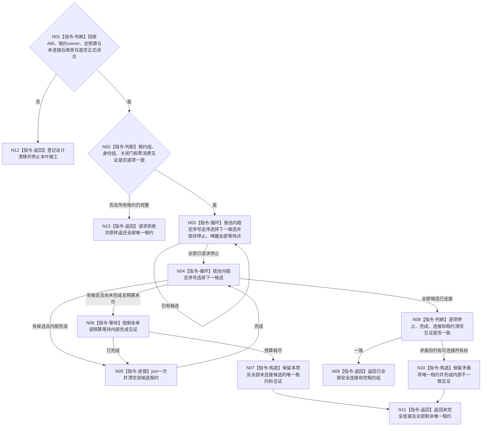

# BIZ-L3-001-05-02 停止并连接本轮已启动工作线程目标函数流程图 v0.2

更新时间：2026-08-28

## 依据

```text
0050、8100、8110、8120；BIZ-L2-001-05；BIZ-L3-001-05-01 v0.2；
当前发布源码：海中鱼巣/线程/任务工作线程.ixx。
```

## 身份与边界

正式目标治理图。该能力只处理线程池尚未对外发布、接收门仍关闭、所有候选均未消费工作包时的半启动失败：先向全部候选锁存停止，再在总预算内逐项等待内部完成并连接。它不替代生产停机阶段对已经开放、可能持有在途工作或动作后材料的正式排空。

现行规范没有冻结任务工作线程候选/正式租约、回收请求/结果、停止与完成见证、总预算或未连接租约后继 owner；仓库也没有对应详细设计和有效计划。旧 v0.1 的两份 L4 只是不完整目标草图，不能作为可施工 ABI。

## 函数合同

```text
根函数候选：停止并连接本轮已启动工作线程
归属模块 / 文件 / 目标分解深度：线程启动协调 / 物理文件待设计治理冻结 / BIZ-L3
现有或待新增：目标组合函数、候选租约组、回收DTO和逐线程结果均不存在；HEAD只有旧结果尾部对象内停止锁存与无时限join
完整签名：未冻结；旧候选为 `任务工作线程候选回收结果 停止并连接本轮已启动工作线程(任务工作线程候选租约组&&, const 任务工作线程候选回收请求&) noexcept`
参数：未冻结；必须明确候选租约组唯一移动所有权、运行代次/逻辑身份/池内序号绑定、关闭门与零消费见证、总单调预算和所有借用依赖寿命
返回结果：未冻结；已连接项必须清空所有权，任何未连接项必须连同唯一租约和继续覆盖其借用的依赖责任返还，不能只返回状态或诊断文本
被调函数流程图：旧 BIZ-L4-001-05-02-01/02 可保留“全量停—逐项连”职责分解作为设计输入，但公开签名、状态和所有权均未冻结
父图：BIZ-L2-001-05
```

## 设计门禁与目标骨架



## 节点合同

| 节点 | 当前可确认合同 | 仍待冻结 | 验证边界 |
| --- | --- | --- | --- |
| N01/N12 | 没有详细设计和完整所有权合同时停止施工 | DTO、状态、版本、owner、预算与异常优先级 | 不从旧对象停止函数补造公开ABI |
| N02/N13 | 只接受尚未发布完整池、门关闭且零工作包消费的候选；拒绝时不得消费租约 | 身份/见证精确字段 | 错代、重复租约、门已开、已消费均原样返还所有权 |
| N03 | 必须先遍历全部候选锁存停止并唤醒，再等待任一线程 | 单线程停止入口、重复语义和8110映射 | 某一项失败不得让后续候选收不到停止 |
| N04—N06 | 只有内部完成见证成立后才 join；总预算取单调时间且不按线程重置 | 完成见证、预算分配和等待结果 | 伪唤醒、首项耗尽预算、双join |
| N07/N10/N11 | 任何未连接或状态矛盾项必须返还唯一租约，并保持其入口/队列/provider借用继续存活 | 返回结果所有权布局和接管 owner | 非成功零 detach、零租约遗失、零悬空借用 |
| N08/N09 | 全部成功必须逐项证明已停止、已完成、已连接且租约已清空 | 完整成功谓词 | 裸线程数或8110投影不能证明回收完成 |

## 冻结发布源码对照（提交 `b6592647`）

- 当前发布源码中没有本组合函数、任务工作线程候选租约组、回收请求/结果、池内稳定顺序、总单调预算或未连接租约返还。
- `任务工作线程::停止接收并排空()`只锁存旧结果队列停止并唤醒一个条件变量；它不识别启动候选、关闭门、零消费见证或池内身份。
- `任务工作线程::收口等待()`直接对对象内 `std::thread` 无时限 `join`，随后改写对象状态；无法先停止整组、等待内部完成见证、有限预算返回或转移未连接所有权。
- 当前析构顺序调用停止和无时限 join 只能防止旧对象泄漏，不能作为结构化半启动回收成功证据。
- 旧 L4 两叶与本函数签名只存在于目标流程图；没有正式详细设计或计划冻结其状态、幂等身份、超时和返回租约语义。

## 具名偏差

1. `DRIFT-BIZ-TASK-WORKER-START-FAILURE-RECOVERY-ABI-AND-LEASE-SURVIVAL-UNFROZEN`：回收 DTO、停止/完成见证、总预算、逐项状态优先级、未连接租约返还形状及其依赖寿命 owner 未冻结。
2. `DRIFT-BIZ-TASK-WORKER-START-FAILURE-RECOVERY-FINITE-RETURN-UNFROZEN`：有限诊断预算与“返回前全部安全连接”不能同时无条件成立；预算耗尽时究竟由谁继续持有并连接剩余租约尚无正式合同。不得以超时为由析构、detach、遗失线程或伪报内部不一致已收口。

## 关键边界

```text
先全量停止、后逐项连接是必须保留的目标顺序；但顺序本身不等于 ABI 和所有权已闭合。
任一候选已经消费工作包时，本入口不适用，必须转 BIZ-L2-001-13 的正式停机与在途材料守恒链。
本叶闭合前，父线程池的半启动失败只能记为设计未闭合，不能宣称零悬空候选或有限时返回。
```

## v0.2 校正记录

- 将请求拒绝、预算耗尽和内部矛盾全部纳入“未连接唯一租约必须返还”的所有权守恒。
- 明确全量停止先于逐项等待/连接，且总预算不得按线程重置。
- 登记正式 DTO、owner、有限返回与后继接管合同不存在，旧两叶不得直接施工。
