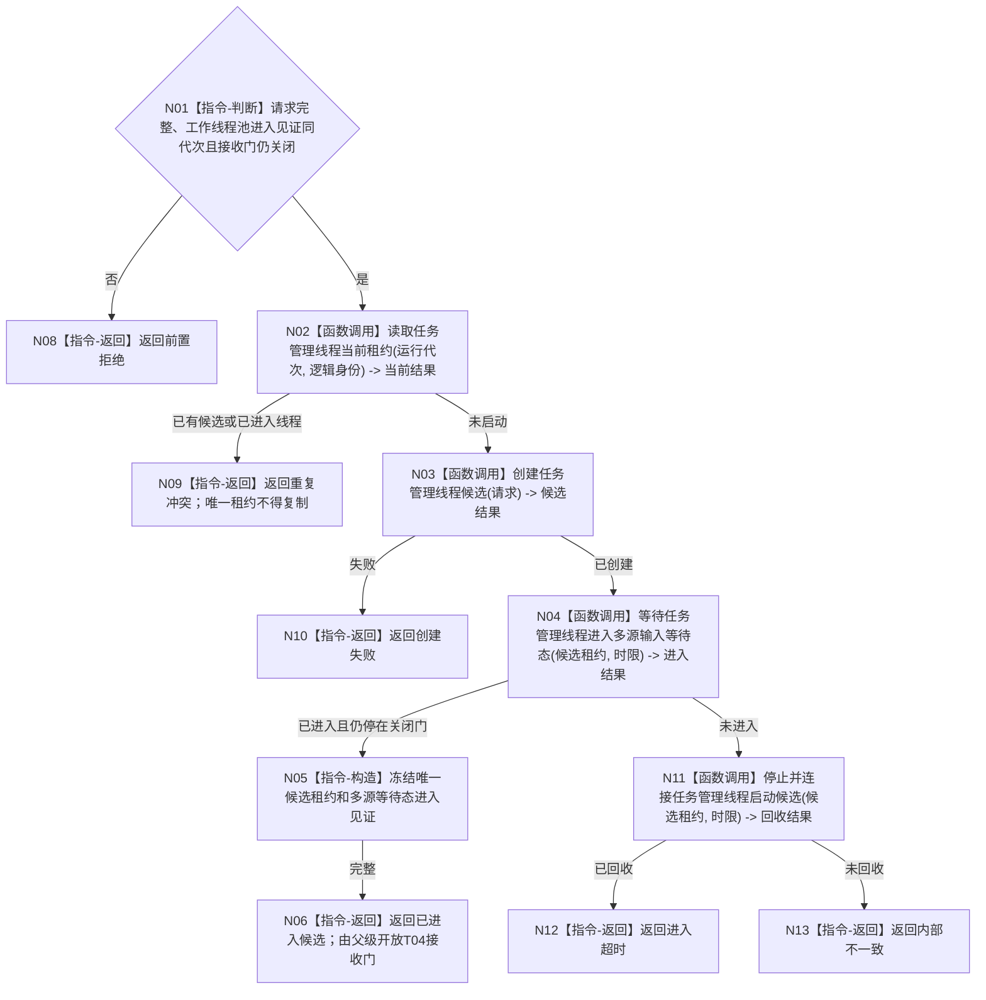

# BIZ-L3-001-06-01 启动任务管理线程入口目标函数流程图 v0.1

更新时间：2026-08-27

## 依据

```text
0050、8100、8110、8120；BIZ-L2-001-06；当前海中鱼巣/线程/任务管理线程.ixx
```

## 身份与边界

正式目标函数设计图。任务管理线程只在工作线程池消费者已进入且接收门仍关闭后启动；本函数只交付尚未对外发布的已进入候选，父级开放T04接收门后才形成完整T03启动结果。现行无参 `启动()` 需扩展为多源输入、派发端口、门绑定和进入见证合同。

## 函数合同

```text
根函数：任务管理线程::启动
归属模块 / 文件 / 目标分解深度：任务管理线程 / 海中鱼巣/线程/任务管理线程.ixx / BIZ-L3
现有或待新增：目标签名未实现；HEAD同名无参入口内联创建线程并立即返回，不等待进入，也不绑定T04接收门
完整签名：任务管理线程启动结果 任务管理线程::启动(const 任务管理线程启动请求& 请求)
参数：请求为只读借用；含运行代次、唯一逻辑身份、治理/工作回执/外设三类输入队列、工作包派发端口、领域处理器组、已进入且接收门仍关闭的工作线程池见证、启动幂等身份和时限；借用对象覆盖线程租约
返回结果：移动值式候选结果；含已进入候选、前置拒绝、重复冲突、创建失败、进入超时或内部不一致，以及唯一候选租约和消费等待态见证；不含T04接收门开放结论，重复调用不得复制唯一租约
被调函数流程图：BIZ-L4-001-06-01-01 创建任务管理线程候选；BIZ-L4-001-06-01-02 运行任务管理线程入口；BIZ-L4-001-06-01-03 等待任务管理线程进入多源输入等待态；BIZ-L3-001-06-02 失败候选回收
父图：BIZ-L2-001-06
```

## 流程图



## 节点合同

| 节点 | 类型 | 输入 | 输出 | 事实读写 | 验证 |
| --- | --- | --- | --- | --- | --- |
| N01—N02 | 判断 / 函数调用 | 请求与消费者见证 | 准入和当前租约 | 只读线程投影 | 池未就绪、错代、重复 |
| N03—N04 | 函数调用 | 启动请求 | 候选与进入结果 | 只发8110消息 | 创建失败、进入超时 |
| N05—N13 | 指令 / 函数调用 | 进入或回收材料 | 候选租约或非成功 | 不创建任务、不派发工作 | 启动阶段零业务消费；父级开门前候选不发布 |

## 关键边界

线程进入只证明T03已能等待多源输入并停在T04关闭门联锁上；任务阶段、工作种类和工作包只能由后续正式任务合同裁决。本函数不能自行开放T04，也不能把已进入候选发布为完整T03租约。

## 当前代码对应（已发布基线 `d5e6373e`）

- HEAD `任务管理线程::启动()`无参数，只检查旧队列容量和若干指针组合，随后先把状态置为`运行中`，再创建平台线程。
- 平台线程内只把无身份原子量`已进入`置真后立即调用`运行结果上行循环()`；`启动()`本身不等待该原子量，不形成运行代次、逻辑身份、启动幂等、池见证、候选租约或进入时限。
- 当前重复判断只识别`运行中`，平台创建失败只返回旧拒绝原因；没有具名候选占用和失败候选回收合同，故只能复用底层`std::thread`机械形状，不能复用当前启动语义。
