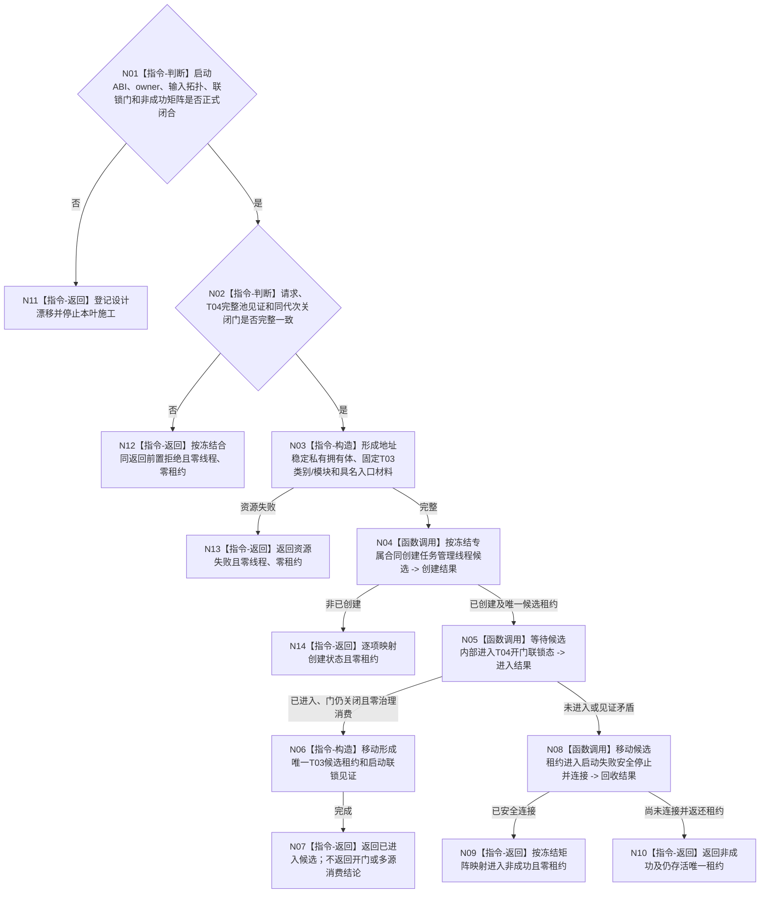

# BIZ-L3-001-06-01 启动任务管理线程入口目标函数流程图 v0.2

更新时间：2026-08-28

## 依据

```text
0050、8100、8110、8120；BIZ-L1-T03 v0.5；BIZ-L2-001-06；
HEAD 海中鱼巣/线程/任务管理线程.ixx。
```

## 身份与边界

正式目标治理图。目标是在 T04 工作线程池全部进入且工作包接收门仍关闭后，创建唯一 T03 候选，使平台线程冻结完整依赖并停在“等待父级开放同代次 T04 门”的启动联锁态；父级验证该内部见证后才开放 T04 门，线程随后进入唯一 BIZ-L1-T03 治理循环。

旧 v0.1 把开门前状态称为“多源输入等待态”，语义不成立：此时治理循环尚未启动，线程不能已经等待或消费业务输入。真正的多源取出、分类和等待全部属于 BIZ-L1-T03。启动叶只能证明依赖已冻结、物理入口已进入、T04 门仍关闭且零治理输入消费。

现行规范没有冻结 T03 候选/正式租约、输入拓扑与 provider 交付、启动联锁门、进入见证或非成功矩阵；仓库也没有对应详细设计和有效计划。因此下列骨架不能直接交代码施工。

## 函数合同

```text
根函数候选：启动任务管理线程入口
归属模块 / 文件 / 目标分解深度：任务管理线程运行基础 / 物理文件待设计治理冻结 / BIZ-L3
现有或待新增：HEAD 只有无参 `任务管理线程操作结果 任务管理线程::启动()`，内联创建匿名平台线程并立即运行旧结果上行循环；目标 DTO、候选/正式租约、具名入口、启动联锁见证和等待结果均不存在
完整签名：未冻结；旧 v0.1 的 `任务管理线程::启动(const 任务管理线程启动请求&)` 只是目标草图
参数：未冻结；必须区分 BIZ-L1-T03 的四种业务输入语义与实际物理输入源，明确工作包派发端口、领域 provider 组、T04 完整池租约/关闭门、8110端口和全部借用寿命由构造还是启动请求交付
返回结果：未冻结；成功必须恰含一份唯一移动候选租约及“已进入启动联锁、门仍关闭、零治理输入消费”内部见证；不含 T04 开门结论
被调函数流程图：旧 BIZ-L4-001-06-01-01—03 与 BIZ-L3-001-06-02 均为未获详细设计支撑的目标草图；可保留候选创建—联锁进入—失败安全连接职责分解，不得直接采用旧字段和状态
父图：BIZ-L2-001-06
```

## 设计门禁与目标骨架



## 节点合同

| 节点 | 当前可确认合同 | 仍待冻结 | 验证边界 |
| --- | --- | --- | --- |
| N01/N11 | 缺少详细设计、输入拓扑或所有权矩阵时停止施工 | DTO、状态、版本、owner和结果优先级 | 不从旧队列或目标图补造公开ABI |
| N02/N12 | T04完整池必须同代次已进入且接收门仍关闭 | 池/门身份、见证字段和调用方保证 | 坏前置零物理线程 |
| N03/N13 | 入口借用必须由地址稳定 owner 覆盖；资源失败在物理创建前返回 | 拥有体布局、依赖注入和销毁顺序 | 零悬空借用、零第二owner |
| N04/N14 | 同代次唯一 T03 物理候选只能有一份移动所有权 | 创建身份墓碑/重试策略和逐项状态 | 不读8110投影判定候选存在，不复制租约 |
| N05—N07 | 成功只证明进入 T04 开门联锁态、门仍关闭、零治理输入消费 | 进入请求/结果、联锁门和内部见证ABI | “多源等待态”、第一条输入、线程ID和构造成功均不能替代见证 |
| N08—N10 | 任一未进入候选必须显式安全连接；有限预算未连接时返还唯一租约 | 回收合同和后继接管owner | 禁止detach、遗失租约或析构冒充正常回收 |

## 当前代码对应（HEAD `191375eb`）

- `任务管理线程::启动()`无参数，只检查旧容量和若干指针组合；它在平台线程形成前先把对象状态置为 `运行中`。
- 匿名 lambda 只把无身份 `已进入` 原子量置真，随后立即调用 `运行结果上行循环()`；没有 T04 关闭门等待、运行代次、逻辑身份、候选租约、进入时限或内部启动联锁见证。
- `启动()`不等待 lambda 进入便返回成功；平台线程构造成功因此被错误等同于 T03 已就绪。相邻 `线程已进入()` 只是无身份 bool 读取，且生产启动方没有消费它。
- 当前 `运行结果上行循环()`是 BIZ-L1-T03 的代码锚点，但仍只覆盖旧结果/重筹办槽；目标治理循环的四种业务输入和十二个 BIZ-L2 根尚未全部接线。启动叶不得复制或提前执行这些业务职责。
- HEAD 不存在本目标的详细设计或有效计划；旧 L4 三叶、候选租约和“三类输入队列”字段只存在于目标流程图。

## 具名偏差

1. `DRIFT-BIZ-TASK-MANAGER-START-ABI-OWNERSHIP-AND-NON-SUCCESS-MATRIX-UNFROZEN`：候选/正式租约 owner、构造与启动依赖分配、T04门、8110端口、版本、状态及创建/进入/回收逐项矩阵未冻结。
2. `DRIFT-BIZ-TASK-MANAGER-START-INPUT-TOPOLOGY-AND-DELIVERY-UNFROZEN`：BIZ-L1-T03 冻结四种业务输入语义，但启动旧图只写“三类输入队列”；语义种类到物理源、队列/端口/provider及同代次交付的唯一映射未冻结。
3. `DRIFT-BIZ-TASK-MANAGER-PREOPEN-WITNESS-NOT-MULTISOURCE-WAIT`：T04开门前只能发布启动联锁见证，不能宣称已经进入多源输入等待态；旧名称会把尚未调用治理循环的线程伪报为业务消费就绪。

## 关键边界

```text
T04消费者池进入见证、T03启动联锁见证和父级T04开门见证必须分账。
本函数不得自行开放T04门；父级开门前不得调用BIZ-L1-T03、取出任何治理输入或派发工作包。
本叶闭合前，BIZ-L2-001-06不能从无参启动成功或无身份已进入bool推断T03/T04握手完成。
```

## v0.2 校正记录

- 将旧“多源输入等待态”改为准确的“T04开门启动联锁态”，明确零治理输入消费。
- 登记四种业务输入语义到物理输入源/端口/provider的映射未冻结。
- 登记目标 DTO、候选/正式租约、具名入口、见证、详细设计和有效计划均不存在。
