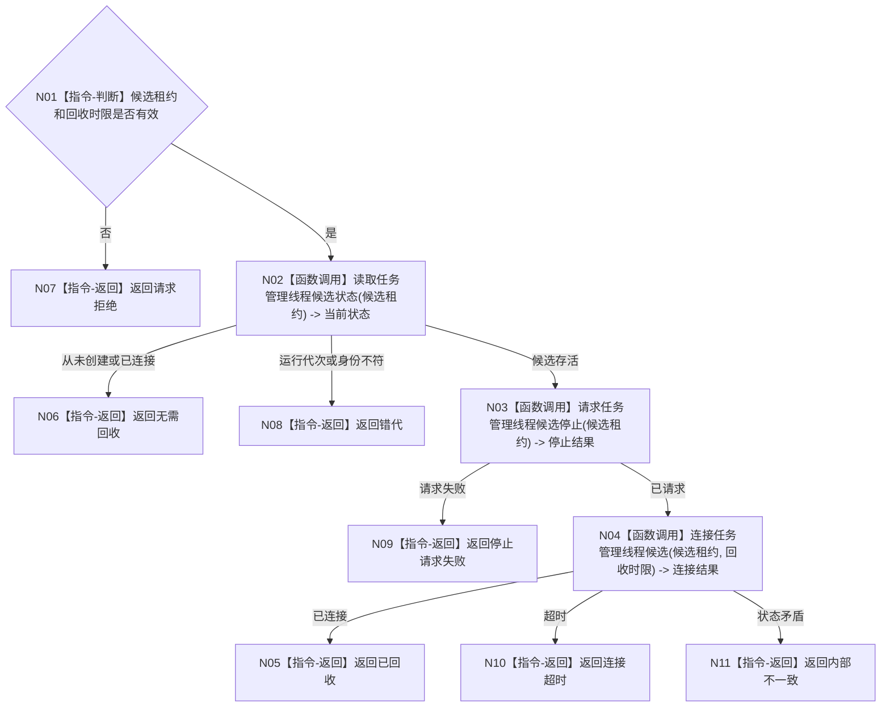

# BIZ-L3-001-06-02 停止并连接任务管理线程启动候选目标函数流程图 v0.1

更新时间：2026-08-27

## 依据

```text
8100、8110、8120；BIZ-L2-001-06；当前任务管理线程的请求停止并发送停止消息/收口等待相邻能力
```

## 身份与边界

正式目标函数设计图。只回收尚未发布为已启动的任务管理线程候选；不承担正式运行期回执排空。

## 函数合同

```text
根函数：停止并连接任务管理线程启动候选
归属模块 / 文件 / 目标分解深度：线程启动协调 / 海中鱼巣/启动.线程组协调.ixx / BIZ-L3
现有或待新增：目标组合未实现；HEAD相邻停止消息和无时限join只服务已启动旧线程，不识别未发布候选
完整签名：任务管理线程候选回收结果 停止并连接任务管理线程启动候选(const 任务管理线程候选租约& 候选租约, const 线程候选回收时限& 回收时限)
参数：候选租约与时限均只读借用；租约绑定运行代次、逻辑身份和启动幂等身份，调用方持有至返回
返回结果：值式回收结果；含已回收、无需回收、停止请求失败、连接超时、错代或内部不一致
被调函数流程图：BIZ-L4-001-06-02-01 请求任务管理线程启动候选停止；BIZ-L4-001-06-02-02 连接任务管理线程启动候选
父图：BIZ-L2-001-06
```

## 流程图



## 节点合同

| 节点 | 类型 | 输入 | 输出 | 事实读写 | 验证 |
| --- | --- | --- | --- | --- | --- |
| N01—N02 | 判断 / 函数调用 | 租约和时限 | 准入与当前状态 | 只读线程投影 | 空租约、错代、已连接 |
| N03—N04 | 函数调用 | 候选租约 | 停止和连接结果 | 只发8110消息并回收线程 | 停止失败、连接超时 |
| N05—N11 | 指令-返回 | 回收结论 | 结构化结果 | 不生成任务结果 | 状态矛盾归内部不一致 |

## 关键边界

一旦父级已开放T04接收门并对外发布T03租约，就必须使用正式停机排空链，不能通过本函数跳过回执和在途工作治理。父级开门失败时门仍关闭，才允许用本函数回收已进入但未发布的T03候选。

## 当前代码对应（已发布基线 `d5e6373e`）

- HEAD没有本组合函数、候选回收请求/结果、候选租约身份或单调回收时限。
- 相邻`请求停止并发送停止消息()`面向已启动对象，修改旧执行请求/结果上行停止锁存并发送旧停止消息；它不区分启动候选与正式运行线程，也不校验运行代次和启动幂等身份。
- 相邻`收口等待()`对对象内`std::thread`直接无时限`join()`，不等待具名完成见证、不返还未连接租约，不能证明启动失败候选已按目标合同安全回收。
