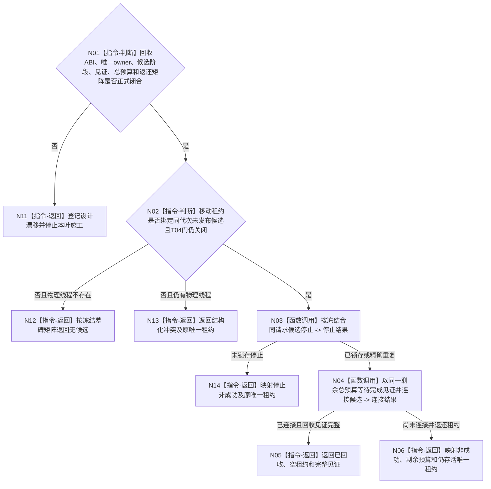

# BIZ-L3-001-06-02 停止并连接任务管理线程启动候选目标函数流程图 v0.2

更新时间：2026-08-28

## 依据

```text
0050、8100、8110、8120；BIZ-L2-001-06；BIZ-L3-001-06-01 v0.2；
当前发布源码：海中鱼巣/线程/任务管理线程.ixx、海中鱼巣/线程/运行包.任务结果生产.ixx。
```

## 身份与边界

正式目标治理图。只处理尚未由父级开放 T04 门、尚未对外发布为正式 T03、且仍由启动方唯一持有的任务管理线程启动候选。目标顺序固定为先请求候选停止，再在有限单调预算内等待入口退出并连接；连接前仍存活的物理线程必须始终由一份可追踪唯一所有权覆盖。

当前 `任务管理线程` 是运行包内嵌、地址稳定且不可复制的对象，线程句柄直接存于对象内；析构和 `收口等待()`都会无时限 `join()`。仓库没有候选阶段、可移动候选租约、候选完成见证、回收墓碑、有限等待或未连接租约返还。旧 v0.1 同时把根租约写成只读借用、把连接叶写成移动消费，所有权合同自相矛盾。

候选回收 ABI、唯一 owner、候选与正式 T03 的阶段切换、停止/完成见证、总预算、未连接租约返还及后继接管 owner 均未由详细设计和有效计划冻结。下列图只保留安全回收骨架，不能直接交代码施工。

## 函数合同

```text
根函数候选：停止并连接任务管理线程启动候选
归属模块 / 文件 / 目标分解深度：线程启动协调 / 物理文件待设计治理冻结 / BIZ-L3
现有或待新增：发布源码只有面向旧正式对象的请求停止并发送停止消息、排空结果上行并停止、收口等待和析构join；目标组合、DTO、候选阶段、唯一租约及回收见证均不存在
完整签名：未冻结；旧 v0.1 的只读候选租约签名与唯一移动所有权冲突，不得采用
参数：未冻结；至少必须按移动所有权交付唯一候选、运行代次/逻辑身份/启动身份、停止原因、同一单调总预算及全部借用寿命
返回结果：未冻结；目标成功只证明候选入口退出、底层线程已连接且租约清空；所有未连接结果必须返还仍存活的唯一候选租约及剩余预算/见证，不得返回空租约或靠析构阻塞兜底
被调函数流程图：旧 BIZ-L4-001-06-02-01—02 只作停止—等待完成—连接职责草图；其签名、字段、状态和三类等待口径均未冻结
父图：BIZ-L2-001-06
```

## 设计门禁与目标骨架



## 节点合同

| 节点 | 当前可确认合同 | 仍待冻结 | 验证边界 |
| --- | --- | --- | --- |
| N01/N11 | ABI、owner、预算或返还矩阵缺一项即停止施工 | DTO、状态、结果优先级和后继接管 | 旧 const 借用签名、对象地址或 joinable bool 不构成租约 |
| N02/N12/N13 | 只有父级开门前未发布候选可走本链；仍有线程时必须返还所有权 | 候选墓碑、阶段切换和错代/错身份矩阵 | 禁止从8110投影或当前状态枚举猜候选阶段 |
| N03/N14 | 停止必须锁存到同一候选并唤醒其启动联锁等待 | 停止身份、重复语义、唤醒源和投影降级 | 不得复用正式停机排空消息冒充候选停止 |
| N04—N06 | 停止与等待共享单调总预算；只有完成见证同候选且入口退出后才 join | 完成见证、伪唤醒处理、连接异常和剩余预算 | 超时/矛盾返还租约；禁止detach、无时限join或析构阻塞兜底 |

## 冻结发布源码对照（提交 `ff61b671`）

- `任务管理线程`把 `std::thread` 直接保存在运行包内嵌对象中；复制被删除，仓库没有独立候选拥有体、候选租约或从候选到正式 T03 的发布切换。
- 析构函数直接锁存多个旧停止量并在 `joinable()` 时无时限 `join()`；这只能防止线程句柄裸析构，不能作为有限回收结果或后继所有权合同。
- `请求停止并发送停止消息()`面向旧正式运行对象：它锁存强类型请求停止、向旧调度队列入停止消息、置正在停止并唤醒结果上行条件；没有候选身份、运行代次、启动幂等、T04门阶段或候选停止见证。
- `收口等待()`直接无时限 `join()`，随后把运行中/正在停止改为已停止并固定返回成功；它不等待具名完成见证，不区分候选与正式线程，也不能在超时或矛盾时返还唯一租约。
- 运行包的启动半失败分支调用 `请求停止新派发()`、`排空结果上行并停止()`和`收口等待()`；这是旧正式治理循环的排空链，不是父级开门前的候选回收合同。

## 具名偏差

1. `DRIFT-BIZ-TASK-MANAGER-CANDIDATE-RECOVERY-ABI-OWNER-AND-MATRIX-UNFROZEN`：候选阶段、移动租约、唯一 owner、停止/完成/回收见证、墓碑及逐项结果矩阵未冻结；旧根只读借用与连接叶移动消费自相矛盾。
2. `DRIFT-BIZ-TASK-MANAGER-CANDIDATE-RECOVERY-LIVENESS-BUDGET-AND-LEASE-RETURN-UNFROZEN`：停止与等待共享总预算、伪唤醒、连接异常、超时后剩余预算、仍存活租约返还及后继接管 owner 未冻结。
3. `DRIFT-BIZ-TASK-MANAGER-CANDIDATE-STOP-WAKE-TOPOLOGY-UNFROZEN`：06-01 的业务输入物理拓扑和启动联锁门尚未闭合，因此候选停止应唤醒哪些专属等待源也不能从旧结果上行条件或“三类输入”等字样补造。

## 关键边界

```text
父级已开放T04门或已发布正式T03后，必须改走正式停产、排空与连接链，本叶不得旁路在途治理。
连接成功只证明候选物理线程已回收，不证明任务、输入、回执或治理业务完成。
任何仍可连接线程都必须由唯一地址稳定拥有体或唯一移动租约覆盖；本叶不允许detach或无主后台线程。
```

## v0.2 校正记录

- 撤销旧 v0.1 已冻结的根签名、DTO、状态矩阵和只读租约口径。
- 将无时限 join、析构 join 和旧正式排空链降为机械候选，不再冒充启动候选安全回收。
- 增加有限总预算、未连接唯一租约返还和后继接管 owner 的设计门禁。
