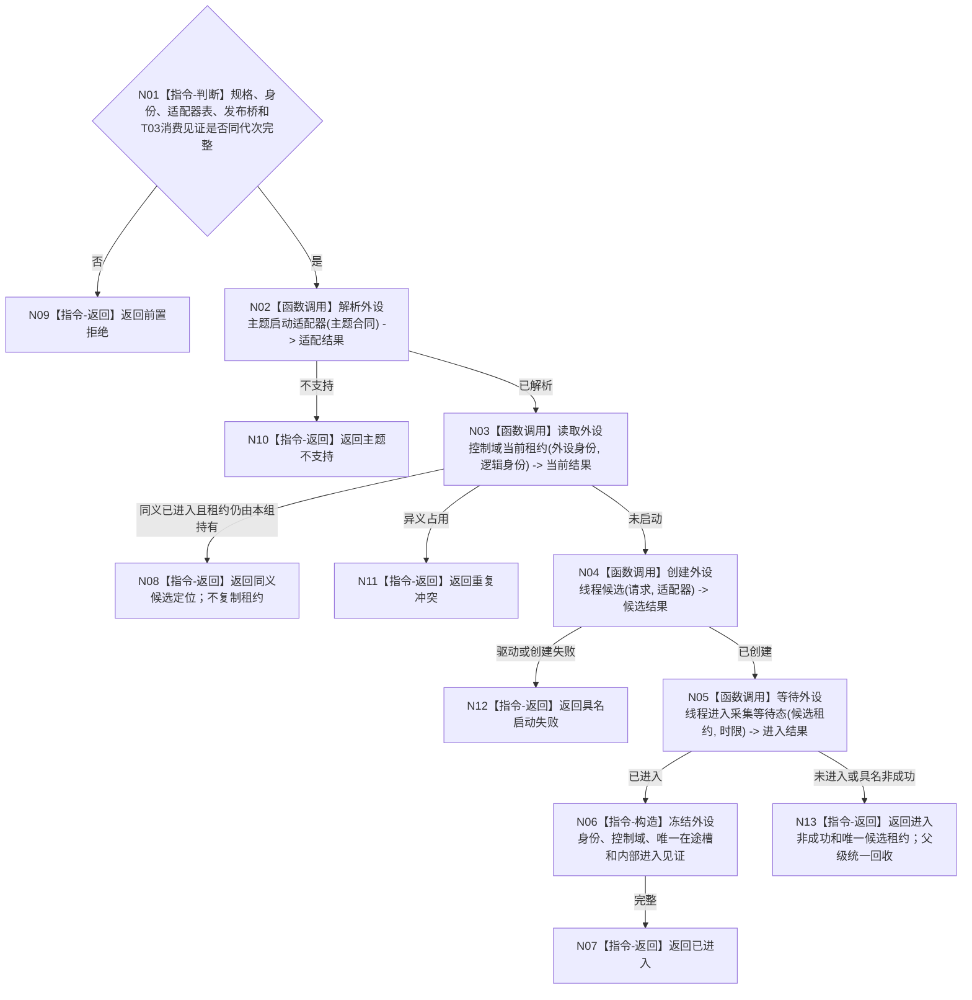

# BIZ-L3-001-07-01 启动一个外设线程目标函数流程图 v0.1

更新时间：2026-08-27

## 依据

```text
0050、6340、8110、8120；BIZ-L2-001-07；当前海中鱼巣/线程/外设采样材料线程.ixx
```

## 身份与边界

正式目标函数设计图。按进程启动配置中已启用的强类型外设主题选择唯一具名适配器，并为一个物理外设实例启动独立控制域候选。进程内适配器表只负责构造路由，不是L1/DATA登记或世界事实；现行外设采样材料线程只证明一个相邻线程壳，不是全部外设的通用合同。

## 函数合同

```text
根函数：启动一个外设线程
归属模块 / 文件 / 目标分解深度：外设线程启动协调 / 海中鱼巣/启动.线程组协调.ixx / BIZ-L3
现有或待新增：目标组合入口、DTO和候选租约未实现；HEAD只有未接线D455帧来源和禁止接D455的模拟线程壳
完整签名：外设单线程启动结果 启动一个外设线程(const 外设单线程启动请求& 请求)
参数：请求为只读借用；含运行代次、规范化单项外设启动规格、外设/线程互异稳定身份、进程内不可变适配器表、驱动/采集端口、6340唯一报告发布桥、T03多源等待/外设消费见证、启动幂等身份和单调时限；借用对象覆盖候选租约
返回结果：移动值式启动结果；含已进入候选、同义现有租约定位、前置拒绝、主题不支持、重复冲突、驱动不可用、进入超时或内部不一致；创建后任一非成功都返还唯一候选租约，由父级统一纳入本轮逆序停止/回收
被调函数流程图：BIZ-L4-001-07-01-01解析已登记外设主题启动适配器、BIZ-L4-001-07-01-02创建双目相机外设线程候选、BIZ-L4-001-07-01-03等待外设线程进入采集等待态；候选入口复用BIZ-L1-T06运行采集循环
父图：BIZ-L2-001-07
```

## 流程图



## 节点合同

| 节点 | 类型 | 输入 | 输出 | 事实读写 | 验证 |
| --- | --- | --- | --- | --- | --- |
| N01—N03 | 判断 / 函数调用 | 请求、进程启动配置和主题合同 | 准入、适配器、当前候选定位 | 只读进程内适配器表和控制域租约表 | 错代、未知主题、重复控制域 |
| N04—N05 | 函数调用 | 请求与适配器 | 候选和内部进入结果 | 取得本地独占资源；8110只作投影 | 驱动失败、进入超时、投影不可用 |
| N06—N13 | 指令 | 进入或非成功材料 | 已进入候选或携租约非成功 | 不采信外设材料为世界事实 | 创建后非成功必须返还唯一租约 |

## 关键边界

线程进入只证明采集载体就绪；外设报告仍须经6340唯一承接和领域正式提交，不能在启动阶段生成世界事实。T03消费见证只证明报告有合法承接路径，不授权外设线程创建任务或跳过唯一物理报告队列。

## 当前代码对应（HEAD `79985857`）

- HEAD不存在本组合函数、进程内外设启动适配器表、规范化外设启动规格、控制域租约表或可移动候选租约。
- D455采集器已经能够打开、采样、停止和读状态，但`创建并打开D455相机采集器`零生产调用；它没有线程逻辑身份、运行代次、6340发布桥、T03消费见证、内部进入见证或完整组所有权。
- 模拟`外设采样材料线程::启动()`只置运行状态并创建忙等线程；调用方必须另行轮询`线程已进入()`，且对象不可移动、无候选租约、无主题路由、无启动幂等和无6340报告能力。因此只能参考线程创建/停止机制，不能映射为本图成功。
