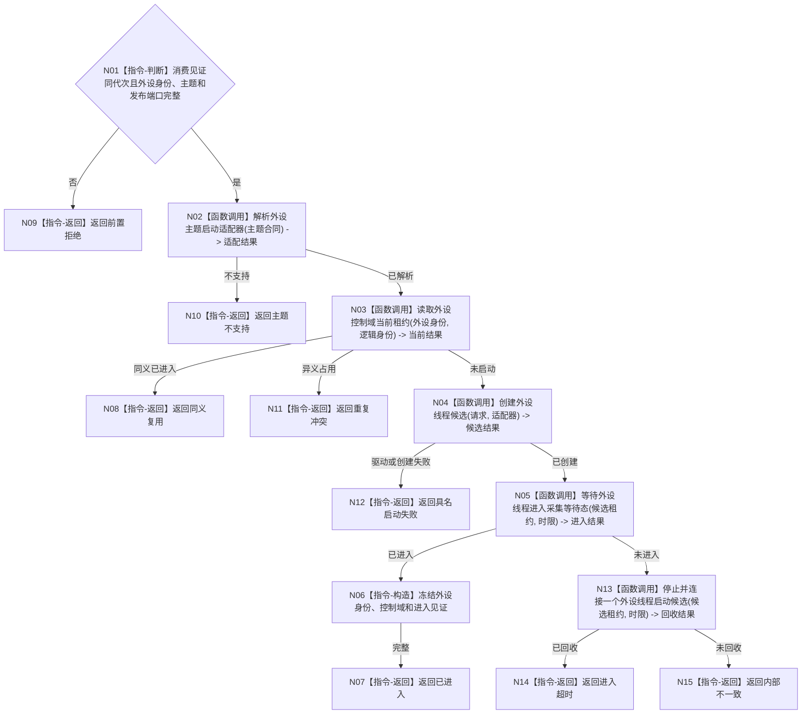

# BIZ-L3-001-07-01 启动一个外设线程目标函数流程图 v0.1

更新时间：2026-08-03

## 依据

```text
0050、6340、8110、8120；BIZ-L2-001-07；当前海中鱼巣/线程/外设采样材料线程.ixx
```

## 身份与边界

正式目标函数设计图。按已登记外设主题选择具名适配器并启动一个独立控制域；现行外设采样材料线程只证明一个相邻实现，不是全部外设的通用合同。

## 函数合同

```text
根函数：启动一个外设线程
归属模块 / 文件 / 层级：外设线程启动协调 / 海中鱼巣/启动.线程组协调.ixx / L3
现有或待新增：待新增通用协调入口；具体适配器可复用现有线程壳
完整签名：外设单线程启动结果 启动一个外设线程(const 外设单线程启动请求& 请求)
参数：请求为只读借用；含运行代次、外设稳定身份、外设主题合同、线程逻辑身份、驱动/采集端口、6340报告发布端口、任务管理消费见证、启动幂等身份和时限；借用对象覆盖线程租约
返回结果：值式启动结果；含已进入、同义复用、前置拒绝、主题不支持、重复冲突、驱动不可用、进入超时或内部不一致，以及调用方拥有的外设线程租约
被调函数流程图：BIZ-L4-001-07-01-01解析已登记外设主题启动适配器、BIZ-L4-001-07-01-02创建双目相机外设线程候选、BIZ-L4-001-07-01-03等待外设线程进入采集等待态；候选入口复用BIZ-L1-T06运行采集循环
父图：BIZ-L2-001-07
```

## 流程图



## 节点合同

| 节点 | 类型 | 输入 | 输出 | 事实读写 | 验证 |
| --- | --- | --- | --- | --- | --- |
| N01—N03 | 判断 / 函数调用 | 请求与主题合同 | 准入、适配器、当前租约 | 只读登记和线程投影 | 错代、未知主题、重复控制域 |
| N04—N05 | 函数调用 | 请求与适配器 | 候选和进入结果 | 只发8110消息 | 驱动失败、进入超时 |
| N06—N15 | 指令 / 函数调用 | 进入或回收材料 | 租约或非成功 | 不采信外设材料为世界事实 | 零悬空控制域 |

## 关键边界

线程进入只证明采集载体就绪；外设报告仍须经6340唯一承接和领域正式提交，不能在启动阶段生成世界事实。
